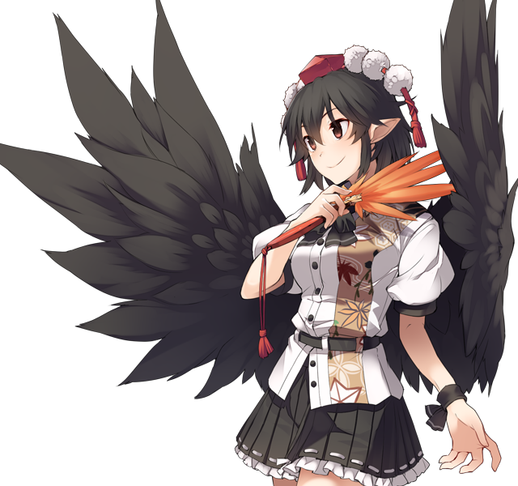

# Aya Shameimaru

This page lists useful spells and skills Aya has in the game, as well as explain her role and how she's useful in the various speedrun categories. The page tries to limit explanations to Aya herself, if you want to see her synergy with others in specific battles, please refer to the relevant enemy pages.

[Back to index page](../index.md)

## Quick Summary

Aya is optional, but her requirement is met naturally and the detour to get her is really short. She's one of the best characters in the game, so it makes the detour well worth it. Her absurd SPD makes her vital for late game bosses since she'll be the only one that can match them. Her spells and skills are also really good for her support role, making her easily one of the best characters for the entire game.

## Quick Links
* [Spells List](#spells)
* [Skills List](#skills)
* [Role & Usefulness](#useful)
	* [Ame-no-Murakumo (NG)](#ng-murakumo)

## Spells List

* **Wind God's Fan**
	* Row WND physical spell that targets DEF
	* Has +12 ACC
	* Very low delay and good damage early on, but quickly becomes useless with how enemy DEF scales
* **Peerless Wind God**
	* WND physical spell that targets DEF
	* Buffs self SPD by 20/23/26/29/32
	* Kind of expensive, but is stronger than Wind God's Fan. Can be useful if you really need to kill some trash and WGF isn't enough.
* **Sarutahiko's Guidance**
	* Single target SPD buff
	* Buffs by 40/43/46/49/52
	* Aya can use this on herself to get lots of turns for switching or supporting
* **Divine Grandson's Advent**
	* Fully completes an ally's ATB
	* Very expensive, but this allows Aya to be one of the best supporters in the game, thanks to the synergy with her other skills. Letting any ally attack immediately again is an amazing tool for damage rushes.

## Skills List

* **HP/ATK/EVA Boost**
	* EVA Boost helps her become a very efficient blink tank
* **Quickwitted**
	* Inverts SPD debuffs on self into buffs of same magnitude
	* Useless since Aya will always have her SPD buffed
* **Gensokyo's Fastest Lessons**
	* 50/100% chance of starting the fight with 20000 ATB
	* Aya's best skill, this allows her to either damage foes before the fight even starts, give buffs or even let any other character move before anyone else thanks to Divine Grandson's Advent.
* **Tengu's Wind**
	* Boosts front line's SPD by 4/8 every turn
	* Can help keep SPD buffs for everyone, which is very useful to keep getting more and more turns. SPD is the most important stat in the game, after all.
* **Ability to Manipulate Wind**
	* Reduces WND damage by 15/30%
	* Aya isn't very tanky, so this is very situational
* **Extra Steps**
	* Raise ATB to 10000 when Aya kills an enemy
	* Amazing skill to kill trash with, since Aya can just sweep everything with Gensokyo's Fastest Lessons before anything even gets a turn

## Role & Usefulness

#### Ame-no-Murakumo (NG)

Temporary text

[Back to index page](../index.md)
