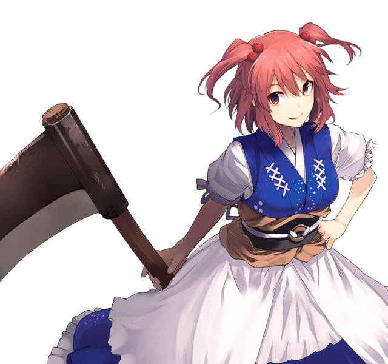

# Komachi Onozuka

This page lists useful spells and skills Komachi has in the game, as well as explain her role and how she's useful in the various speedrun categories. The page tries to limit explanations to Komachi herself, if you want to see her synergy with others in specific battles, please refer to the relevant enemy pages.

[Back to index page](../index.md)

## Quick Summary

Komachi guards the stairs to 4F, so she's required to beat the game. Thanks to her absurd HP count she's the perfect trash tank, which paired with her money skill grants us a much needed money increase for most trash fights in the game. She also plays a very important role in dealing with specific bosses and trash thanks to her access to high proc DTH.

## Quick Links
* [Spells List](#spells)
* [Skills List](#skills)
* [Role & Usefulness](#useful)
	* [Ame-no-Murakumo (NG)](#ng-murakumo)

## Spells List

* **Short Life Expectancy**
	* PHY physical spell that targets DEF
	* Chance to DTH: 40/44/48/52/56
	* Very cheap way to inflict DTH on trash, and maybe get chip damage
* **Ferriage in the Deep Fog**
	* Row CLD physical spell that targets DEF
	* Chance to DTH: 40/46/52/58/64
	* Her spell with highest DTH proc chance, and the most important spell used to deal with some bosses
* **Narrow Confines of Avici**
	* AoE SPI magical spell that targets MND
	* Chance to ATK/DEF/MAG/MND/SPD-debuff(16): 60
	* Chance to TRR(16000): 60/64/68/72/76
	* Chance to PAR(3333): 40/44/48/52/56
	* Chance to DTH: 32/35/38/41/44
	* Since it scales off MAG, this is mostly a debuff and ailment spell. Very useful to cripple trash and debuff some bosses
* **Scythe that Chooses the Dead**
	* SPI physical spell that targets DEF
	* No DTH chance and a bad damage formula makes this either useless or very situational

## Skills List

* **HP/ATK/MND Boost**
	* HP Boost is the only really useful one since Komachi is an HP tank
* **The Shinigami's Work**
	* Increases DTH chance by 25 for all moves
	* This is Komachi's most important skill, since it puts her best move at 89, enough to proc DTH on some bosses after Reisen's Intense Vertigo. Vital for any speedrun.
* **Ferry Wages of Sanzu River**
	* Boosts money drop rate by 2-20%
	* Exactly the same as Kourin's skill, but since Komachi is better at dealing with trash, we prefer this skill to boost our money gain.
* **Flexibility**
	* Inverts DEF/MND debuffs on self into buffs of same magnitude
	* Not as useful since Komachi tanks hits with her massive HP, not her defenses
* **Regeneration**
	* Restores 10% HP every turn
	* Great skill for Komachi since her max HP is so absurdly high. Helps her recover from chip damage during trash fights.
* **Edokko God of Death**
	* 25% chance to counter attacks. 100% if it had a DTH effect or someone from frontline dies
	* Not too useful since Komachi isn't all that strong. Could work on a gimmick ATK build.
* **An Eye for an Eye**
	* Buffs self ATK by 5/10 on each hit
	* Not too useful since Komachi isn't all that strong. Could work on a gimmick ATK build.

## Role & Usefulness

#### Ame-no-Murakumo (NG)

Temporary text

[Back to index page](../index.md)
