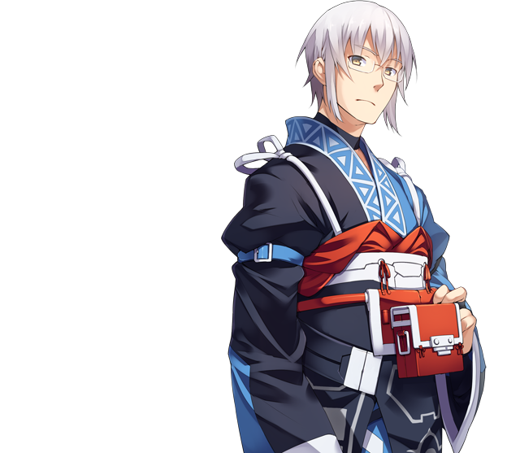

# Rinnosuke Morichika

This page lists useful spells and skills Rinnosuke has in the game, as well as explain her role and how he's useful in the various speedrun categories. The page tries to limit explanations to Kourin himself, if you want to see her synergy with others in specific battles, please refer to the relevant enemy pages.

[Back to index page](../index.md)

## Quick Summary

Kourin is part of your starting party, but doesn't play a big role in early game due to how weak he is to everything. After he gets access to some of his boost skills and other useful stuff he does put in work as an excellent support unit though.

## Quick Links
* [Spells List](#spells)
* [Skills List](#skills)
* [Role & Usefulness](#useful)
	* [Ame-no-Murakumo (NG)](#ng-murakumo)

## Spells List

* **First Aid**
	* Single target heal, can cure PSN/TRR, HVY at Lv2 and SIL at Lv3
	* Useless spell that heals for a laughable amount.
* **Battle Command**
	* Single target ATK/DEF/MAG/MND/SPD buff
	* Buffs by 10/12/14/16/18
	* Decent all buff early on, and can help keep some characters fully buffed on later fights. Also a good way to waste his turn waiting for a better switch opportunity.

## Skills List

* **MP/TP/ATK/DEF/MAG/MND High Boost**
	* All high boosts are really good at inflating Kourin's below average stats. This makes him the primary target for Insight Tomes, specially HP to help his longevity.
* **Gensokyo's Shopkeeper**
	* Boosts item drop rate by 4-40%
	* Excellent early on when we're farming materials to craft items and recruit Nitori
* **Keen-eyed Shop Owner Saga**
	* Boosts money drop rate by 2-20%
	* Not as useful as Shopkeeper since there are better ways to increase money gain.
* **Effective Formation Change**
	* Form Change puts switched character's ATB at 8300/9100.
	* Kourin's best skill by far, this allows for characters to very quickly switch in, use their nuke, and then have someone remove them from the frontline. Then Kourin can swap them back in and keep the cycle going. Very useful for damage rushing bosses and bringing in emergency healers.
* **Weird Creatures Knowledge**
	* Increases damage to Other enemies by 10/20%
	* Useful skill if bosses are Other-type, but since very few bosses are this type, it's very situational.
* **Attack Debuff Add-On**
	* Debuff enemy ATK by 4/8 every turn
	* Kinda useful, but there are better skills and boosts to spend points on before using this
* **Magic Debuff Add-on**
	* Debuff enemy MAG by 4/8 every turn
	* Kinda useful, but there are better skills and boosts to spend points on before using this

## Role & Usefulness

#### Ame-no-Murakumo (NG)

Temporary text

[Back to index page](../index.md)
