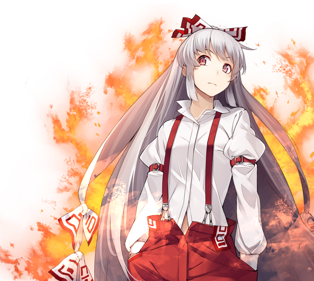

# Fujiwara no Mokou

This page lists useful spells and skills Mokou has in the game, as well as explain her role and how she's useful in the various speedrun categories. The page tries to limit explanations to Mokou herself, if you want to see her synergy with others in specific battles, please refer to the relevant enemy pages.

[Back to index page](../index.md)

## Quick Summary

Mokou is optional, and part of the big Eientei sidequest. We do that sidequest for Wriggle and Reisen, so we naturally get Mokou while doing it. Specially since getting Mokou early unlocks Reisen early. That said, Mokou works as a decent damage dealer that ends up playing more of a support and "phoenix tank" role thanks to her skills.

## Quick Links
* [Spells List](#spells)
* [Skills List](#skills)
* [Role & Usefulness](#useful)
	* [Ame-no-Murakumo (NG)](#ng-murakumo)

## Spells List

* **Fire Bird -Flying Phoenix-**
	* FIR physical spell that targets DEF
	* Basic spell with a decent delay, useful for chipping damage or finishing off trash
* **Tsuki no Iwakasa's Curse**
	* AoE WND physical spell that targets DEF
	* Chance to ATK/MAG-debuff(12/13/14/15/16): 90/93/96/99/102
	* Good trash cleaner if they're weak to WND, but the debuff is too weak to be useful, there are better debuffers out there
* **Fujiyama Volcano**
	* AoE FIR physical spell that targets DEF
	* Mokou's nuke, ends up being too costly for her poor MP count, though it is amazing at clearing trash.

## Skills List

* **HP/TP/ATK Boost**
	* TP can help her get more casts of Resurrection
* **With Keine**
	* Buffs self DEF/MND for 15/30 if Keine is in front
	* Kinda useless since Mokou's entire gimmick is dying and all, but can help in very few situations I guess
* **Regeneration**
	* Restores 10% HP every turn
	* Decent skill if she's playing a tanky role, but kinda goes against her gimmick
* **Resurrection**
	* 30/60/90% chance to revive with 33% HP on death, costing 6 TP
	* Her gimmick skill, allows her to continually sacrifice herself for the team, possibly by exploiting some boss' AI
* **Blazing**
	* Increase FIR damage by 15/30%
	* Very useful skill for boosting not only Mokou's damage but also anyone else with access to FIR nukes
* **Fighting Spirit**
	* Increases damage dealt and decreases damage dealt by 5-30%, one stack per turn, up to 6 stacks
	* Good skill for boosting Mokou if you plan on keeping her as an attacker, or even as a tank

## Role & Usefulness

#### Ame-no-Murakumo (NG)

Temporary text

[Back to index page](../index.md)
