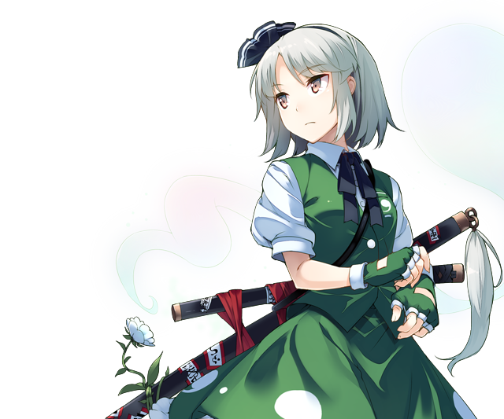

# Youmu Konpaku

This page lists useful spells and skills Youmu has in the game, as well as explain her role and how she's useful in the various speedrun categories. The page tries to limit explanations to Youmu herself, if you want to see her synergy with others in specific battles, please refer to the relevant enemy pages.

[Back to index page](../index.md)

## Quick Summary

Youmu is mandatory to beat the game and joins you late in 1F, making her pretty much part of the starting cast. Sadly, she's not all that useful since her attacking potential is very limited by her low MP and poor damage calculation. She can help with trash and some early bosses, but by midgame she's dead weight already.

## Quick Links
* [Spells List](#spells)
* [Skills List](#skills)
* [Role & Usefulness](#useful)
	* [Ame-no-Murakumo (NG)](#ng-murakumo)

## Spells List

* **Present Life Slash**
	* PHY physical spell that targets DEF
	* Youmu's only decent spell in terms of MP cost, but isn't all that powerful. Can help clear trash and chip damage bosses.
* **Slash of Eternity**
	* PHY physical spell that targets DEF
	* Improved version of Present Life Slash, but the damage increase is not enough to make this useful, specially with how high the delay and MP cost are.
* **God's Slash of Karma Wind**
	* AoE WND physical spell that targets DEF
	* Very powerful AoE spell, but insane cost and not enough damage output to justify using it in bosses. Trash cleaner.
* **Slash Clearing the Six Senses**
	* AoE NTR physical spell that targets DEF
	* Very powerful AoE spell, but insane cost and not enough damage output to justify using it in bosses. Trash cleaner.

## Skills List

* **ATK/DEF/MND Boost**
	* Not even ATK boost can help her shallow attacking power
	* DEF Boost can make her a decent tank for switching in a few parts of the game.
* **Regeneration**
	* Restores 10% HP every turn
	* Good skill if using Youmu as a tank. Free heals are always nice.
* **Netherworld Dweller**
	* Increases damage to Ghost by 10/20%
	* Useful skill if bosses are Ghost-type, the problem is keeping Youmu out there doing something useful.
* **Dexterity**
	* Inverts ATK/MAG debuffs on self into buffs of same magnitude
	* Very situational since you don't want your party debuffed in the first place.
* **Mental Concentration**
	* Increases MP regenerated by concentrate by 1-4
	* Pretty much mandatory if using Youmu long term since her MP count is atrocious
* **Meikyo Shisui**
	* Buffs ATK/DEF/MAG/MND/SPD by 6/12 every turn if full HP
	* Doesn't play well with her tanking role, and even with the buffs there are stronger offensive options
* **Desperation**
	* Buffs ATK/DEF/MAG/MND/SPD/ACC/EVA by 25 when HP drops below 40/60%
	* Great skill for a tanky role, specially with Regeneration putting her back over the threshold so it procs again
* **Swordmaster's Spirit**
	* Concentrate and then attack with full HP for 50% extra damage and 20% HP sacrifice
	* Might sound dumb but this plays very well with Regeneration, since you'll get those 20% HP back by the time you can attack again. Not only that, Mental Concentration also gives back a lot of MP to play with. That said, this is not worth the effort because of Youmu's low power.

## Role & Usefulness

#### Ame-no-Murakumo (NG)

Temporary text

[Back to index page](../index.md)
