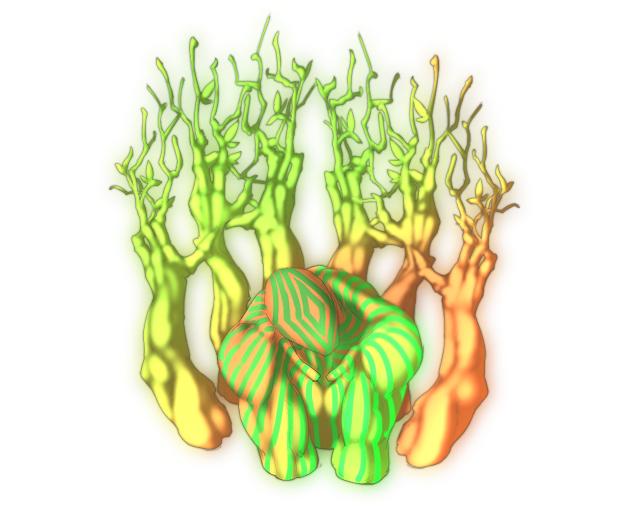

# Alaya-Vijnana

This page explains the strategies employed against Alaya-Vijnana on its boss fight. This includes party composition, which spells to use offensively and defensively, and how the battle should flow, which attacks to watch out for, etc. Since strategies vary greatly from route to route, explanations will be separated accordingly.

[Back to index page](../index.md)

## Quick Summary

Alaya-Vijnana is a mandatory boss fight on 3F that guards the way to Komachi, and is a complete pushover on NG since we have overleveleld Yukari and Yuyuko to help us fight it. On NG+ we actually need to beat a nerfed version of it, making this fight really hard to deal with.

## Quick Links
* [AI Script](#script)
* [Attack List](#attacks)
* [Strategies](#strats)
	* [Ame-no-Murakumo (NG)](#ng-murakumo)

## AI Script

* Phase 1: Any HP
	* 40% chance to Horizontal Slice
	* 20% chance to either:
		* Storm of Yellow Drive
		* Storm of Wood Leaves
		* Storm of Purple Magic

## Attack List

* **Horizontal Slice**
	* Row PHY spell targetting DEF, very high damage compared to other spells
* **Storm of Yellow Drive**
	* AoE WND spell targetting MND, deals good damage if weak to WND
* **Storm of Wood Leaves**
	* AoE NTR spell targetting MND, deals good damage if weak to NTR
* **Storm of Purple Magic**
	* AoE NTR spell targetting DRK, deals good damage if weak to NTR

## Strategies

#### Ame-no-Murakumo (NG)

Since we have access to overlevelled Yukari and Yuyuko, the fight boils down to the following script:

* Yukari spams Ran Yakumo+
* Yuyuko uses Ghostly Butterfly twice, then Saigyouji Flawless Nirvana

[Back to index page](../index.md)
