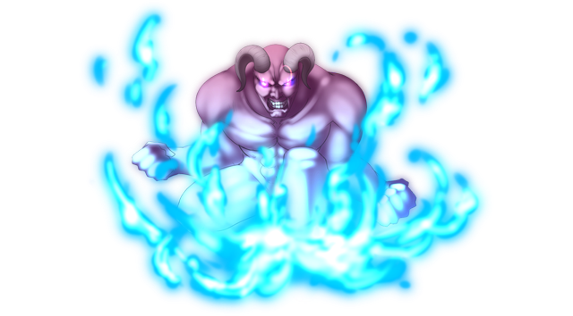

# Glowing Azure Giant

This page explains the strategies employed against Glowing Azure Giant on its boss fight. This includes party composition, which spells to use offensively and defensively, and how the battle should flow, which attacks to watch out for, etc. Since strategies vary greatly from route to route, explanations will be separated accordingly.

[Back to index page](../index.md)

## Quick Summary

Glowing Azure Giant is a mandatory boss on 15F that guards a key item used to unseal the way to Yukari. It's normally a very hard boss fight, with all the buffing it does to itself, but thanks to its 100 DTH resistance, we can use Komachi or Yuyuko paired with Reisen to kill it in one blow.

## Quick Links
* [AI Script](#script)
* [Attack List](#attacks)
* [Strategies](#strats)
	* [Ame-no-Murakumo (NG)](#ng-murakumo)

## AI Script

* Threshold Moves:
	* Azure Shining Body -> Azure Shining Light at 50%
* On turn 1:
	* Azure Shining Body
* Phase 1: Any HP
	* 30% chance to either Regular Attack or Rasetsu Fist
	* 20% chance to either Great Roar or Earth Shaker

## Attack List

* **Regular Attack**
	* Basic PHY attack targetting DEF, has a 3/103 chance of targetting slot 4
* **Great Roar**
	* AoE PHY spell targetting MND, doesn't hit that hard but can inflict TRR
* **Earth Shaker**
	* AoE NTR spell targetting DEF, moderate damage, can debuff SPD and inflict HVY
* **Rasetsu Fist**
	* PHY spell that ignores defenses, deals up to 8k damage at max buff
* **Azure Shining Body**
	* Buffs the boss' ATK/DEF/MAG/MND/SPD by 100%
* **Azure Shining Light**
	* AoE spell with no damage but has high chance to debuff ATK/DEF/MAG/MND/SPD by 10%

## Strategies

#### Ame-no-Murakumo (NG)

Temporary text

[Back to index page](../index.md)