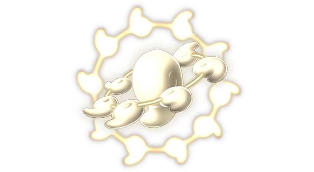

# Magatama of the High God

This page explains the strategies employed against Magatama of the High God on its boss fight. This includes party composition, which spells to use offensively and defensively, and how the battle should flow, which attacks to watch out for, etc. Since strategies vary greatly from route to route, explanations will be separated accordingly.

[Back to index page](../index.md)

## Quick Summary

Magatama of the High God is a mandatory boss on 20F, one of the 3 final artifact bosses. It's a very similar fight to the Magatama on 12F, only with higher stats and resistances. Because of those stats and the level difference, Diva Aya is the most consistent way of dealing with this fight.

## Quick Links
* [AI Script](#script)
* [Attack List](#attacks)
* [Strategies](#strats)
	* [Ame-no-Murakumo (NG)](#ng-murakumo)

## AI Script

* Every turn:
	* SPD = SPD + 24
* Threshold Moves:
	* World Devouring Destruction at 75% and 25%
	* Graces of Tama no Oya no Mikoto at 50%
* Phase 1: Any HP
	* 40% chance to Earthquake
	* 20% chance to Regular Attack
	* 15% chance to either Razor Wind or Half Moon Slash

## Attack List

* **Regular Attack**
	* Basic PHY attack targetting DEF, has a 3/103 chance of targetting slot 4 and ruining your day
* **Razor Wind**
	* AoE WND spell targetting DEF, moderate damage
* **Earthquake**
	* AoE NTR spell targetting DEF, moderate damage
* **Half Moon Slash**
	* Halves the front row's current HP. If a unit is at 1 HP, it is killed.
* **Graces of Tama no Oya no Mikoto**
	* Restores 50% of max HP and buffs DEF/MND by 100%
* **World Devouring Destruction**
	* Reduces the entire party of 12's HP to 1.

## Strategies

#### Ame-no-Murakumo (NG)

Temporary text

[Back to index page](../index.md)