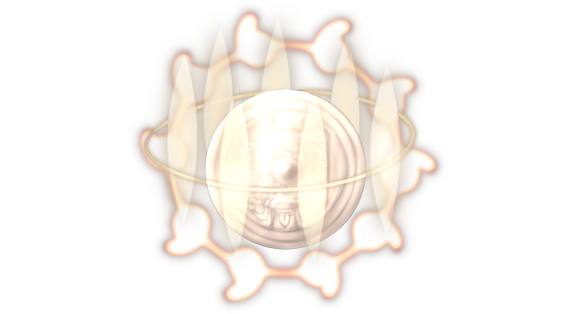

# Mirror of the High God

This page explains the strategies employed against Mirror of the High God on its boss fight. This includes party composition, which spells to use offensively and defensively, and how the battle should flow, which attacks to watch out for, etc. Since strategies vary greatly from route to route, explanations will be separated accordingly.

[Back to index page](../index.md)

## Quick Summary

Mirror of the High God is a mandatory boss on 20F, one of the 3 final artifact bosses. It's a very similar fight to the Mirror on 12F, only with higher stats and resistances. Because of those stats and the level difference, Diva Aya is the most consistent way of dealing with this fight.

## Quick Links
* [AI Script](#script)
* [Attack List](#attacks)
* [Strategies](#strats)
	* [Ame-no-Murakumo (NG)](#ng-murakumo)

## AI Script

* Every turn:
	* MAG = MAG + 300
* On turn 1:
	* World Devouring Calamity
* Threshold Moves:
	* Devil's Crimes at 56%
	* World Devouring Calamity at 33%
* Phase 1: Any HP
	* 13% chance to either:
		* Blade Arrow
		* Storm of Cutting Knives
		* Magical Light
		* Magical Blast
		* Red Curse
		* Purple Curse
	* 8% chance to Flowing Hellfire
	* 7% chance to Wild Dance of Freezing Mist or Ancient Curse

## Attack List

* **Blade Arrow**
	* Single target PHY spell targetting MND, pretty much a regular attack
* **Storm of Cutting Knives**
	* AoE PHY spell targetting MND, kinda same damage as Blade Arrow
* **Magical Light**
	* Single target MYS spell targetting MND, very high MND influence
* **Magical Blast**
	* AoE MYS spell targetting MND, extremely high MND influence
* **Flowing Hellfire**
	* AoE FIR spell targetting MND, very powerful with high delay too
* **Wild Dance Of Freezing Mist**
	* AoE CLD spell targetting MND, very powerful with high delay too
* **Red Curse**
	* AoE FIR spell targetting MND, low damage but can ATK-debuff entire party
* **Purple Curse**
	* AoE MYS spell targetting MND, low damage but can MAG-debuff entire party
* **Ancient Curse**
	* AoE DRK spell targetting MND, moderate damage and can inflict PSN, PAR, HVY and SHK
* **Devil's Crimes**
	* AoE DRK spell targetting MND, very low damage but high chance to debuff ATK/DEF/MAG/MND/SPD by 40%
* **World Devouring Calamity**
	* Fully depletes the entire party of 12's MP.

## Strategies

#### Ame-no-Murakumo (NG)

Temporary text

[Back to index page](../index.md)