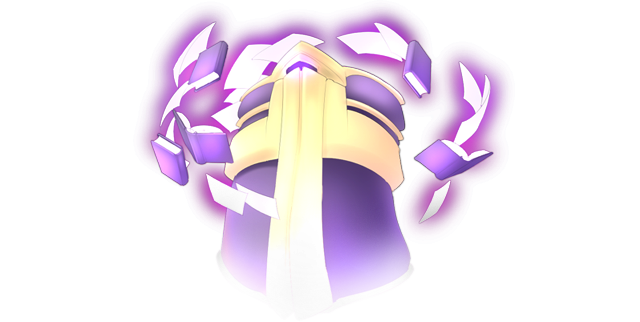

# Memorized Knowledge

This page explains the strategies employed against Memorized Knowledge on its boss fight. This includes party composition, which spells to use offensively and defensively, and how the battle should flow, which attacks to watch out for, etc. Since strategies vary greatly from route to route, explanations will be separated accordingly.

[Back to index page](../index.md)

## Quick Summary

Memorized Knowledge is a mandatory boss on 14F, guarding the key item to access the second half of 13F that leads into the deeper parts of the fire stratum. It follows a very simple pattern that is easy to work around, and it being weak to PHY, DRK and TRR makes Nitori and Parsee very useful here for dealing damage.

## Quick Links
* [AI Script](#script)
* [Attack List](#attacks)
* [Strategies](#strats)
	* [Ame-no-Murakumo (NG)](#ng-murakumo)

## AI Script

* On odd turns:
	* MAG Up
* On even turns:
	* Ether Flare

## Attack List

* **MAG Up**
	* Buffs MAG by 100%, making the next attack very deadly
* **Ether Flare**
	* AoE MYS spell targetting MND, will oneshot anyone without MYS resistance

## Strategies

#### Ame-no-Murakumo (NG)

This fight requires very careful planning to make Nitori survive an Ether Flare, and after tanking that first hit just blasting Memorized Knowledge with damage before it can even cast MAG UP again. Sometimes TRR won't proc, which can make this a bit unreliable. For damage, we focus on Parsee, Kasen, and Nitori as they are the more reliable PHY/DRK damage dealers.

The plan at the start of the fight is to prepare for Ether Flare, and if you get lucky with TRR, get some damage in. We get Aya to buff Sanae's SPD, as her job is to make sure Parsee is maxing out on damage. Aya then swaps herself for Reisen to improve our odds at sticking TRR to the boss, using Parsee's Grudge Returning. We use that instead of Midnight Anathema Ritual since we care more about TRR sticking rather than its duration. Reisen can chip some debuffs on the boss, and if TRR from Grudge Returning proc'd, Parsee can fire one Jealousy of the Kind before Ether Flare.

The setup for Ether Flare is to sack 3 characters and get Nitori to survive. The lineup we use for that is Nitori / Kourin / Cirno / Keine. Cirno's only purpose is to proc Blizzard Blowout and get Memorized Knowledge stuck in a very, very slow state.

After tanking an Ether Flare (thanks to massive HP and MYS investment), Nitori swaps in Momiji, who swaps in Sanae and Parsee. The goal of the fight then becomes inflicting TRR with Parsee (60% chance) and capitalizing on it with Jealousy of the Kind. It's important that Reisen is in whenever you go for a TRR proc, and Sanae should be constantly buffing Parsee. Momiji can be used to AI pivot Sanae and Parsee, and Nitori can sneak in a 3D Super Scope whenever she's no longer needed (remember her ATB goes to 0 after casting that).

If Parsee is out of MP and can't finish the job without concentrating, Kasen can also deal very reliable damage to Memorized Knowledge, make sure to buff them with Sanae to fully optimize how much damage you're dealing. The ideal fight doesn't even see a second MAG UP, and if you need to tank a second Ether Flare, you need more damage.

**PHASE 1 - Preparation**

The goal here is to prepare some buffs, debuffs, and the frontline for Ether Flare:

* Aya buffs Sanae SPD twice
* Sanae spams Miracle Fruit on Parsee
* Aya switches self for Reisen
* Nitori IA pivots Sanae
* Parsee uses Grudge Returning
* Reisen spams Discarder
* If TRR proc'd:
	* Nitori swaps Sanae with Cirno
	* Parsee uses Jealousy of the Kind and Lovely
* Form Change into Nitori / Kourin / Cirno / Keine

**PHASE 2 - Quick Kill**

Rushdown with Parsee, then Kasen if necessary. Keep buffs up and IA pivot whenever needed:

* Nitori swaps in Momiji, who swaps in Parsee
* Parsee concentrates
* Nitori swaps in Sanae
* Momiji swaps self with Reisen
* Sanae spams Miracle Fruit on Parsee
* Nitori and Reisen IA pivot Sanae and Parsee
* Parsee uses Grudge Returning
* If TRR does not proc:
	* Concentrate -> Grudge Returning until proc
* Parsee uses Jealousy of the Kind and Lovely
* At low HP, Nitori and Kasen finish

[Back to index page](../index.md)
