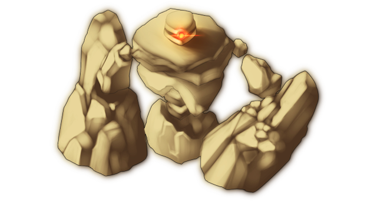

# Lesser Golem

This page explains the strategies employed against the Lesser Golem on its boss fight. This includes party composition, which spells to use offensively and defensively, and how the battle should flow, which attacks to watch out for, etc. Since strategies vary greatly from route to route, explanations will be separated accordingly.

[Back to index page](../index.md)

## Quick Summary

The Lesser Golem is an FOE guarding the area with Chen and a few treasures, and is quite powerful physically, both in offense and defense. Since it is entirely optional like every FOE, we come back to face it when we are already overlevelled.

## Quick Links
* [AI Script](#script)
* [Attack List](#attacks)
* [Strategies](#strats)
	* [Ame-no-Murakumo (NG)](#ng-murakumo)

## AI Script

* Phase 1: Any HP
	* Regular Attack

## Attack List

* **Regular Attack**
	* Basic PHY attack targetting DEF, gets very strong thanks to boss' high ATK

## Strategies

#### Ame-no-Murakumo (NG)

Since we show up completely overlevelled here, we simply nuke it with whatever strong spells we have here. Stuff like Kasen's Higekiri Cursed Arm and Nitori's Super Scope 3D make short work of it, despite it having very high DEF.

[Back to index page](../index.md)
