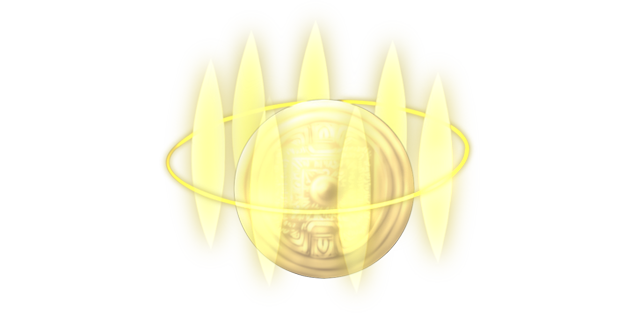

# Divine Beasts' Golden Mirror

This page explains the strategies employed against the Divine Beasts' Golden Mirror on its boss fight. This includes party composition, which spells to use offensively and defensively, and how the battle should flow, which attacks to watch out for, etc. Since strategies vary greatly from route to route, explanations will be separated accordingly.

[Back to index page](../index.md)

## Quick Summary

The Divine Beasts' Golden Mirror is a necessary boss to unlock the final part of 12F. With absurdly high defenses, it should be an extremely tough fight to do underlevelled. However, note it only has 100 DTH resistance. Reisen's Intense Vertigo drops that to 80, allowing some characters to proc DTH on it, completely trivializing this fight.

## Quick Links
* [AI Script](#script)
* [Attack List](#attacks)
* [Strategies](#strats)
	* [Ame-no-Murakumo (NG)](#ng-murakumo)

## AI Script

* Every turn:
	* MAG = MAG + 80
* Once, when HP drops below 40%:
	* World Devouring Calamity
* Phase 1: Any HP
	* Equal chance to use any of these moves:
		* Blade Arrow
		* Storm of Cutting Knives
		* Magical Light
		* Magical Blast
		* Red Curse
		* Purple Curse
		* Ancient Curse

## Attack List

* **Blade Arrow**
	* Single target PHY spell targetting MND, pretty much a regular attack
* **Storm of Cutting Knives**
	* AoE PHY spell targetting MND, kinda same damage as Blade Arrow
* **Magical Light**
	* Single target MYS spell targetting MND, very high MND influence
* **Magical Blast**
	* AoE MYS spell targetting MND, extremely high MND influence
* **Red Curse**
	* AoE FIR spell targetting MND, low damage but can ATK-debuff entire party
* **Purple Curse**
	* AoE MYS spell targetting MND, low damage but can MAG-debuff entire party
* **Ancient Curse**
	* AoE DRK spell targetting MND, moderate damage and can inflict PSN, PAR, HVY and SHK
* **World Devouring Calamity**
	* Fully depletes the entire party of 12's MP.

## Strategies

#### Ame-no-Murakumo (NG)

As mentioned in the summary, the strat is to proc DTH on this thing before it can even move. We use Komachi to do this, since she's the only one in this route that has access to high DTH skills. Ferriage in the Deep Fog at level 5 has a 64% chance to DTH, and stacked with 25% from The Shinigami's Work, that gives us a 9% chance to proc DTH on the Mirror. We use Aya, Komachi and Reisen to achieve this:

* Aya uses DGA on Komachi
* Komachi tries Ferriage in the Deep Fog #1
* Aya uses Sarutahiko's Guidance on herself
* Komachi tries Ferriage in the Deep Fog #2
* Aya uses DGA on Komachi
* Komachi tries Ferriage in the Deep Fog #3

[Back to index page](../index.md)
