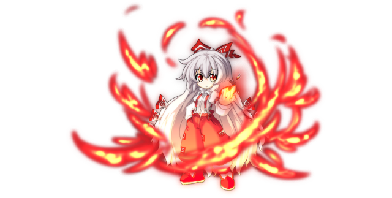

# Fujiwara no Mokou (Boss)

This page explains the strategies employed against Mokou on her boss fight. This includes party composition, which spells to use offensively and defensively, and how the battle should flow, which attacks to watch out for, etc. Since strategies vary greatly from route to route, explanations will be separated accordingly.

[Back to index page](../index.md)

## Quick Summary

Mokou is an optional boss fight that continues the Eientei side quest. She has access to many powerful moves and will regenerate HP every turn, on top of reviving after death to spam her nuke right in your face. The fight would be really hard if not for the fact we get there overlevelled, so it ends up being a breeze.

## Quick Links
* [AI Script](#script)
* [Attack List](#attacks)
* [Strategies](#strats)
	* [Ame-no-Murakumo (NG)](#ng-murakumo)

## AI Script

* Threshold Moves:
	* Tsuki no Iwakasa's Curse at 75% and 25%
	* Earth Shaker at 30%
* Phase 1: Over 50% HP
	* 20% chance to Fire Bird or Daze (A)
	* 15% chance to either:
		* Regular Attack (A)
		* Row Attack
		* Spark Storm
		* Azure Arrow (A)
* Phase 2: Below 50% HP
	* 30% chance to Fire Bird (A)
	* 25% chance to Row Attack or Azure Arrow (A)
	* 10% chance to Spark Storm or Regular Attack (A)
* Phase 3: After revive
	* Fujiyama Volcano

## Attack List

* **Regular Attack**
	* Basic PHY attack targetting DEF, low damage
* **Row Attack**
	* Row version of the regular attack, will hit rightmost slots for barely any damage
* **Daze**
	* FIR spell targetting DEF, moderate damage and can inflict SHK
* **Spark Storm**
	* AoE FIR spell targetting MND, deals good damage if weak to FIR
* **Azure Arrow**
	* CLD spell targetting MND, deals good damage if weak to CLD
* **Earth Shaker**
	* AoE NTR spell targetting DEF, moderate damage, can debuff SPD and inflict HVY
* **Fire Bird -Flying Phoenix-**
	* FIR spell targetting DEF, moderate damage
* **Tsuki no Iwakasa's Curse**
	* AoE WND spell targetting DEF, moderate damage and very high chance to debuff ATK/MAG by 50%
* **Fujiyama Volcano**
	* AoE FIR spell targetting DEF, very high damage unless you heavily resist FIR

## Strategies

#### Ame-no-Murakumo (NG)

Since we show up overlevelled for this fight, it's very easy to overwhelm Mokou with Nitori and Kasen, all thanks to her CLD and WND weakness. Keine stays around to buff those two, and Komachi to absorb damage and try to spread some debuffs. The only way this fight can go wrong is if no one dodges Fujiyama Volcano and Kasen's Guts doesn't proc, in which case you might full wipe. The fight is kinda fast though so it's not a big time loss. The flowchart is basically:

* Komachi spams Narrow Confines of Avici to get debuffs
* Kasen spams Diving Waltz of the Raijuu for damage and possible PAR (40%)
* Nitori spams Kappa's Waterfall for big damage and possible DEF-debuff (40%)
* Keine spams Three Treasures - Sword to buff everyone
* After Fujiyama Volcano, Marisa can come in to Master Spark

[Back to index page](../index.md)
