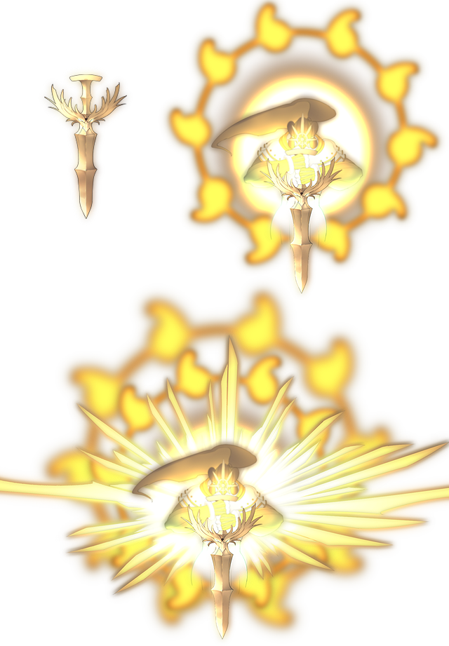

# Ame-no-Murakumo

This page explains the strategies employed against Ame-no-Murakumo on its boss fight. This includes party composition, which spells to use offensively and defensively, and how the battle should flow, which attacks to watch out for, etc. Since strategies vary greatly from route to route, explanations will be separated accordingly.

[Back to index page](../index.md)

## Quick Summary

Ame-no-Murakumo is the main story final boss on 20F. The fight has 3 phases, but they can be easily skipped if you deal enough damage to the boss before it can trigger its phase change. Strategies for this boss involve killing it in 1 hit with Parsee, to avoid having to deal with phases 2 and 3. It's just barely doable thanks to the low TRR resistance.

## Quick Links
* [AI Script](#script)
* [Attack List](#attacks)
* [Strategies](#strats)
	* [Ame-no-Murakumo (NG)](#ng-murakumo)

## AI Script

* Threshold Moves:
	* Divine Exile at 80%
		* This triggers Phase 2
	* World Devouring Calamity at 70%
	* Graces of Tama no Oya no Mikoto at 60%
	* Devil's Crimes at 50%
	* World Devouring Destruction at 40%
	* Divine Messenger's Light at 30%
		* This triggers phase 3
* Phase 1: Above 80% HP
	* 50% chance to either Regular Attack or Ame-no-Murakumo Slash
* Phase 2: Between 30% HP and 80% HP
	* 30% chance to Great Tree that Descended from the Sky
	* 20% chance to Yakumo's Futsu no Mitama no Tsurugi
	* 15% chance to Devil's Crimes
	* 10% chance to cast either of these:
		* Ame-no-Murakumo Slash
		* Rasetsu Fist
		* World Shaking Military Rule
	* 5% chance to Destroy Magic
* Phase 3: Below 30% HP
	* After entering this phase, cast these in order:
		* World Shaking Military Rule
		* Start of Heavenly Demise
	* If sum of buffs and debuffs is negative:
		* 40% chance to World Shaking Military Rule
	* Equal chance to cast any of these:
		* Yellow Curse
		* Great Tree that Descended from the Sky
		* Rasetsu Fist
		* Ame-no-Murakumo Slash
		* True Ame-no-Murakumo Slash
		* Start of Heavenly Demise
		* Yakumo's Futsu no Mitama no Tsurugi

## Attack List

* **Regular Attack**
	* Basic PHY attack targetting DEF, has a 3/103 chance of targetting slot 4
* **Ame-no-Murakumo Slash**
	* SPI spell targetting DEF, deals moderate damage
* **Great Tree that Descended from the Sky**
	* AoE SPI spell targetting MND, moderate damage with moderate chance to PAR and DTH
* **Yakumo's Futsu no Mitama no Tsurugi**
	* PHY spell targetting DEF, deals high damage and drains MP, restores HP based on drained MP
* **Devil's Crimes**
	* AoE DRK spell targetting MND, very low damage but high chance to debuff ATK/DEF/MAG/MND/SPD by 40%
* **Rasetsu Fist**
	* PHY spell that ignores defenses, deals up to 16k damage at max buff
* **World Shaking Military Rule**
	* Buffs all enemies ATK/DEF/MAG/MND/SPD by 50%
* **Destroy Magic**
	* MYS spell targetting MND, very low damage but drains all MP
* **World Devouring Calamity**
	* Fully depletes the entire party of 12's MP
* **World Devouring Destruction**
	* Reduces the entire party of 12's HP to 1
* **Graces of Tama no Oya no Mikoto**
	* Restores 50% of max HP and buffs DEF/MND by 100%
* **Yellow Curse**
	* AoE WND spell targetting MND, low damage but can SPD-debuff entire party
* **True Ame-no-Murakumo Slash**
	* SPI spell targetting DEF, deals high damage
* **Start of Heavenly Demise**
	* AoE SPI spell targetting DEF and MND, deals high damage
* **Divine Exile**
	* Changes Murakumo's form and begins phase 2, no damage or effects
* **Divine Messenger's Light**
	* Changes Murakumo's form and begins phase 3, no damage or effects

## Strategies

#### Ame-no-Murakumo (NG)

* Jealousy of the Kind Formula = 2.5 \* (2.5 \* ATK - 0.5 \* DEF) \* (1.0 + (0.01 \* (TRR / 2500)))
* Spell level 5 multiplier = 1.2
* Final Blow multiplier = 1.32
* Flames of Jealousy multiplier = 1.3
* Herb of Awakening multiplier = 1.36
* Trauma Recollection multiplier = 1.24
* Affinity multiplier = 1.333
* Murakumo's HP = 1280000
* Murakumo's DEF = 56000
* Murakumo's DEF w/ HVY = 28000
* Murakumo's DEF w/ HVY and 40% DBF = 16800

Final formula:
* TRR = (HP \* 250000 / (ATKF - DEFF)) - 250000
* TRR = (320000000000 / (ATK \* 28.938625 - 162056)) - 250000 (NO debuff)
* TRR = (320000000000 / (ATK \* 28.938625 - 97234)) - 250000 (WITH debuff)

Where:
* MULT = Product of all multipliers = 11.57545
* ATKF = Parsee's approximate ATK \* 2.5 \* MULT = ATK \* 28.938625
* DEFF = Target's DEF \* 0.5 \* MULT = 162056 (NO debuff) / 97234 (WITH debuff)

Buff possibilities:
* 80% -> MAX, requires 2 buffs
* 50% -> After last wish or thundercloud
* 30% -> After miracle fruit only
* None -> YOLO

* Parsee's approximate ATK (7-N / 7-Y or 10-N / 10-Y):
	* No buffs = 5900 / 6200 / 6500 -> 4.104M / 3.644M / 3.272M (WITH debuff)
	                                   36.7M / 18.2M / 12.1M (NO debuff)
	* 30% buff = 7670 / 8060 / 8450 -> 2.316M / 2.103M / 1.923M (WITH debuff)
	                                   5.092M / 4.246M / 3.630M (NO debuff)
	* 50% buff = 8850 / 9300 / 9750 -> 1.765M / 1.612M / 1.481M (WITH debuff)
	                                   3.153M / 2.739M / 2.415M (NO debuff)
	* 80% buff = 10620 / 11160 / 11700 -> 1.274M / 1.168M / 1.076M (WITH debuff)
	                                      1.953M / 1.739M / 1.563M (NO debuff)

[Back to index page](../index.md)