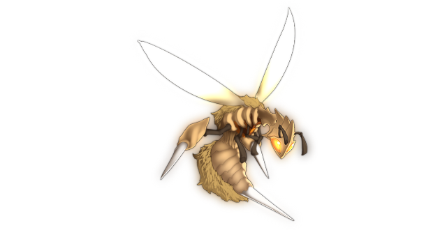

# Great Tree's Paralyzing Wasp

This page explains the strategies employed against Paralyzing Wasp on its boss fight. This includes party composition, which spells to use offensively and defensively, and how the battle should flow, which attacks to watch out for, etc. Since strategies vary greatly from route to route, explanations will be separated accordingly.

[Back to index page](../index.md)

## Quick Summary

The Paralyzing Wasp is an optional boss fight that is part of the Eientei side quest. As the name implies, it focuses heavily on applying PAR on you, and then dealing some damage to finish you off.

## Quick Links
* [AI Script](#script)
* [Attack List](#attacks)
* [Strategies](#strats)
	* [Ame-no-Murakumo (NG)](#ng-murakumo)

## AI Script

* Odd turns:
	* Ultraparalysis Needles (D)
* Even turns:
	* 30% chance to Paralyzing Fog or Row Attack
	* 20% chance to Storm of Yellow Drive or Regular Attack (A)

## Attack List

* **Regular Attack**
	* Basic PHY attack targetting DEF, moderate damage
* **Row Attack**
	* Row version of the regular attack, will hit rightmost slots for barely any damage
* **Storm of Yellow Drive**
	* AoE WND spell targetting MND, deals good damage if weak to WND
* **Paralyzing Fog**
	* AoE WND spell targetting MND, low damage but can PAR entire party
* **Ultravenomous Needles**
	* WND spell targetting DEF, high damage and can PAR target. Will always target leftmost target.

## Strategies

#### Ame-no-Murakumo (NG)

We actually show up near the challenge level here, so this fight ends up being easy, but not completely free like the previous ones in the Eientei side quest. The fight is surprisingly simple, thanks to Nitori and Kasen being completely overpowered:

* Kasen spams Higekiri's Cursed Arm
* Nitori uses Portable Machine 3 times, then Super Scope 3D
* Keine spams Three Treasures - Sword
* Momiji stays PAR'd hopefully

The Wasp does not have enough power to kill Momiji or anyone else, so unless you get very unlucky with Paralysis Fog, you'll always win this.

[Back to index page](../index.md)
