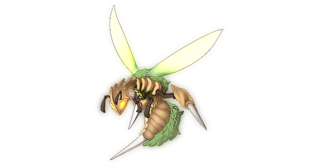

# Great Tree's Poisonous Wasp

This page explains the strategies employed against Poisonous Wasp on its boss fight. This includes party composition, which spells to use offensively and defensively, and how the battle should flow, which attacks to watch out for, etc. Since strategies vary greatly from route to route, explanations will be separated accordingly.

[Back to index page](../index.md)

## Quick Summary

The Poison Wasp is an optional boss fight that is part of the Eientei side quest. As the name implies, it focuses heavily on applying PSN on you, and then dealing some damage to finish you off.

## Quick Links
* [AI Script](#script)
* [Attack List](#attacks)
* [Strategies](#strats)
	* [Ame-no-Murakumo (NG)](#ng-murakumo)

## AI Script

* Odd turns:
	* 60% chance to Ultravenomous Needles
	* 40% chance to Venomous Fog
* Even turns:
	* Storm of Yellow Drive

## Attack List

* **Storm of Yellow Drive**
	* AoE WND spell targetting MND, deals good damage if weak to WND
* **Venomous Fog**
	* AoE NTR spell targetting MND, low damage but can PSN entire party
* **Ultravenomous Needles**
	* NTR spell targetting DEF, high damage and can PSN target

## Strategies

#### Ame-no-Murakumo (NG)

Since we show up completely overlevelled here, we simply nuke her with Nitori's Super Scope 3D and Kasen's Hiigekiri's Cursed Arm and call it a day. The boss might survive and get a turn, but it won't be able to deal much damage.

[Back to index page](../index.md)
