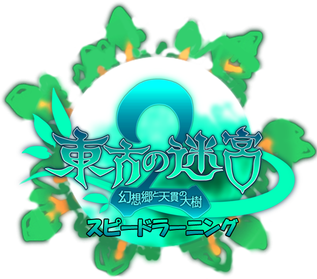

# Touhou Labyrinth 2 Speedrunning

## Quick Links
* [The Speedrun Routes](#speedrun-routes)
* [Character Data and Information](#character-info)
* [Enemy Data and Information](#enemy-info)
* [Item Data and Information](#item-info)
* [Featured Runs](#special-runs)

Huge shoutouts to the [japanese wiki](https://www54.atwiki.jp/thlabyroth2/) for providing maps for most floors, and the [english wiki](https://en.touhouwiki.net/wiki/Labyrinth_of_Touhou_2/) for providing bestiary information, as well as being a great source of general information regarding the game.

## The Speedrun Routes

These are links to the routes for each category. Runs that haven't been routed are crossed out. It will be a loooong time until everything is available.

### New Game
* [Ame-no-Murakumo](routes/ng/murakumo.md)
* ~~Ame-no-Murakumo (Hard mode)~~
* ~~Enhanced Ame-no-Murakumo~~
* ~~All Achievements~~
* ~~Yamata-no-Orochi~~
* ~~Dragon God~~
* ~~Full Power Dragon God~~
* ~~All Plus Achievements~~

### New Game+
* ~~Ame-no-Murakumo~~
* ~~Ame-no-Murakumo (Hard mode)~~
* ~~Enhanced Ame-no-Murakumo~~
* ~~All Achievements~~
* ~~Yamata-no-Orochi~~
* ~~Dragon God~~
* ~~Full Power Dragon God~~
* ~~All Plus Achievements~~

## Character Data and Information

This section talks about speedrun data and information. If you want game-specific data and information, please refer to the [English Wiki](https://en.touhouwiki.net/wiki/Labyrinth_of_Touhou_2/Characters).

#### Starting Characters
* [Reimu Hakurei](chara/reimu.md)
* [Marisa Kirisame](chara/marisa.md)
* [Rinnosuke Morichika](chara/kourin.md)
* [Keine Kamishirasawa](chara/keine.md)

#### First Stratum Characters
* [Momiji Inubashiri](chara/momiji.md)
* [Youmu Konpaku](chara/youmu.md)
* [Kogasa Tatara](chara/kogasa.md)
* [Rumia](chara/rumia.md)
* [Cirno](chara/cirno.md)
* [Minoriko Aki](chara/minoriko.md)
* [Komachi Onozuka](chara/komachi.md)
* [Chen](chara/chen.md)
* [Nitori Kawashiro](chara/nitori.md)
* [Parsee Mizuhashi](chara/parsee.md)

#### Second Stratum Characters
* [Wriggle Nightbug](chara/wriggle.md)
* [Kaguya Houraisan](chara/kaguya.md)
* [Fujiwara no Mokou](chara/mokou.md)
* [Aya Shameimaru](chara/aya.md)
* [Mystia Lorelei](chara/mystia.md)
* [Kasen Ibaraki](chara/kasen.md)
* [Nazrin](chara/nazrin.md)
* [Hina Kagiyama](chara/hina.md)
* [Rin Kaenbyou](chara/rin.md)
* [Utsuho Reiuji](chara/utsuho.md)
* [Satori Komeiji](chara/satori.md)
* [Yuugi Hoshiguma](chara/yuugi.md)

#### Third Stratum Characters
* [Hong Meiling](chara/meiling.md)
* [Alice Margatroid](chara/alice.md)
* [Patchouli Knowledge](chara/patchy.md)
* [Eirin Yagokoro](chara/eirin.md)
* [Reisen Udongein Inaba](chara/reisen.md)
* [Sanae Kochiya](chara/sanae.md)
* [Iku Nagae](chara/iku.md)
* [Suika Ibuki](chara/suika.md)
* [Ran Yakumo](chara/ran.md)

#### Fourth Stratum Characters
* [Remilia Scarlet](chara/remilia.md)
* [Sakuya Izayoi](chara/sakuya.md)
* [Kanako Yasaka](chara/kanako.md)
* [Suwako Moriya](chara/suwako.md)
* [Tenshi Hinanawi](chara/tenshi.md)
* [Flandre Scarlet](chara/flandre.md)

#### Fifth Stratum Characters
* [Yuyuko Saigyouji](chara/yuyuko.md)
* [Yuuka Kazami](chara/yuuka.md)
* [Yukari Yakumo](chara/yukari.md)
* [Byakuren Hijiri](chara/byakuren.md)
* [Shikieiki Yamaxanadu](chara/eiki.md)

#### Post-game Characters
* ~~Renko Usami~~
* ~~Maribel Hearn~~

#### Plus Disk Characters
* ~~Shou Toramaru~~
* ~~Mamizou Futatsuiwa~~
* ~~Mononobe no Futo~~
* ~~Toyosatomimi no Miko~~
* ~~Hata no Kokoro~~
* ~~Tokiko~~
* ~~Koishi Komeiji~~
* ~~Hieda no Akyuu~~

## Enemy Data and Information

This section talks about speedrun data and information. If you want game-specific data and information, please refer to the English Wiki [dungeon section](https://en.touhouwiki.net/wiki/Labyrinth_of_Touhou_2/Dungeons) and [bestiary](https://en.touhouwiki.net/wiki/Labyrinth_of_Touhou_2/Bestiary).

#### First Stratum Enemies
* [Random Encounters](enemy/trash1.md)
* ~~Malignut Eater~~
* [Youmu Konpaku](enemy/youmu.md)
* [Chrysomallos](enemy/chrysomallos.md)
* ~~Alice's Doll~~
* [Kaguya Houraisan](enemy/kaguya.md)
* [Lesser Golem](enemy/lessergolem.md)
* [Alaya-Vijnana](enemy/alayavijnana.md)
* [Great Tree's Poisonous Wasp](enemy/poisonwasp.md)
* [Komachi Onozuka](enemy/komachi.md)

#### Second Stratum Enemies
* [Random Encounters](enemy/trash2.md)
* ~~Lamprey Serpent~~
* ~~Alice's Remote Doll~~
* [Great Tree's Paralysing Wasp](enemy/parawasp.md)
* [Fujiwara no Mokou](enemy/mokou.md)
* ~~Siren of Silence~~
* ~~Philosopher's Stone - Fire~~
* [Kraken](enemy/kraken.md)
* [Hina Kagiyama](enemy/hina.md)
* ~~Yuugi Hoshiguma~~
* ~~Philosopher's Stone - Water~~
* ~~Philosopher's Stone - Wind~~
* [Blue Orchid](enemy/orchid.md)
* [Tenshi Hinanawi](enemy/tenshi.md)

#### Third Stratum Enemies
* [Random Encounters](enemy/trash3.md)
* ~~Philosopher’s Stone - Earth~~
* ~~Philosopher’s Stone - Mystic~~
* ~~Giant Tree~~
* ~~Jungle’s Demonic Eye~~
* ~~Alice Margatroid~~
* ~~Violet Ada-Bana~~
* [Iku Nagae](enemy/iku.md)
* ~~Ran Yakumo~~
* [Tenshi Hinanawi](enemy/tenshi2.md)

#### Fourth Stratum Enemies
* [Random Encounters](enemy/trash4.md)
* [Desert Weapon - Gold Hymn](enemy/goldhymn.md)
* [Desert Weapon – Silver Mail](enemy/silvermail.md)
* [Sakuya Izayoi and Remilia Scarlet](enemy/sakuremi.md)
* [Divine Beasts' Golden Mirror](enemy/mirror.md)
* [Magatama of Amber Fangs](enemy/magatama.md)
* [Tenshi Hinanawi](enemy/tenshi3.md)
* ~~Flandre Scarlet~~

#### Fifth Stratum Enemies
* [Random Encounters](enemy/trash5.md)
* [Memorized Knowledge](enemy/knowledge.md)
* [Yuyuko Saigyouji](enemy/yuyuko.md)
* ~~Burning Hell's Lava Dragon~~
* [Glowing Azure Giant](enemy/azuregiant.md)
* [Yukari Yakumo](enemy/yukari.md)
* [Yuuka Kazami](enemy/yuuka.md)
* ~~Shikieiki Yamaxanadu~~

#### Sixth Stratum Enemies
* [Random Encounters](enemy/trash6.md)
* [Black Goddess of Fertility](enemy/goddess.md)
* ~~Taur Magician~~
* [Golden Orb Trio](enemy/goldenorbs.md)

#### Final Stratum Enemies
* [Random Encounters](enemy/trash7.md)
* [Random Encounters (Depths)](enemy/trash8.md)
* [Mirror of the High God](enemy/highmirror.md)
* [Magatama of the High God](enemy/highmagatama.md)
* [Ame-no-Murakumo](enemy/murakumo.md)

## Item Data and Information

#### Special Items
* [Treasure Chest Keys and Locked Chests](item/lockedchest.md)
* [Subclasses and Stones of Awakening](item/subclass.md)

#### Equipment
* [Useful Equipment](item/equipment.md)
* [Materials and Crafting](item/material.md)

#### Miscellaneous
* [Useful Enemy Drop Rates](item/drop.md)
* [Treasure Chest Listing](item/chests.md)
* [Achievements](item/achievements.md)

## Featured Runs

| Time | IGT | Runner | Category | Video | Date | Description |
| :---: | :---: | :---: | :---: | :---: | :---: | :---: |
| 5h35m34s | 4h48m00s | Thurler | (NG) Ame-no-Murakumo | [Link](https://www.youtube.com/watch?v=99ujqlHXi6Y) | Jan 18 2026 | Current WR for category |
| 9h56m38s | 9h03m20s | Thurler | (NG) Ame-no-Murakumo | [Link](https://www.youtube.com/watch?v=Pa1MW8tVAVw) | Jan. 25 2020 | First single segment run for category |
| 9h55m00s | 9h16m15s | Thurler | (NG) Ame-no-Murakumo | [Link](https://www.youtube.com/playlist?list=PL3eHe2wxlYthwfDU034a04rrQhHcN_bQ5) | Jan. 24 2020 | Segmented run used as a proof of concept for the route |
