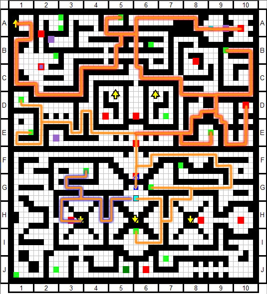
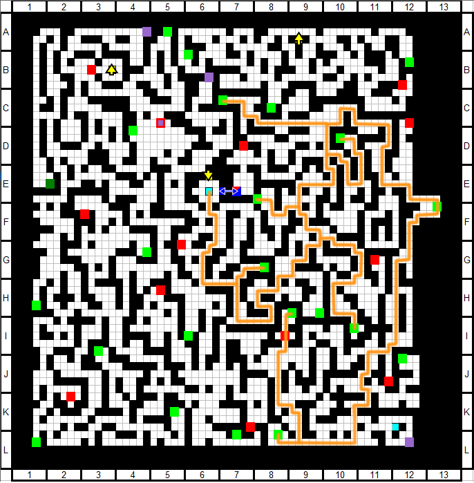
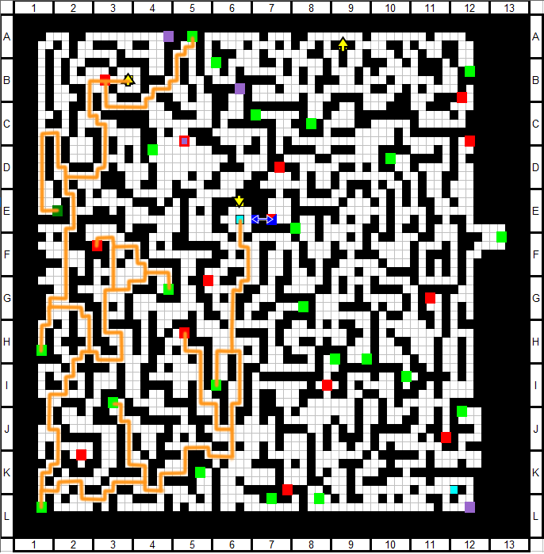
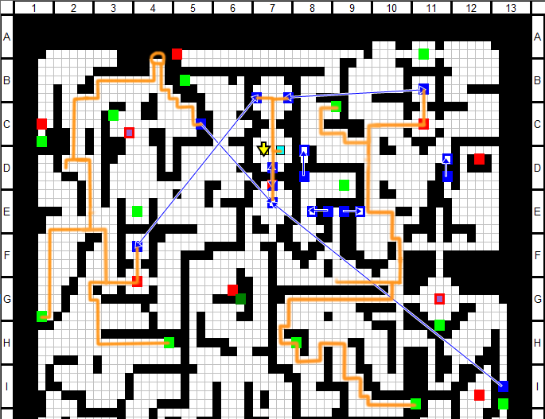
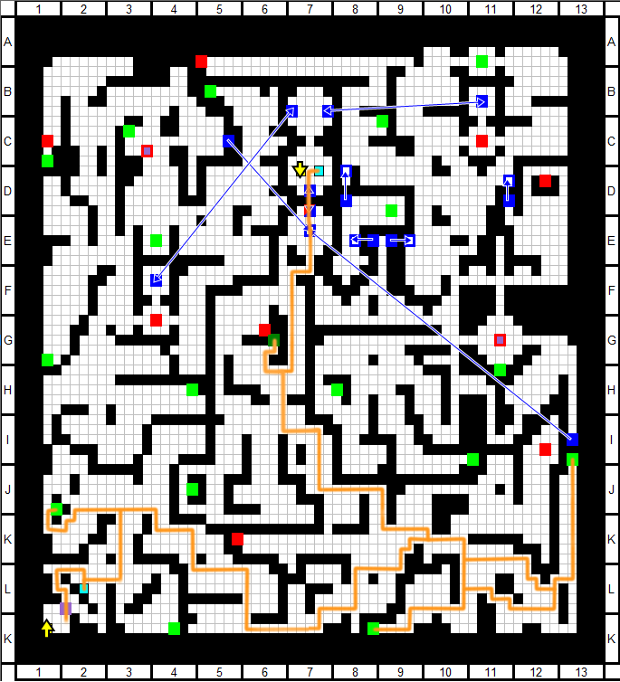
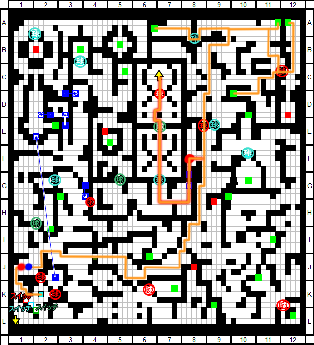
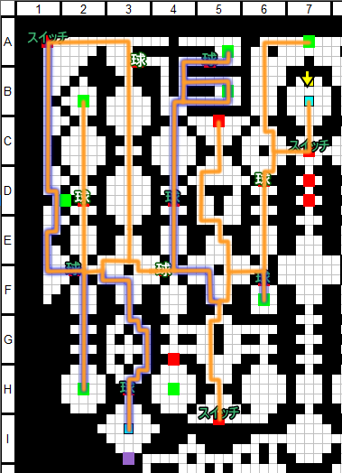
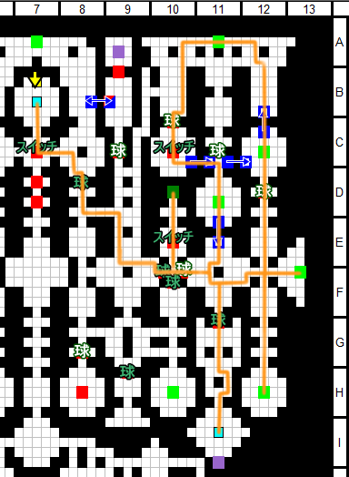
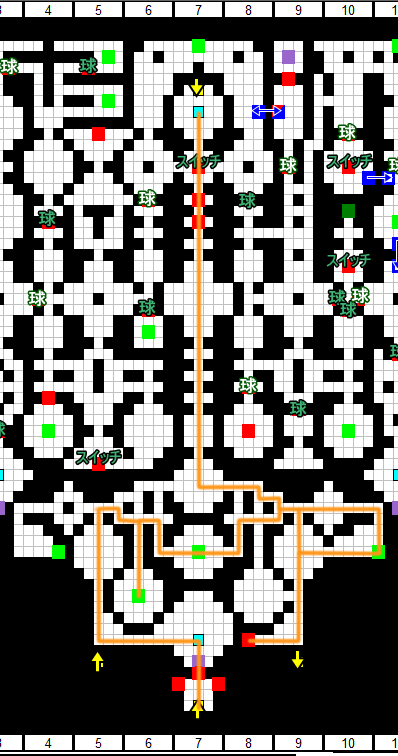

# Beat Ame-no-Murakumo (NG)

**Timer starts on** selecting New Game on title screen

**Timer ends on** fade to black after Murakumo fight battle results screen

[Back to index page](../../index.md)

## Quick Links
* [Grass Stratum](#Header-1) (1F ~ 3F)
	* [Explore 1F](#Header-1-1)
	* [Youmu Fight](#Header-1-2)
	* [Explore 2F (Part 1)](#Header-1-3)
	* [Chrysomallos Fight](#Header-1-4)
	* [Explore 2F (Part 2)](#Header-1-5)
	* [Explore 3F](#Header-1-6)
	* [Alaya-Vijana Fight](#Header-1-7)
	* [Komachi Fight](#Header-1-8)
* [Ocean Stratum](#Header-2) (4F ~ 6F)
	* [Explore 4F](#Header-2-1)
	* [Explore 5F](#Header-2-2)
	* [Wriggle Side Quest](#Header-2-3)
	* [Hina Fight](#Header-2-4)
	* [Explore 6F](#Header-2-5)
	* [Kraken Fight](#Header-2-6)
	* [Blue Orchid Fight](#Header-2-7)
	* [Mokou Side Quest](#Header-2-8)
	* [Tenshi 1 Fight](#Header-2-9)
* [Jungle Stratum](#Header-3) (7F ~ 9F)
	* [Explore 7F](#Header-3-1)
	* [Explore 8F (Part 1)](#Header-3-2)
	* [Iku Fight](#Header-3-3)
	* [Explore 8F (Part 2)](#Header-3-4)
	* [Explore 9F](#Header-3-5)
	* [Tenshi 2 Fight](#Header-3-6)
* [Desert Stratum](#Header-4) (10F ~ 12F)
	* [Explore 10F](#Header-4-1)
	* [Gold Hymn Fight](#Header-4-2)
	* [Remilia & Sakuya Fight](#Header-4-3)
	* [Explore 11F](#Header-4-4)
	* [Explore 12F](#Header-4-5)
	* [Golden Mirror Fight](#Header-4-6)
	* [Magatama Fight](#Header-4-7)
	* [Tenshi 3 Fight](#Header-4-8)
* [Fire Stratum](#Header-5) (13F ~ 15F)
	* [Explore 13F (Part 1)](#Header-5-1)
	* [Explore 14F (Part 1)](#Header-5-2)
	* [Memorized Knowledge Fight](#Header-5-3)
	* [Explore 13F (Part 2)](#Header-5-4)
	* [Explore 14F (Part 2)](#Header-5-5)
	* [Explore 15F](#Header-5-6)
	* [Azure Giant Fight](#Header-5-7)
	* [Yuuka Side Quest](#Header-5-8)
	* [Yuyuko Fight](#Header-5-9)
	* [Yukari Fight](#Header-5-10)
* [Dark Stratum](#Header-6) (16F ~ 18F)
	* [Explore 16F](#Header-6-1)
	* [Explore 17F (Part 1)](#Header-6-2)
	* [Goddess of Fertility Fight](#Header-6-3)
	* [Explore 17F (Part 2)](#Header-6-4)
	* [Explore 18F](#Header-6-5)
	* [Golden Orbs Fight](#Header-6-6)
* [Heaven Stratum](#Header-7) (19F ~ 20F)
	* [Explore 19F North / 20F West](#Header-7-1)
	* [Explore 19F South / 20F East](#Header-7-2)
	* [High Mirror Fight](#Header-7-3)
	* [High Magatama Fight](#Header-7-4)
	* [Explore 20F Depths](#Header-7-5)
	* [Ame-no-Murakumo](#Header-7-6)

# Grass Stratum (1F ~ 3F)

## Explore 1F

* Start the game and hold Z to skip text, say no to NG+ and Hard mode
* Go into Akyuu's house to get **Treasure Chest Key x1**
* Open the menu and take the following actions:
	* Form Change: **Kourin / Keine / Reimu / Marisa**
	* Learn Skills:
		* **Kourin**: Shopkeeper Lv0 -> Lv3
* Enter the dungeon (1F)

* Right after you open the locked treasure chest, do this menu:
	* **Keine** equips **Piece of Heart** / **Purple Metallic Armor**
	* **Reimu** equips **Biggest Sword Ever** / **Symbol of Faith**
	* **Marisa** equips **Mana Flower**
* Once you reach the destination on second map, farm until wipe

* Back to Gensokyo, use these facilities:
	* **Hakurei Shrine**: Level All Characters
	* **Human Village**: Include Momiji in party (slot 5)
* Open the menu and take the following actions:
	* Form Change: **Momiji / Keine / Reimu / Marisa**
	* Equipment:
		* **Keine** unequips **Purple Metallic Armor** / **Piece of Heart**
		* **Momiji** equips **Purple Metallic Armor** / **Piece of Heart** / **Power Bracer**
		* **Marisa** equips **Cypress Stick** / **Cantrip Book**
	* Learn Skills:
		* **Keine**: MP Boost Lv0 -> Lv2
		* **Marisa**: MP Boost Lv0 -> Lv2
		* **Kourin**: Shopkeeper Lv3 -> Lv4
* Level reference: Reimu 2
* Enter the dungeon (1F)

* **Boss Fight - Chen Encounter (Lv4)**
	* Momiji spams Expellee's Canaan
	* Keine spams 3ST - Sword
 	* Reimu spams Fantasy Seal
	* Marisa uses Master Spark
* When you reach the destination, farm until wipe

## Youmu Fight

* Do the following menu after re-entering the dungeon:
	* Form Change: **Marisa**
* Move up towards Youmu fight and wipe 11/12 times to get Kasen

* Back at Gensokyo, visit the following facilities:
	* **Hakurei Shrine**: Level All Characters
	* **Human Village**: Include Kasen in party (slot 6)
* Open the menu and take the following actions:
	* Form Change: **Momiji / Kasen / Keine / Reimu**
	* Equipment:
		* **Reimu** unequips **Biggest Sword Ever**
		* **Kasen** equips **Biggest Sword Ever** / **Bulletproof Armor** / **Bludgeon**
	* Learn Skills:
		* **Reimu**: Yin-Yang Orb Lv1 -> Lv2
		* **Kourin**: Shopkeeper Lv4 -> Lv5
* Level reference: Reimu 3
* Enter the dungeon (1F)

* Move up to Youmu's boss icon and fight her
* **Boss Fight - Youmu Konpaku (Lv5)**
	* Kasen spams Higekiri's Cursed Arm
	* Reimu uses Great Hakurei Barrier once
	* Keine spams 3ST - Sword
	* Momiji does Attack -> Switch Reimu for Marisa -> Rabies Bite
	* Marisa spams Magic Missile
	* For finer details see Youmu's [Boss Info](../../enemy/youmu.md)
* Exit the dungeon when you beat Youmu

## Explore 2F (Part 1)

* Back at Gensokyo, visit the following facilities:
	* **Hakurei Shrine**: Level All Characters, apply bonus
		* Reimu, Marisa MAG
		* Kourin, Keine, Momiji HP
		* Youmu, Kasen ATK
	* **Human Village**: Include Youmu in party (slot 9)
	* **Nitori Shop**: Buy 2 Manga Meat
* Open the menu and take the following actions:
	* Form Change: **Momiji / Keine / Reimu / Marisa**
	* Equipment:
		* **Reimu** equips **Uniform of Exorcism** (if you got the 25% drop)
	* Learn Skills:
		* **Kourin**: Shopkeeper Lv5 -> Lv6
		* **Kasen**: Guts Lv0 -> Lv1
		* **Youmu**: Netherworld Dweller Lv0 -> Lv1
* Level reference: Reimu 4
* Enter the dungeon (1F)

* When you reach the destination, farm until wipe

## Chrysomallos Fight

* Back at Gensokyo, visit the following facilities:
	* **Hakurei Shrine**: Level All Characters, apply new bonus
		* Rumia MAG
		* Cirno ATK
	* **Human Village**: Include Rumia and Cirno in party (slots 7 and 8)
	* **Nitori Shop**: Buy 1 Cypress Stick
* Open the menu and take the following actions:
	* Form Change: **Momiji / Kasen / Keine / Reimu**
	* Equipment:
		* **Kasen** equips **Cypress Stick**
	* Learn Skills:
		* **Kourin**: Shopkeeper Lv6 -> Lv7
		* **Rumia**: Piercing Attack Lv0 -> Lv1
		* **Cirno**: Icicle Fall Lv1 -> Lv2
* Level reference: Reimu 6
* Enter the dungeon (2F)

* **FOE Boss Fight - Chrysomallos (Lv9)**
	* Kasen spams Higekiri's Cursed Arm
	* Reimu uses Great Hakurei Barrier once
	* Keine spams 3ST - Sword
	* Momiji does switching as needed
	* Marisa uses Buff -> Buff -> MP Heal -> Master Spark
		* If Marisa gets TRR just spam Magic Missile
	* Reimu and Rumia can also deal reliable damage
	* For finer details see Chrysomallos' [Boss Info](../../enemy/chrysomallos.md)
* Keep going up and take the north treasure in 1F, then exit the dungeon

## Explore 2F (Part 2)

* Back at Gensokyo, visit the following facilities:
	* **Hakurei Shrine**: Level All Characters
* Open the menu and take the following actions:
	* Form Change: **Momiji / Kasen / Reimu / Marisa**
	* Equipment:
		* **Reimu** equips **DX Mechamonkey Model** / **Crepe Mariette**
		* **Marisa** equips **Crepe Mariette**
	* Learn Skills:
		* **Kourin**: Shopkeeper Lv7 -> Lv8
* Level reference: Reimu 6
* Enter the dungeon (2F)

* When you reach 3F, take the relay point and farm on rare spot until wipe
* When you're done grinding, go back to Gensokyo

## Explore 3F

* Back at Gensokyo, visit the following facilities:
	* **Hakurei Shrine**: Level All Characters, apply all bonuses
	* **Nitori Shop**: Buy 1 Cypress Stick
* Open the menu and take the following actions:
	* Equipment:
		* **Momiji** equips **Cypress Stick** / **Sirloin** over Piece of Heart
		* **Kasen** equips **Bludgeon** over Bulletproof Armor
		* **Reimu** equips **Light Crystal** over Crepe Mariette
	* Learn Skills:
		* **Momiji**: Accelerate Lv0 -> Lv1
		* **Kourin**: Shopkeeper Lv8 -> Lv10
		* **Rumia**: Piercing Attack Lv1 -> Lv2
		* **Cirno**: Icicle Fall Lv2 -> Lv3
* Level reference: Reimu 7
* Enter the dungeon (3F)

* **Boss Fight - Chen Encounter (Lv6)**
	* Just beat it with what you have
* Exit the dungeon back to Gensokyo

## Alaya-Vijnana Fight

* Back at Gensokyo, visit the following facilities:
	* **Hakurei Shrine**: Level All Characters, apply new bonus
		* Minoriko MAG
	* **Human Village**: Include Minoriko in party (slot 10)
* Open the menu and take the following actions:
	* Equipment:
		* **Marisa** equips **Glow Crystal** over Cantrip Book
* Level reference: Reimu 9
* Enter the dungeon (3F)

* **Boss Fight - Chen Encounter (Lv10)**
	* Just beat it with what you have
* Before entering the fight with Alaya-Vijana, do the following menu:
* Form Change: **Momiji / Kasen**
* **Boss Fight - Alaya-Vijnana (Lv11)**
	* Yukari spams Shikigami: Ran Yakumo+
	* Yuyuko spams Ghostly Dream's Butterfly, ends with Saigyouji Flawless Nirvana
* Exit the dungeon back to Gensokyo

## Komachi Fight

* Back at Gensokyo, visit the following facilities:
	* **Hakurei Shrine**: Level All Characters
	* **Nitori Shop**:
		* Forge Crepe Mariette, Piche's Bauble, whatever else you can
		* Count how many forges you have, need 10 total on next trip
* Level reference: Reimu 10
* Enter the dungeon (3F)

* When you reach the relay point, farm 60 battles in 1F
* Prolong grind if you don't have materials for 10 total crafts

* Back at Gensokyo, visit the facilities:
	* **Nitori Shop**:
		* Forge until you recruit Nitori
		* Buy **Cypress Stick x1**
	* **Human Village**: Include Nitori in party (slot 11)
	* **Magic Library**:
		* ** Reset Kourin**
		* **Reimu**: HP/DEF/MND Lv0 -> Lv10
		* **Momiji**: HP/DEF Lv0 -> Lv20
		* **Nitori**: ATK Lv0 -> Lv40
		* **Kasen**: HP/DEF/MND Lv0 -> Lv10
	* **Hakurei Shrine**: Level All Characters, apply all bonuses
		* Nitori ATK
		* Use **Training Manual x3** on **Nitori**
* Open the menu and take the following actions:
	* Form Change: **Momiji / Keine / Reimu / Nitori**
	* Equipment:
		* **Marisa** equips **Miko Board** over Cypress Stick
		* **Momiji** equips **Courtesan's Sorrow** over Power Bracer
		* **Keine** equips **Heater Muffler** / **Gokiri's Charm** / **Lucky Horseshoe**
		* **Reimu** equips **Cypress Stick** / **Super-Hard Rye Bread** over DX Mechamonkey Model
		* **Nitori** equips **Cypress Stick** / **Wash Basin Set** / **DX Mechamonkey Model** / **Power Bracer**
		* **Rumia** equips **Piche's Bauble x2** / **Crepe Mariette**
		* **Youmu** equips **Piece of Heart x2** / **Bulletproof Armor**
		* **Minoriko** equips **Mana Flower** / **Cantrip Book** / **Crepe Mariette**
	* Learn Skills:
		* **Keine**: 3ST - Sword Lv1 -> Lv2
		* **Reimu**: MP Boost Lv0 -> Lv1 / Armored Yin-Yang Orb Lv0 -> Lv1
		* **Nitori**: Maintenance Lv0 -> Lv1
		* **Kourin**: Effective Formation Change Lv0 -> Lv2
		* **Kasen**: Guts Lv1 -> Lv2
		* **Youmu**: Netherworld Dweller Lv1 -> Lv2
		* **Minoriko**: Rapid Charge Lv0 -> Lv1
		* **Marisa**: MP Boost Lv2 -> Lv5
* Level reference: Reimu 10
* Enter the dungeon (3F Center)

* **Boss Fight - Komachi Onozuka (Lv12)**
	* **Phase 1 - Buffing**
		* Momiji attacks to delay turn
		* Nitori spams Portable Machine
		* Keine uses 3ST - Sword
		* Reimu uses Great Hakurei Barrier
		* Momiji swaps Nitori for Kasen
	* **Phase 2 - Kasen**
		* Keine spams 3ST - Sword
		* Reimu uses Exorcising Border
		* Kasen spams Diving Waltz of the Raijuu
		* Momiji swaps Keine with Kasen
		* Momiji swaps Reimu with Minoriko
		* Minoriko juggles buff/heal/damage
	* **Phase 3 - Kourin/Nitori**
		* Momiji swaps no MP Keine with Cirno
		* Cirno uses Icicle Fall
		* Minoriko swaps self with Kourin
		* Momiji swaps no MP Kasen with Youmu
		* Kourin swaps Cirno with Nitori
		* Nitori spams Extending Arm
		* Momiji/Kourin combo swap Nitori to renew her ATB
	* **Phase 4 - Narrow Confines of Avici**
		* Swap Nitori for Reimu when Komachi below 40%
		* Reimu uses Great Hakurei Barrier
		* Tank the Confines of Avici
		* Resume combo swap with Nitori
	* For finer details see Komachi' [Boss Info](../../enemy/komachi.md)
* Take the stairs to 4F, get the relay point and exit the dungeon

# Ocean Stratum (4F ~ 6F)

## Explore 4F

* Back at Genokyo, visit these facilities:
	* **Hakurei Shrine**: Level All Characters, apply new bonus
		* Komachi HP
	* **Human Village**: Include Komachi in party (slot 12)
* Open the menu and take the following actions:
	* Form Change: **Komachi / Kasen / Minoriko / Nitori**
	* Equipment:
		* **Momiji** unequips all but Purple Metallic Armor
		* **Komachi** equips **Sirloin**
		* **Minoriko** equips **Cypress Stick**
	* Learn Skills:
		* **Komachi**: Shinigami Work Lv0 -> Lv1 / Ferry Wages Lv0 -> Lv2
* Level reference: Nitori 11
* Enter the dungeon (4F)

* After getting the 2 treasures on northwest, do red outline path
* After reaching 5F, do the blue outline path
* Before going down to 3F, farm until frontline is out of MP

## Explore 5F

* Back at Genokyo, visit these facilities:
	* **Hakurei Shrine**: Level All Characters, apply all bonuses
* Open the menu and take the following actions:
	* Equipment:
		* **Nitori** equips **Getitup V** over Power Bracer
		* **Reimu** equips **Ultrafast Granite Keystone** over Light Crystal
		* **Marisa** equips **Light Staff** over Crepe Mariette
		* **Komachi** equips **Violent Green Rupee** / **Light Crystal**
	* Learn Skills:
		* **Komachi**: Ferry Wages Lv2 -> Lv4
		* **Minoriko**: Ability Control Harvests Lv0 -> Lv1
		* **Rumia**: Darkness Manipulation Lv0 -> Lv1
		* **Keine**: 3ST - Sword Lv2 -> Lv3
		* **Reimu**: MP Boost Lv1 -> Lv2
		* **Marisa**: Magic Training Lv0 -> Lv1
* Level reference: Nitori 13
* Enter the dungeon (5F)

* When you reach the warp, go back to Gensokyo
* When you reach the destination, farm as much as you can

## Wriggle Side Quest

* When you're back to Gensokyo, visit the facilities:
	* **Hakurei Shrine**: Level All Characters
		* Use **Tome of Insight - Vitality** on **Kourin**
* Open the menu and take the following actions:
	* Form Change: **Momiji / Kasen / Keine / Nitori**
	* Equipment:
		* **Nitori** equips **Biggest Sword Ever** over DX Mechamonkey Model
		* **Reimu** equips **Flipskirt Dagger** over Super-Hard Rye Bread
		* **Minoriko** equips **Super-Hard Rye Bread** over Cantrip Book
	* Learn Skills:
		* **Nitori**: Kappa Ecology Observation Lv0 -> Lv1
		* **Kourin**: HP High Boost Lv0 -> Lv1
		* **Reimu**: MP Boost Lv2 -> Lv4
		* **Komachi**: Ferry Wages Lv4 -> Lv6
* Level reference: Nitori 16
* Enter the dungeon (2F Center)

* Go up and fight Kaguya as a boss
* **Boss Fight - Kaguya Houraisan (Lv8)** 
	* Spam highest damage spells, you're overlevelled
* Exit the dungeon and enter back on (3F)

* Move back to 2F and go south for Eirin event
* Exit the dungeon and enter back on (3F)

* Follow the path south, then head west for Wriggle event
* Exit the dungeon and enter back on (3F Center)

* Take the shortcut to the right and fight the Wasp
* **Boss Fight - Great Tree's Poisonous Wasp (Lv11)**
	* Spam highest damage spells, you're overlevelled
* Exit the dungeon and enter back on (4F)

* Head north then west on upper area, then fight the Wasp
* **Boss Fight - Great Tree's Paralyzing Wasp (Lv15)**
	* Momiji just tanks hits and attacks, will probably stay PAR'd
	* Kasen spams Higekiri's Cursed Arm
	* Keine spams 3ST - Sword
	* Nitori buff x3 -> Super Scope
	* For finer details see Para Wasp's [Boss Info](../../enemy/parawasp.md)
* Head back to Gensokyo and enter the dungeon on (3F)

* Go talk to Eirin on 2F
* Head back to Gensokyo and enter the dungeon on (3F Center)

* Move southeast to get Reisen event
* Go talk to Wriggle and finally recruit her
* Head back to Gensokyo and enter the dungeon on (1F)

* Recruit Parsee and go back to Gensokyo

## Hina Fight

* When you're back at Gensokyo, use these facilities:
	* **Hakurei shrine**: Level All Characters, apply bonus
		* Ignore Youmu and Cirno
		* Parsee to MND
	* **Magic Library**:
		* **Parsee**: HP/MND Lv0 -> Lv30
		* **Kasen**: HP/DEF Lv10 -> Lv20
	* **Human Village**:
		* Swap **Youmu -> Wriggle**
		* Swap **Cirno -> Parsee**
	* **Nitori Shop**:
		* Buy **Cypress Stick, Mad Milk, Booster v0.8**
* Open the menu and take the following actions:
	* Form Change: **Parsee / Rumia / Reimu / Wriggle**
	* Equipment:
		* **Parsee** equips **Shoes of Happiness** / **Love Machine 3322** / **Symbol of Faith** / **Crepe Mariette**
		* **Rumia** equips **Glow Crystal** (if dropped by Kaguya) over Piche's Bauble
		* **Wriggle** equips **Booster v0.8  x2** / **Bone Stake**
		* **Kasen** equips **DX Mechamonkey Model** over Bludgeon
		* **Momiji** equips **Bludgeon** / **Heater Muffler**
		* **Komachi** equips **Mad Milk**
	* Learn Skills:
		* **Parsee**: Final Blow Lv0 -> Lv2 / Flames of Jealousy Lv0 -> Lv1
		* **Komachi**: Ferry Wages Lv6 -> Lv7
* Level reference: Reimu 16
* Enter the dungeon (5F South)

* **Boss Fight - Hina Kagiyama (Lv20)**
	* **Wriggle cannot die turn 1**
	* Parsee sponges all the hits and does the switching
	* Wriggle spams Comet on Earth
	* **Sacrifice Rumia, Marisa and Keine at start**
	* Watch Hina's ATB to switch in Minoriko to buff/heal
		* Reimu can also buff/heal and tank a hit
	* On Biorhythm of Misfortune God, cast Midnight Anathema Ritual
	* On second cast of biorhythm, damage race
	* For finer details see Hina's [Boss Info](../../enemy/hina.md)
* Go up and take the 6F relay, then go back to Gensokyo

## Explore 6F

* When you're back at Gensokyo, open the menu and take these actions:
	* Form Change: **Komachi / Kasen / Nitori / Rumia**
* Enter the dungeon (3F Center)

* **FOE Boss Fight - Lesser Golem (Lv14)**
	* Spam strongest moves, you're overlevelled
* Recruit **Chen** and take treasures
* Go back to Gensokyo and re-enter the dungeon through (4F)

* Move all the way east to recruit **Aya**

* Go back to Gensokyo and use these facilities:
	* **Hakurei shrine**: Level All Characters, apply new bonus
		* Switch **Parsee** bonus to ATK
		* Chen, Aya ATK
	* **Human Village**:
		* Swap **Kourin -> Chen**
		* Swap **Keine -> Aya**
		* Unequp non-party characters
	* **Nitori Shop**:
		* Buy **Cypress Stick x2**
*  Open the menu and take the following actions:
	* Form Change: **Komachi / Kasen / Nitori / Aya**
	* Equipment:
		* **Wriggle** unequips **Everything**
		* **Aya** equips **Cypress Stick** / **Booster v0.8** / **Bone Stake** (x2 if Komachi dropped)
		* **Chen** equips **Cypress Stick** / **Booster v0.8** / **Power Bracer**
	* Learn Skills:
		* **Komachi**: Ferry Wages Lv7 -> Lv8
		* **Aya**: ATK Boost Lv0 -> Lv4 / Gensokyo's Fastest Lessons Lv0 -> Lv2
		* **Chen**: Instant Attack Lv0 -> Lv1
* Level reference: Nitori 17
* Enter the dungeon (6F)

* When you reach the destination, backtrack to 5F part with FOE and farm
* Go back to Gensokyo after farming and visit the facilities:
	* **Hakurei shrine**: Level All Characters, apply bonus
		* Reimu, Marisa
		* Momiji, Rumia, Minoriko
		* Komachi, Chen
		* Nitori, Parsee
		* Wriggle, Aya, Kasen
	* **Nitori Shop**:
		* Forge **Getitup V**
*  Open the menu and take the following actions:
	* Equipment:
		* **Kasen** equips **Getitup V** over Bludgeon
		* **Nitori** equips **Blade Cuisinart** over Biggest Sword Ever
		* **Aya** equips **Pale Wing Thruster** (over Booster if needed)
		* **Chen** equips **Biggest Sword Ever** / **Bone Stake** over Power Bracer
	* Learn Skills:
		* **Komachi**: Ferry Wages Lv8 -> Lv10
		* **Kasen**: Impact Attack Lv0 -> Lv1
		* **Nitori**: Kappa Ecology Observation Lv0 -> Lv1
		* **Minoriko**: Ability Control Harvests Lv1 -> Lv2
		* **Reimu**: MP Boost Lv4 -> Lv5
		* **Rumia**: Darkness Manipulation Lv1 -> Lv2
		* **Marisa**: Magic Training Lv1 -> Lv2
		* **Parsee**: MP Boost Lv0 -> Lv1 / Flames of Jealousy Lv1 -> Lv2
* Level reference: Nitori 20
* Enter the dungeon (6F Center)

* When you reach the destination, simply go back to Gensokyo

## Kraken Fight

* When you're back to Genokyo, visit the facilities:
	* **Magic Library**: 
		* **Wriggle** learns **Toxicologist** subclass
* Open the menu and take the following actions:
	* Form Change: **Momiji / Kasen / Nitori / Parsee**
	* Equipment:
		* **Chen** unequips **Biggest Sword Ever**
		* **Parsee** equips **Cypress Stick** / **Biggest Sword Ever** over Shoes of Happiness / Love Machine 3322
		* **Momiji** equips **Love Machine 3322** / **Lv70 Lover Snapper's Scale** over Bludgeon / Heater Muffler
	* Learn Skills:
		* **Wriggle**: Enhanced Toxins Lv0 -> 2 / Numbling Incense Lv0 -> Lv3
* Enter the dungeon (5F)

* Take the shortcut and go northwest to fight the Kraken
* **Boss Fight - Kraken (Lv19)**
	* Kasen spams Higekiri's Cursed Arm
	* Parsee spams Jealousy of the Kind and Lovely
	* Nitori self buffs and then uses Super Scope 3D
	* Momiji swaps Kasen and Parsee with Chen for Instant Attack pivoting
	* Keine can join to buff if Nitori dies
	* For finer details see Kraken's [Boss Info](../../enemy/kraken.md)
* Exit the dungeon and go back to Gensokyo

## Blue Orchid Fight

* When you're back at Gensokyo, take the following actions:
	* Form Change: **Kasen / Wriggle / Aya / Parsee**
* Enter the dungeon (6F)

* Take the lower shortcut and fight the Orchid boss
* **Boss Fight - Blue Orchid (Lv23)**
	* Aya uses DGA on Wriggle to inflict HVY
	* Wriggle then switches herself out for Nitori
	* Kasen and Parsee do the TRR combo
	* Aya and Nitori swap Kasen/Parsee with Chen for IA pivoting
	* For finer details see Blue Orchid's [Boss Info](../../enemy/orchid.md)
* Go back to Gensokyo

## Mokou Side Quest

* When back at Gensokyo and use these facilities:
	* **Magic Library**: 
		* **Reset Nitori / Wriggle**
		* **Chen** learns **Warrior** subclass
		* **Chen**: ATK Lv0 -> Lv30
	* **Human Village**:
		* Swap **Rumia -> Keine**
* Open the menu and take the following action:
	* Form Change: **Komachi / Kasen / Nitori / Keine**
	* Learn Skills:
		* **Nitori**: Maintenance Lv0 -> Lv1 / Ability to Manip Water Lv0 -> Lv2
* Enter the dungeon (4F Northeast)

* Go up and fight Mokou as a boss
* **Boss Fight - Mokou Fujiwara (Lv17)**
	* Switch things in if anyone dies
	* Komachi spams Narrow Confines of Avici
	* Kasen spams Diving Waltz of the Raijuu
	* Nitori spams Kappa's Waterfall
	* Keine spams 3ST - Sword
	* After Mokou resurrects, switch in Marisa for Master Spark
	* For finer details see Mokou's [Boss Info](../../enemy/mokou.md)
* Go back to Gensokyo and re-enter through (5F)

* Go down and see the event with Mokou and Kaguya
* **CHOOSE MOKOU** (Just hold A)
* Keep going and recruit Satori
* Retreat to Gensokyo with your new allies

## Tenshi 1 Fight

* When you're back, use these facilities:
	* **Hakurei shrine**: Level All Characters, apply new bonus
		* Mokou ATK
		* Utsuho MAG
	* **Human Village**:
		* Swap **Minoriko -> Rumia**
		* Swap **Wriggle -> Mokou**
		* Swap **Keine -> Utsuho**
		* Unequip non-party characters
	* **Nitori Shop**:
		* Buy **Cypress Stick x1**
* Open the menu and take the following actions:
	* Form Change: **Komachi / Utsuho / Nitori / Chen**
	* Equipment:
		* **Parsee** equips **Shoes of Happiness** over Cypress Stick and unequips **Biggest Sword Ever**
		* **Utsuho** equips **Cypress Stick** / **Mana Flower** / **Cantrip Book**
		* **Chen** equips **Biggest Sword Ever**
		* **Mokou** equips **Cypress Stick** / **Piece of Heart** / **Purple Metallic Armor** / **Super-Hard Rye Bread**
	* Learn Skills:
		* **Utsuho**: MP Boost Lv0 -> Lv5 / Blazing Lv0 -> Lv2
		* **Chen**: Enhanced Row Attack Lv0 -> Lv3
		* **Momiji**: Instant Attack: Lv0 -> Lv1
		* **Mokou**: Resurrection Lv0 -> Lv2 / Blazing Lv0 -> Lv2
* Level reference: Nitori 21
* Enter the dungeon (6F)

* Take the northern shortcut and fight Tenshi
* **Boss Fight - Tenshi Hinanawi (Lv40)**
	* Simply throw characters at the leftmost spots to die
	* Concentrate spam since higher delay
* Destroy the Satori rock ahead and take the relay on 7F
* Go back to Gensokyo to heal

# Jungle Stratum (7F ~ 9F)

## Explore 7F

* When you're back, enter the dungeon (7F)

* When you reach the destination, farm until wipe
* Go back to Gensokyo and use this facility
	* **Hakurei shrine**: Level All Characters, apply bonuses
		* Reimu, Marisa
		* Momiji, Rumia
		* Komachi, Chen
		* Nitori, Parsee
		* Mokou, Aya
		* Kasen, Utsuho
	* **Magic Library**: 
		* **Nitori** learns **Warrior** subclass
* Open the menu and take the following actions:
	* Equipment:
		* **Aya** equips **Shoes of Happiness** over Cypress Stick
	* Learn Skills:
		* **Aya**: Ability to Manipulate Wind Lv0 -> Lv1
* Level reference: Nitori 22
* Enter the dungeon (7F)

* When you reach the destination, farm until wipe

## Explore 8F (Part 1)

* When you're back at Gensokyo, use these facilities:
	* **Hakurei shrine**: Level All Characters, apply bonuses
		* Reimu, Marisa
		* Momiji, Rumia
		* Komachi, Chen
		* Nitori, Parsee
		* Mokou, Aya
		* Kasen, Utsuho
* Open the menu and take the following actions:
	* Equipment:
		* **Komachi** equips **Energy Tank** over Light Crystal
		* **Utsuho** equips **Glow Crystal**
		* **Nitori** equips **Asura Blade** over Blade Cuisinart
		* **Chen** equips **Blade Cuisinart** over Booster v0.8
		* **Kasen** equips **Luster Candy** over DX Mechamonkey Model
		* **Rumia** equips **Light Staff** over Piche's Bauble
		* **Mokou** equips **DX Mechamonkey Model** over Piece of Heart
	* Learn Skills:
		* **Reimu**: Armored YinYang Orb Lv1 -> Lv2
* Level reference: Nitori 24
* Enter the dungeon (8F)

* When you recruit Sanae, farm until wipe

## Iku Fight

* When you're back at Gensokyo, use these facilities:
	* **Hakurei shrine**: Level All Characters, apply bonuses
		* Reimu, Marisa
		* Kourin, Keine
		* Rumia, Komachi, Chen
		* Nitori, Parsee(HP)
		* Mokou, Aya(HP)
		* Kasen, Utsuho, Sanae(HP)
	* **Magic Library**: 
		* Reset **Nitori**
		* **Nitori** learns **Warrior** subclass
		* **Aya** learns **Guardian** subclass
		* **Reimu**: HP Lv10 -> Lv30
		* **Nitori**: HP Lv0 -> Lv30
		* **Aya**: HP Lv0 -> Lv30
		* **Sanae**: HP Lv0 -> Lv30
	* **Human Village**:
		* Swap **Utsuho -> Kourin**
		* Swap **Rumia -> Keine**
		* Swap **Momiji -> Sanae**
	* **Nitori Shop**:
		* Buy **Source of Magic x2**
* Open the menu and take the following actions:
	* Form Change: **Parsee / Reimu / Aya / Sanae**
	* Equipment:
		* **Nitori** equips **Source of Magic** over Cypress Stick
		* **Parsee** equips **First-Aid Kit** / **Hero's Medal** / **Card Ruler of Heavens** over Shoes of Happiness / Crepe Mariette
		* **Reimu** equips **Pride** over Crepe Mariette
		* **Aya** equips **Cypress Stick** / **Ultrafast Keystone** over Shoes of Happiness / Power Bracer (or Booster v0.8)
		* **Sanae** equips **Cypress Stick** / **Lambda Driver** / **Big Bang Woganizer** / **Symbol of Faith**
		* **Keine** equips **Source of Magic** / **Piece of Heart** / **Crepe Mariette x2**
		* **Kourin** equips **Light Crystal** / **Spellbook Hurricane** / **Piece of Heart**
	* Learn Skills:
		* **Aya**: HP Boost Lv0 -> Lv2
		* **Sanae**: Miracle Fruit Lv1 -> Lv5 / Last Wish Lv0 -> Lv1
		* **Kasen**: Fighting Spirit Lv0 -> Lv1
		* **Keine**: 3ST - Sword Lv4 -> Lv5
		* **Chen**: Beat Down Lv0 -> Lv1
		* **Mokou**: Resurrection Lv2 -> Lv3
		* **Kourin**: HP High Boost Lv1 -> Lv2
		* **Nitori**: Maintenance Lv0 -> Lv1 / Kappa Ecology Observation Lv0 -> Lv2 / Mind Body One Lv0 -> Lv1
* Level reference: Reimu 26
* Enter the dungeon (8F South)

* Head right to fight Iku
* **Boss Fight - Iku Nagae (Lv29)**
	* **Phase 1 - Buffing**
		* Aya buffs Reimu and Sanae
		* Reimu uses GHB
		* Swap Reimu with Keine, Aya with Nitori
		* Buff Nitori for a while
		* Swap Nitori with Kasen
	* **Phase 2 - Kasen**
		* Kasen spams Higekiri's Cursed Arm
		* Keine spams 3ST - Sword
		* Sanae juggles Miracle Fruit on Kasen and heals
		* Parsee switches Chen with whoever needs IA pivoting
		* Chen can Kimontonkou + PSW
	* **Phase 3 - Light Dragon's Sigh**
		* Swap Keine with Aya, Kasen with Kourin
		* Put Nitori in slot 4 to attack with Extending Arm
		* Aya can DGA her for another hit
		* Parsee switches her out, Kourin back in
		* Lineup Parsee/Aya/Komachi/Sanae for Light Dragon's Sigh
	* **Phase 4 - Whiskers of the Dragon God**
		* Swap in Reimu so she can use Exorcising Border
		* Swap Kourin back in to damage rush with Nitori
		* Chen and Kasen deal massive damage now that she is debuffed
		* Improvise until you win
	* For finer details see Iku's [Boss Info](../../enemy/iku.md)
* Go back to Gensokyo to heal

## Explore 8F (Part 2)

* When you're back at Gensokyo, use these facilities:
	* **Hakurei shrine**: Level All Characters
		* Switch Parsee/Aya/Sanae to ATK/ATK/MAG
	* **Magic Library**: 
		* Reset **Nitori**
		* **Nitori** learns **Warrior** subclass
	* **Human Village**:
		* Swap **Keine -> Rumia**
		* Swap **Kourin -> Utsuho**
* Open the menu and take the following actions:
	* Form Change: **Komachi / Utsuho / Nitori / Chen**
	* Equipment:
		* **Chen** equips **Shinai of Spirits** over Biggest Sword Ever (if Iku dropped)
		* **Parsee** equips **Shoes of Happiness** / **Biggest Sword Ever** over First-Aid Kit / Card Ruler of Heavens
		* **Aya** equips **Shoes of Happiness** over Cypress Stick
	* Learn Skills:
		* **Nitori**: Maintenance Lv0 -> Lv1 / Ability Manip Water Lv0 -> Lv2 / Mind Body One Lv0 -> Lv1
* Level reference: Nitori 26
* Enter the dungeon (8F South)

* When you reach 9F, get the locked chest and farm until wipe

## Explore 9F

* When you're back at Gensokyo, use these facilities:
	* **Hakurei shrine**: Level All Characters, apply bonuses
		* Reimu, Marisa
		* Rumia, Komachi, Chen
		* Nitori, Parsee
		* Mokou, Aya
		* Kasen, Utsuho, Sanae
* Open the menu and take the following actions:
	* Equipment:
		* **Nitori** equips **Glaive of Pain** over Asura Blade
		* **Kasen** equips **Asura Blade** over Biggest Sword Ever
		* **Rumia** equips **Mana Flower** over Crepe Mariette
		* **Mokou** equips **Biggest Sword Ever** over Super-Hard Rye Bread
		* **Parsee** equips **Growth Egg** over Shoes of Happiness
* Level reference: Nitori 28
* Enter the dungeon (9F)

* Re-enter the dungeon after you reach the northwest treasure

* Follow the green paths after pressing the switch
* When you reach the destination event go back to Gensokyo
* When you're back at Gensokyo, use these facilities:
	* **Hakurei shrine**: Level All Characters
* Open the menu and take the following actions:
	* Equipment:
		* **Sanae** equips **Century's End Jacket** over Symbol of Faith
		* **Mokou** equips **T45-d Power Armor** over Purple Metallic Armor
		* **Reimu** equips **Star of Elendil** / **Water Cutting Sword** over Ultrafast Keystone / Flipskirt Dagger
		* **Parsee** equips **Diva's Apron** over Symbol of Faith
* Level reference: Nitori 29
* Enter the dungeon (9F)

* When you reach the destination farm until wipe

## Tenshi 2 Fight

* When you're back at Gensokyo, open the menu and take the following actions:
	* Equipment:
		* **Utsuho**/**Mokou** unequip everything

* Use these facilities:
	* **Hakurei shrine**: Level All Characters, apply bonuses
		* Reimu, Marisa(SPD)
		* Minoriko, Komachi
		* Nitori(HP), Parsee
		* Aya, Kasen
		* Reisen(HP), Sanae, Iku(MAG)
	* **Magic Library**:
		* Reset **Marisa / Chen / Nitori / Aya**
		* **Marisa** learns **Enchanter** subclass
		* **Nitori** learns **Guardian** subclass
		* **Reisen** learns **Hexer** subclass
		* **Iku** learns **Sorcerer** subclass
		* **Nitori**: HP Lv30 -> Lv50 / DEF Lv0 -> Lv50 / SPD Lv0 -> Lv30
		* **Iku**: MAG/SPD Lv0 -> Lv50
	* **Human Village**:
		* Swap **Utsuho -> Minoriko**
		* Swap **Chen -> Reisen**
		* Swap **Mokou -> Iku**
* Open the menu and take the following actions:
	* Form Change: **Sanae / Minoriko / Aya / Reisen**
	* Equipment:
		* **Minoriko** equips **Flipskirt Dagger** / **Super-Hard Rye Bread x2**
		* **Aya** equips **The Arch** over Booster v0.8 (or Pale Wing Thruster)
		* **Reisen** equips **Cypress Stick** / **Flipskirt Dagger** / **Pale Wing Thruster x2**
		* **Komachi** equips **Luster Candy** over Mad Milk
		* **Iku** equips **Source of Magic** / **Glow Crystal** / **Mana Flower x2**
		* **Marisa** equips **Cypress Stick** over Miko Board
		* **Nitori** equips **First Aid Kit** over Source of Magic / **Intama** over Getitup V
	* Learn Skills:
		* **Sanae**: Last Wish Lv1 -> Lv2
		* **Minoriko**: SPD Boost Lv0 -> Lv5
		* **Aya**: Gensokyo's Fastest Lessons Lv0 -> Lv2 / Tengu's Wind Lv0 -> Lv2 / HP Boost Lv0 -> Lv4
		* **Reisen**: Enhanced Hexes Lv0 -> Lv2 / Intense Vertigo Lv0 -> Lv1 / MP Boost Lv0 -> Lv4
		* **Kasen**: Fighting Spirit Lv1 -> Lv2
		* **Rumia**: Youkai Knowledge Lv0 -> Lv2
		* **Iku**: Hagoromo Sky Lv0 -> Lv2 / Enhanced Attack Lv0 -> Lv1 / Mind Body One Lv0 -> Lv2
		* **Reimu**: Final Prayer Lv0 -> Lv1
		* **Marisa**: MP Boost Lv0 -> Lv2 / Magic Training Lv0 -> Lv2 / Art of Battlemage Lv0 -> Lv5
		* **Nitori**: Maintenance Lv0 -> Lv1 / Frontline Guard Lv0 -> Lv1 / DEF Boost Lv0 -> Lv4
* Level reference: Nitori 29
* Enter the dungeon (9F)

* Head north to fight Tenshi
* **Boss Fight - Tenshi Hinanawi (Lv36)**
	* **Phase 1 - Sacrifice**
		* Aya buffs Minoriko SPD twice
		* Minoriko swaps Aya for Iku
		* Reisen uses Lunatic Red Eyes
		* Sanae uses Miracle Fruit on Iku
		* Minoriko swaps Reisen for Marisa
		* Iku uses Attack
		* Minoriko uses Owotoshi Harvester on Sanae
		* Sanae dies to Sword of Hisou, triggering Last Wish
	* **Phase 2 - Concentrate**
		* Marisa swaps in Nitori
		* Iku spams Attack
		* Nitori spams Portable Versatile Machine / Concentrate
		* Minoriko juggles Nitori's buffs and heals
		* Marisa spams Art of the Battlemage on Iku
		* On concentrate, make lineup Nitori / Reimu / Komachi
	* **Phase 3 - State of Enlightenment**
		* Repeat phase 2 loop until State of Enlightenment
		* Swap Marisa for Reisen so she can debuff MND with LRE
		* Swap Marisa back and repeat phase 2
	* For finer details see Tenshi's [Boss Info](../../enemy/tenshi2.md)
* Take the stairs to 10F and get the relay point
* Go back to Gensokyo to heal

# Desert Stratum (10F ~ 12F)

## Explore 10F

* When you're back at Gensokyo, use these facilities:
	* **Hakurei shrine**: Level All Characters, apply bonus
		* Rumia, Chen
		* Nitori(ATK)
	* **Magic Library**:
		* Reset **Marisa / Nitori**
		* **Chen** learns **Warrior** subclass
		* **Nitori** learns **Warrior** subclass
	* **Human Village**:
		* Swap **Marisa -> Chen**
* Open the menu and take the following actions:
	* Form Change: **Komachi / Kasen / Nitori / Chen**
	* Equipment:
		* **Iku** equips **Cypress Stick** over Source of Magic / **Portable Oscillation Cannon** over Glow Crystal (if Tenshi dropped)
		* **Nitori** equips **Source of Magic / Getitup V** over First-Aid Kit / Intama
	* Learn Skills:
		* **Komachi** Short Life Expectancy Lv1 -> Lv3
		* **Nitori**: Maintenance Lv0 -> Lv1 / Cooling Down Lv0 -> Lv1
		* **Chen**: Instant Attack Lv0 -> Lv1 / Beat Down Lv0 -> Lv1 / Enhanced Row Attack Lv0 -> Lv3
* Level reference: Nitori 30
* Enter the dungeon (10F)

* After getting last treasure, farm until wipe
* When you're back at Gensokyo, use these facilities:
	* **Hakurei shrine**: Level All Characters, apply bonuses
	* Reimu, Rumia, Minoriko
	* Komachi, Chen
	* Nitori, Parsee
	* Aya, Kasen
	* Reisen, Sanae, Iku
* Open the menu and take the following actions:
	* Equipment:
		* **Iku** equips **Tisiphone Edge** over Glow Crystal / Mana Flower
		* **Minoriko** equips **Tin Watering Can / Demon Core / Glow Crystal / T-45d Armor**
	* Learn Skills:
		* **Chen** Beat Down Lv1 -> Lv2
* Level reference: Nitori 31
* Enter the dungeon (10F)

* When you reach the destination, farm until wipe

## Gold Hymn Fight

* When you're back at Gensokyo, use these facilities:
	* **Hakurei shrine**: Level All Characters, apply bonus
		* Keine, Cirno(SPD), Reisen
	* **Human Village**:
		* Swap **Rumia -> Keine**
		* Swap **Parsee -> Cirno**
* Open the menu and take the following actions:
	* Form Change: **Keine / Kasen / Nitori / Aya**
	* Equipment:
		* **Keine** equips **Purple Orb** over Source of Magic
		* **Kasen** equips **Purple Orb** over Cypress Stick
		* **Nitori** equips **Purple Orb** over Souce of Magic
		* **Aya** equips **Source of Magic** over Shoes of Happiness
		* **Iku** equips **Source of Magic / Forbidden Tablet / Portable Oscillation Cannon** over Cypress Stick / Mana Flower x2
		* **Reimu** equips **Getitup V** over Water Cutting Sword
		* **Cirno** equips **Cypress Stick** / **Booster v0.8 x3**
		* **Chen**: **Portable Oscillation Cannon** over Biggest Sword Ever (if Iku already has)
	* Learn Skills:
		* **Iku**: Heavenly Maiden Blow Lv0 -> Lv1
		* **Cirno**: Icicle Fall Lv3 -> Lv5
* Level reference: Nitori 32
* Enter the dungeon (10F) and head east for FOE

* **FOE Boss Fight - Gold Hymn (Lv36)**
	* Aya DGAs Keine, then Nitori twice
	* Keine spams 3ST - Sword
	* Kasen spams Diving Waltz of Raijuu to keep PAR
	* Nitori spams Kappa's Watterfall
	* For finer details see Gold Hymn' [Boss Info](../../enemy/goldhymn.md)
* Get the treasure behind FOE, then exit the dungeon
* Re-enter to talk to Kanako and then again for Suwako

## Remilia & Sakuya Fight

* When you're back at Gensokyo, use these facilities:
	* **Hakurei shrine**: Level All Characters
		* Change Nitori/Aya bonus to HP
	* **Magic Library**:
		* Reset **Komachi / Nitori / Sanae**
		* **Nitori** learns **Guardian** subclass 
		* **Aya** learns **Guardian** subclass
		* **Nitori**: ATK Lv40 -> Lv80
		* **Reisen**: HP Lv0 -> Lv50
* Open the menu and take the following actions:
	* Form Change: **Nitori / Aya / Komachi / Reisen**
	* Equipment:
		* **Nitori** equips **First Aid Kit / Button Aegis** over Purple Orb / Getitup V
	* Learn Skills:
		* **Nitori**: Maintenance Lv0 -> Lv1 / Frontline Guard Lv0 -> Lv1 / DEF Boost Lv0 -> Lv5
		* **Aya**: HP Boost Lv4 -> Lv5 / EVA Boost Lv0 -> Lv1
		* **Komachi**: Shinigami Work Lv0 -> Lv1 / Ferriage Fog Lv1 -> Lv5
		* **Sanae**: Youkai Buster Lv0 -> Lv2 / Miracle Fruit Lv1 -> Lv5
* Enter the dungeon (10F southwest) and head for the boss
* Level reference: Nitori 32

* **Boss Fight - Remilia Scarlet & Sakuya Izayoi (Lv43)**
	* **Phase 1 - DTH Sakuya**
		* Aya DGA Komachi twice for Ferriage in Deep Fog DTH
		* Reisen spams Lunatic Red Eyes
		* Nitori buffs self with PVM
		* No DTH proc or Reisen dead = reset
	* **Phase 2 - Remilia**
		* Nitori self buffs and switches, Super Scopes at end
		* Aya plays switch and DGA support
		* Swap in Cirno to debuff SPD with Icicle Fall
		* Reisem spams LRE until MND debuff is big enough, can also Discarder
		* Iku spams EDP until DEF debuff is big enough
		* Sanae must heal Nitori, can buff Iku for extra damage, stay out for Youkai Buster
		* Chen does IA pivoting and Kimontonkou + PSW for damage when DEF debuff present
		* Reimu is a good source of emergency damage with Yin-Yang, if buffed
	* For finer details see RemiSaku's [Boss Info](../../enemy/sakuremi.md)
* Take the stairs to 11F and get the relay circle, then retreat to Gensokyo

## Explore 11F

* When you're back at Gensokyo, use these facilities:
	* **Hakurei shrine**: Level All Characters, apply bonuses
		* Komachi, Nitori(ATK)
		* Aya(ATK), Iku
	* **Magic Library**:
		* Reset **Komachi / Nitori / Aya / Iku**
		* **Nitori** learns **Warrior** subclass 
		* **Aya** learns **Monk** subclass
		* **Iku** learns **Monk** subclass
	* **Human Village**:
		* Swap **Keine -> Rumia**
		* Swap **Reisen -> Wriggle**
* Open the menu and take the following actions:
	* Form Change: **Komachi / Aya / Nitori / Iku**
	* Equipment:
		* **Aya** equips **Shoes of Happiness** over Source of Magic
		* **Nitori** equips **Purple Orb / Getitup V** over First Aid Kit / Button Aegis
		* **Rumia** equips **Grand Dragon Medal**
	* Learn Skills:
		* **Komachi**: Shinigami Work Lv0 -> Lv1 / Ferry Wages Lv0 -> Lv10 / Short Life Expectancy Lv1 -> Lv3
		* **Aya**: HP Boost Lv0 -> Lv5 / Gensokyo Fastest Lv0 -> Lv2 / Tengu Wind Lv0 -> Lv2
		* **Nitori**: Maintenance Lv0 -> Lv1 / Ability Manip Water Lv0 -> Lv2 / Cooling Down Lv0 -> Lv1
		* **Iku**: Hagoromo Sky Lv0 -> Lv2 / Lightning Fish Lv0 -> Lv1 / Area Attack Lv0 -> Lv1
		* **Reimu**: Final Prayer Lv1 -> Lv2
* Level reference: Nitori 33
* Enter the dungeon (11F)

* When you reach the destination, farm until Nitori wipe
* When you're back at Gensokyo, use these facilities:
	* **Hakurei shrine**: Level All Characters
	* **Magic Library**:
		* **Komachi** learns **Guardian** subclass
* Open the menu and take the following actions:
	* Equipment:
		* **Komachi** equips **Yggdrasil Dew** over Sirloin
		* **Chen** equips **Purple Orb / Glaive of Pain / The Arch** over Cypress Stick / Biggest Sword Ever / Bone Stake
		* **Rumia** equips **Portable Oscillation Cannon** over Light Staff (if Chen had it)
* Level reference: Nitori 35
* Enter the dungeon (11F)

* When you reach the destination, farm until Nitori wipe
* When you're back at Gensokyo, use these facilities:
	* **Hakurei shrine**: Level All Characters
* Open the menu and take the following actions:
	* Equipment:
		* **Aya** equips **Meteor Drive** over Ultrafast Keystone
* Level reference: Nitori 36
* Enter the dungeon (11F)

* When you reach the last treasure, re-enter the dungeon and follow red path
* When you reach the 12F relay circle, farm until Nitori wipe on 11F

## Explore 12F

* When you're back at Gensokyo, use these facilities:
	* **Hakurei shrine**: Level All Characters, apply bonuses
		* Komachi, Chen, Nitori
		* Aya, Kasen, Iku
* Open the menu and take the following actions:
	* Equipment:
		* **Iku** equips **Forbidden Tablet** over Portable Oscillation Cannon
* Level reference: Nitori 38
* Enter the dungeon (12F)

* Once you get to the relay point, farm until Nitori wipe
* When you're back at Gensokyo, use these facilities:
	* **Hakurei shrine**: Level All Characters
* Open the menu and take the following actions:
	* Equipment:
		* **Aya** equips **Wallbreaker Armband** over Bone Stake (or Booster v0.8)
		* **Reimu** equips **Lambda Driver** over Getitup V
		* **Minoriko** equips **Portable Oscillation Cannon** over Demon Core
* Level reference: Nitori 39
* Enter the dungeon (12F)

* Once you get to the relay point, go back to Gensokyo

## Golden Mirror Fight

* When you're back at Gensokyo, use these facilities:
	* **Hakurei shrine**: Level All Characters
		* Change Aya bonus to HP
	* **Magic Library**:
		* **Reset Komachi**
	* **Human Village**:
		* Swap **Wriggle -> Reisen**
* Open the menu and take the following actions:
	* * Form Change: **Kasen / Aya / Komachi / Reisen**
	* Equipment:
		* **Kasen** equips **Olzhas Shamshir** over Getitup V
		* **Aya** equips **Growth Egg** over Shoes of Happiness
		* **Komachi** equips **Energy Pack** over Energy Tank
		* **Reisen** equips **Tisiphone Edge** over Flipskirt Dagger
	* Learn Skills:
		* **Komachi**: Shinigami Work Lv0 -> Lv1 / Ferriage Fog Lv1 -> Lv5
* Level reference: Reisen 39
* Enter the dungeon (12F west) and go fight the Mirror

* **Boss Fight - Golden Mirror (Lv48)**
	* **If Reisen dies or Komachi fails thrice, reset**
	* Hit the 9% DTH proc on Komachi's Ferriage in the Deep Fog
	* Aya DGAs Komachi for try #1
		* Sarutahiko self while Komachi does try #2
		* DGA again for try #3
	* Reisen spams Grand Patriot's Elixir so she lives
	* Komachi spams Ferriage in Deep Fog for DTH
	* For finer details see Golden Mirror's [Boss Info](../../enemy/mirror.md)
* When you're done, retreat to Gensokyo

## Magatama Fight

* Enter the dungeon (12F east) and go fight the Magatama
* **Boss Fight - Magatama of Amber Fangs (Lv48)**
	* **If Reisen dies or Komachi fails thrice, reset**
	* Hit the 9% DTH proc on Komachi's Ferriage in the Deep Fog
	* Aya DGAs Komachi for try #1
		* Sarutahiko self while Komachi does try #2
		* DGA again for try #3
	* Reisen spams Grand Patriot's Elixir so she lives
	* Komachi spams Ferriage in Deep Fog for DTH
	* For finer details see Magatama's [Boss Info](../../enemy/magatama.md)
* When you're done, retreat to Gensokyo

## Tenshi 3 Fight

* When you're back at Gensokyo, use these facilities:
	* **Hakurei shrine**: Level All Characters
		* Change Aya bonus to ATK
	* **Magic Library**:
		* **Reset Komachi**
		* **Komachi** learns **Guardian** subclass
* Open the menu and take the following actions:
	* Form Change: **Komachi / Aya / Nitori / Iku**
	* Learn Skills:
		* **Komachi**: Shinigami Work Lv0 -> Lv1 / Ferry Wages Lv0 -> Lv10 / Short Life Expectancy Lv1 -> Lv5
		* **Aya**: EVA Boost Lv0 -> Lv5
* Level reference: Nitori 40
* Enter the dungeon (12F)

* Once you've reached the relay point, go back to Gensokyo
* When you're back on Gensokyo, use these facilities:
	* **Hakurei shrine**: Level All Characters, apply bonus
		* Change Nitori bonus to HP
		* Reimu, Marisa, Minoriko
		* Komachi, Nitori(HP), Aya
		* Reisen, Sanae, Iku
	* **Magic Library**:
		* **Reset Nitori/Iku**
		* **Marisa** learns **Enchanter** subclass
		* **Nitori** learns **Guardian** subclass
		* **Iku** learns **Sorcerer** subclass
	* **Human Village**:
		* Swap **Rumia -> Marisa**
* Open the menu and take the following actions:
	* Form Change: **Sanae / Minoriko / Aya / Reisen**
	* Equipment:
		* **Nitori** equips **First-Aid Kit / Intama** over Purple Orb / Getitup V
	* Learn Skills:
		* **Sanae**: Last Wish Lv0 -> Lv2
		* **Reisen**: SPD Boost Lv0 -> Lv5
		* **Nitori**: DEF Boost Lv0 -> Lv4 / AFF Boost Lv0 -> Lv5 / Maintenance Lv0 -> Lv1 / Frontline Guard Lv0 -> Lv1
		* **Marisa**: MP Boost Lv0 -> Lv5 / Magic Training Lv0 -> Lv2 / Enhanced Buffing Lv0 -> Lv1 / Art of the Battlemage Lv0 -> Lv5
		* **Iku**: Hagoromo Sky Lv0 -> Lv2 / Magic Beating Lv0 -> Lv2 / Enhanced Attack Lv0 -> Lv1 / Mind Body Lv0 -> Lv2
		* **Komachi**: HP Boost Lv3 -> Lv5
* Level reference: Aya 40
* Enter the dungeon (12F depths) and fight Tenshi

* **Boss Fight - Tenshi Hinanawi (Lv50)**
	* **Phase 1 - Sacrifice**
		* Aya buffs Minoriko SPD twice
		* Minoriko swaps Aya for Iku
		* Reisen uses Lunatic Red Eyes
		* Sanae uses Miracle Fruit on Iku
		* Minoriko swaps Reisen for Marisa
		* Iku uses Attack
		* Minoriko uses Owotoshi Harvester on Sanae
		* Sanae dies to Sword of Hisou, triggering Last Wish
	* **Phase 2 - Quick Kill**
		* Iku spams Attack
		* Marisa spams Art of the Battlemage on Iku
		* Minoriko swaps in Aya then self with Reisen
		* Marisa spams Art of the Battlemage on Iku
		* Reisen spams Lunatic Red Eyes
		* Aya spams DGA on Iku
		* **REMOVE REISEN FROM FRONT BEFORE KILL**
	* **Phase 3 - Murakumo DTH**
		* Swap in Reisen
		* Yuyuko spams Saigyouji Flawless Nirvana
		* Keep Yuyuko and Reisen alive
	* For finer details see Tenshi's [Boss Info](../../enemy/tenshi3.md)
* When you're done, move to 13F and take the relay circle

# Fire Stratum (13F ~ 15F)

## Explore 13F (Part 1)

* When you're back on Gensokyo, use these facilities:
	* **Hakurei shrine**: Level All Characters
		* Change Nitori bonus to ATK
	* **Magic Library**:
		* **Reset Nitori/Iku**
		* **Nitori** learns **Warrior** subclass
		* **Iku** learns **Monk** subclass
	* **Human Village**:
		* Swap **Wriggle -> Reisen**
* Open the menu and take the following actions:
	* Form Change: **Komachi / Aya / Nitori / Iku**
	* Equipment:
		* **Nitori** equips **Purple Orb / Getitup V** over First-Aid Kit / Intama
		* **Reimu** equips **Star of Elendil** over Lambda Driver (if Tenshi dropped)
	* Learn Skills:
		* **Nitori**: Maintenance Lv0 -> Lv1 / Ability Manip Water Lv0 -> Lv2 / Cooling Down Lv0 -> Lv1
		* **Iku**: Hagoromo Sky Lv0 -> Lv2 / Heaven Blow Lv0 -> Lv1 / Lightning Fish Lv0 -> Lv1 / Area Attack Lv0 -> Lv1
* Level reference: Nitori 41
* Enter the dungeon (13F)

* When you reach the -4 orb, re-enter the dungeon
* When you reach the 14F relay circle, farm until Nitori wipe on 13F

## Explore 14F (Part 1)

* When you're back on Gensokyo, use these facilities:
	* **Hakurei shrine**: Level All Characters
* Open the menu and take the following actions:
	* Equipment:
		* **Nitori** equips **Master's Emblem** over Purple Orb
		* **Iku** equips **Wash Basin Set** over Tisiphone Edge
		* **Sanae** equips **Tisiphone Edge** over Big Bang Woganizer
* Enter the dungeon (14F center east)

* When you reach the closed area in 13F, farm until Nitori wipe

## Memorized Knowledge Fight

* When you're back on Gensokyo, use these facilities:
	* **Hakurei shrine**: Level All Characters, apply bonus
		* Change Nitori to HP, Cirno to SPD
		* Rin SPD
		* Keine, Cirno
		* Komachi, Chen
		* Nitori, Parsee
		* Aya, Kasen, Rin
		* Reisen, Sanae, Iku
	* **Magic Library**:
		* **Reset Nitori**
		* **Nitori** learns **Guardian** subclass
		* **Parsee**: ATK Lv0 -> Lv50
		* **Kasen**: ATK Lv0 -> Lv50
	* **Human Village**:
		* Swap **Minoriko -> Keine**
		* Swap **Komachi -> Parsee**
		* Swap **Rumia -> Rin**
		* Swap **Wriggle -> Reisen**
* Open the menu and take the following actions:
	* Form Change: **Nitori / Aya / Kasen / Cirno**
	* Equipment:
		* **Kasen** equips **War Mask of the Butcher** over Olzhas Shamshir
		* **Nitori** equips **First-Aid Kit / Olzhas Shamshir x2** over Purple Orb / Blue Saber / Getitup V
		* **Parsee** equips **Glaive of Pain / Pride** over Biggest Sword Ever / Diva Apron (if Remilia dropped a Glaive)
		* **Rin** equips **Chario Boots / Bone Stake / Getitup V x2**
		* ???
		* **Nitori** equips **Blue Saber** over Glaive of Pain
		* **Kasen** equips **Glaive of Pain** over Getitup V
	* Learn Skills:
		* **Nitori**: MND Boost Lv0 -> Lv5 / AFF Boost Lv0 -> Lv5 / Maintenance Lv0 -> Lv1 / Cooling Down Lv0 -> Lv1
		* **Kasen**: SPD Boost Lv0 -> Lv5
		* **Rin**: SPD Boost Lv0 -> Lv5 / Speedy Formation Lv2
		* **Parsee**: MP Boost Lv1 -> Lv5 / Jealousy of the Kind Lv1 -> Lv4
* Enter the dungeon (14F east) and go fight the boss
* **Boss Fight - Memorized Knowledge (Lv55)**
	* **If Nitori dies at all, reset**
	* Nitori spams switches and self buff
	* Boss buffs self MAG then nukes
		* Sacrifice Reimu / Cirno / Iku on first nuke
	* Aya DGAs Cirno at start to Icicle Fall
	* Swap in Keine and Parsee to receive buffs
	* Kasen spams Higekiri's Cursed Arm to hope for TRR
	* Parsee spams Large Box and hopes for JotKaL
	* After first nuke, switch Rin -> Kasen -> Reisen
		* Rin self switches for Sanae for Miracle Fruit
	* Reisen stays for Intense Vertigo and Discarder
	* Chen + Parsee is the way to victory
	* For finer details see Memorized Knowledge's [Boss Info](../../enemy/knowledge.md)
* When you're done, simply go back to Gensokyo

## Explore 13F (Part 2)

* When you're back on Gensokyo, use these facilities:
	* **Hakurei shrine**: Level All Characters
		* Change Nitori to ATK
	* **Magic Library**:
		* **Reset Nitori**
		* **Nitori** learns **Warrior** subclass
	* **Human Village**:
		* Swap **Parsee -> Rumia**
		* Swap **Keine -> Minoriko**
		* Swap **Rin -> Komachi**
* Open the menu and take the following actions:
	* Form Change: **Komachi / Aya / Nitori / Iku**
	* Equipment:
		* **Nitori** equips **Master's Emblem / Blue Saber / Getitup V ** over First-Aid Kit / Olzhas Shamshir x2
	* Learn Skills:
		* **Nitori**: Maintenance Lv0 -> Lv1 / Ability Manip Water Lv0 -> Lv2 / Cooling Down Lv0 -> Lv2
* Enter the dungeon (13F) and reset the temperature
* Leave and re-enter the dungeon on (14F center east) and fall down hole

* When you reach the -6 orb, leave and re-enter the dungeon on (13F)
* After getting the two treasures, leave and re-enter the dungeon on (13F)
* After getting the 14F relay, leave and re-enter the dungeon on (13F)
* Reset the temperature, leave and re-enter the dungeon on (14F center west)
* After getting the two treasures, farm until Nitori wipe

## Explore 14F (Part 2)

* When you're back on Gensokyo, use these facilities:
	* **Hakurei shrine**: Level All Characters
* Enter the dungeon (14F center west)

* When you reach the 15F relay, farm until Nitori wipe

## Explore 15F

* When you're back on Gensokyo, use these facilities:
	* **Hakurei shrine**: Level All Characters
* Enter the dungeon (15F)

* When you are back on 15F, leave and re-enter from (14F center west)
* After getting the two treasures, farm until Nitori wipe
* When you're back on Gensokyo, use these facilities:
	* **Hakurei shrine**: Level All Characters
* Enter the dungeon (15F)

* After getting the treasure in 13F, farm until Nitori wipe
* When you're back on Gensokyo, use these facilities:
	* **Hakurei shrine**: Level All Characters
* Enter the dungeon (15F center)

* After fleeing from FOE, farm until Nitori wipe
* When you're back on Gensokyo, use these facilities:
	* **Hakurei shrine**: Level All Characters
* Enter the dungeon (15F)

* After getting last treasure, farm until Nitori wipe

## Azure Giant Fight

* When you're back on Gensokyo, use these facilities:
	* **Hakurei shrine**: Level All Characters
	* **Magic Library**:
		* **Reset Komachi**
* Open the menu and take the following actions:
	* Form Change: **Nitori / Aya / Komachi / Reisen**
	* Equipment:
		* **Komachi** equips **Dark Will** over Violent Green Rupee
	* Learn Skills:
		* **Komachi**: Shinigami Work Lv0 -> Lv1 / Ferriage Fog Lv1 -> Lv5
* Enter the dungeon (15F center) and go fight the Giant
* **Boss Fight - Glowing Azure Giant (Lv62)**
	* **If Reisen dies or Komachi fails thrice, reset**
	* Hit the 17% DTH proc on Komachi's Ferriage in the Deep Fog
	* Aya DGAs Komachi for try #1
		* Sarutahiko self while Komachi does try #2
		* DGA again for try #3
	* Reisen spams Grand Patriot's Elixir so she lives
	* Komachi spams Ferriage in Deep Fog for DTH
	* For finer details see Azure Giant's [Boss Info](../../enemy/azuregiant.md)
* When you're done, go back to Gensokyo

## Yuuka Side Quest

* When you're back on Gensokyo, use these facilities:
	* **Hakurei shrine**: Level All Characters
	* **Magic Library**:
		* **Reset Komachi**
		* **Komachi** learns **Guardian** subclass
	* **Human Village**:
		* Swap **Minoriko -> Parsee**
* Open the menu and take the following actions:
	* Form Change: **Komachi / Aya / Nitori / Iku**
	* Equipment:
		* **Komachi** equips **Violent Green Rupee** over Dark Will
	* Learn Skills:
		* **Komachi**: HP Boost Lv0 -> Lv5 / Shinigami Work Lv0 -> Lv1 / Regeneration Lv0 -> Lv1 / Frontline Guard Lv0 -> Lv1
* Do the Yuuka events (3F, 5F south, 8F south, 10F southwest, 14F center east hole)

* When you're done with all events, go back to Gensokyo
* If Nitori isn't around Lv50, farm on 15F
* When you're back on Gensokyo, use these facilities:
	* **Hakurei shrine**: Level All Characters, apply bonuses
		* Switch Parsee to HP
		* Reimu, Kourin, Cirno
		* Komachi, Chen
		* Nitori, Parsee
		* Aya, Kasen, Rin
		* Reisen, Sanae, Iku
	* **Magic Library**:
		* **Reset Cirno / Parsee**
		* **Kourin** learns **Guardian** subclass
		* **Parsee** learns **Guardian** subclass
		* **Sanae** learns **Enchanter** subclass
		* **Kourin**: HP/MND/SPD Lv0 -> Lv50
		* **Nitori**: MND Lv0 -> Lv50
		* **Parsee**: HP/MND Lv30 -> Lv50 / SPD Lv0 -> Lv50
		* **Aya**: SPD Lv0 -> Lv50
		* **Sanae**: HP Lv30 -> LV50 / MND Lv0 -> Lv50
	* **Human Village**:
		* Swap **Reisen -> Kourin**
		* Swap **Rumia -> Rin**
* Open the menu and take the following actions:
	* Form Change: **Cirno / Kourin / Sanae / Kasen**
	* Equipment:
		* **Kourin** equips **First-Aid Kit** / **Energy Pack** / **Star World Bracelet** / **Rosebush Robe**
		* **Sanae** equips **Master's Emblem** over Cypress Stick
		* **Parsee** equips **Divine Barrier / Green Dream** over Pride / Hero's Medal
		* **Nitori** equips **Green Dream** over Getitup V
	* Learn Skills:
		* **Cirno**: Blizzard Blowout Lv0 -> Lv5
		* **Kourin**: HP High Boost Lv4 -> Lv5 / MND High Boost Lv0 -> Lv2
		* **Sanae**: MND Boost Lv0 -> Lv4 / Enhanced Buffing Lv0 -> Lv2
		* **Kasen**: HP Boost Lv0 -> Lv5
		* **Rin**: Cat's Walk Lv1 -> Lv7
		* **Parsee**: MND/RES Boost Lv0 -> Lv5 / Ability Manip Jealousy Lv0 -> Lv1 / Emergency Recovery Lv0 -> Lv1 / Frontline Guard Lv0 -> Lv1
		* **Iku**: Lightning Fish Lv1 -> Lv2
		* **Reimu**: HP Boost Lv0 -> Lv5 / MAG Boost Lv0 -> Lv3
		* **Nitori**: Cooling Down Lv1 -> Lv2
		* **Aya**: HP Boost Lv0 -> Lv5 / EVA Boost Lv3 -> Lv4
		* **Chen**: ATK Boost Lv0 -> Lv5 / Mind and Body as One Lv0 -> Lv2
* Enter the dungeon (9F) and unlock Yuuka's room
* Re-enter after saving and fight Yuuka
* **Boss Fight - Yuuka Kazami (Lv53)**
	* **If Nitori or Kourin die, reset**
	* She will use **Concentrate / Master Spark at 40%**, SHK her
	* Ideally have Cirno die turn 1 for SPD debuff
	* Swap in Parsee where Cirno was
	* Parsee and Kourin swap people out
		* Kourin can buff Nitori with Battle Command
	* Sanae buffs Nitori and heals when necessary
		* On death, try to have Nitori out for the buff
	* Reimu can also buff and heal
		* She also does a full heal on death
	* Chen and Nitori come in to attack
		* Kappa Waterfall and Kimontonkou+PSW
	* When she reached 40% and Concentrates, swap Rin in
	* Damage race until her Master Spark, can SHK her
	* For finer details see Yuuka's [Boss Info](../../enemy/yuuka.md)
* When you're done, go back to Gensokyo

## Yuyuko  Fight

* Open the menu and take the following actions:
	* **Unequip Kourin**
* When you're back on Gensokyo, use these facilities:
	* **Hakurei shrine**: Level All Characters, apply new bonus
		* Satori, Yuuka HP
		* Switch Parsee to ATK
	* **Magic Library**:
		* **Reset Parsee**
		* **Parsee** learns **Warrior** subclass
		* **Satori**: HP/SPD Lv0 -> Lv50
		* **Yuuka**: HP/SPD Lv0 -> Lv50
	* **Human Village**:
		* Swap **Kourin -> Satori**
		* Swap **Rin -> Yuuka**
* Open the menu and take the following actions:
	* Form Change: **Komachi / Cirno / Reimu / Iku**
	* Equipment:
		* **Komachi** equips **First Aid Kit** over Violent Green Rupee
		* **Reimu** unequips **Star of Elendil**
		* **Yuuka** equips **First Aid Kit** / **Energy Pack** / **Sirloin** / **Dark Magic Grimoire**
		* **Parsee** equips **Strange Meat Pie** / **Glaive of Pain** / **Olzhas Shamshir x2**
		* **Sanae** equips **Star of Elendil** over Lambda Driver
		* **Nitori** equips **Getitup V** over Green Dream
		* **Satori** equips **First Aid Kit** / **Yggdrasil Dew** / **Courtesan's Sorrow** / **Dark Magic Grimoire**
		* **Reimu** equips **Lambda Driver**
	* Learn Skills:
		* **Satori**: MP Boost Lv0 -> Lv5 / Small MP Recovery Lv0 -> Lv1 / Spell Recollection Lv0 -> Lv5
		* **Parsee**: Final Blow Lv0 -> Lv2 / Flames of Jealousy Lv0 -> Lv2 / Jealousy of the Kind Lv1 -> Lv5 / Mind Body as One Lv0 -> Lv2
		* **Yuuka**: HP/MP Boost Lv0 -> Lv5 / Majesty Lv0 -> Lv2 / Gensokyo Eternal Flower Lv0 -> Lv1
* Enter the dungeon (15F) and go fight Yuyuko
* **Boss Fight - Yuyuko Saigyouji (Lv60)**
	* **If Komachi or Sanae die, reset**
	* Cirno dies turn 1 for SPD debuff
	* Reimu also dies to heal Komachi
	* Swap in Chen -> Sanae -> Parsee -> Yuuka -> Satori
	* Sanae buffs Parsee to max and keeps her on backrow
	* Parsee procs TRR with Midnight Anathema
	* Yuuka and Satori spam Beauty of Nature to increase TRR
		* Chen can help with delay
	* When TRR reaches 3.5~4 million, swap in Parsee to JotKaL OHKO
	* For finer details see Yuyuko's [Boss Info](../../enemy/yuyuko.md)
* When you're done, go back to Gensokyo

##  Yukari Fight

* When you're back on Gensokyo, use these facilities:
	* **Hakurei shrine**: Level All Characters
		* Change Nitori and Aya bonus to SPD
		* Use **Training Manual x6** on **Satori**
	* **Magic Library**:
		* **Reset Kourin, Parsee, Aya, Satori, Reisen, Yuuka**
		* **Parsee** learns **Monk** subclass
		* **Aya** learns **Strategist** subclass
		* **Satori** learns **Monk** subclass
		* **Yuuka** learns **Monk** subclass
	* **Human Village**:
		* Swap **Iku -> Kourin**
* Open the menu and take the following actions:
	* Form Change: **Aya / Parsee / Yuuka / Satori**
	* Equipment:
		* **Satori** equips **Meteor Drive** over Courtesan's Sorrow
		* **Cirno** unequips everything
		* **Kourin** equips **Chario Boots** / **Booster v0.8 x3**
	* Learn Skills:
		* **Aya**: HP Boost Lv0 -> Lv4 / Gensokyo Fastest Lv0 -> Lv2 / Tengu Wind Lv0 -> Lv2 / Ironclad Strat Lv0 -> Lv10 / Raid Maneuver Lv0 -> Lv1
		* **Parsee**: Final Blow Lv0 -> Lv2 / Flames of Jealousy Lv0 -> Lv2 / Jealousy of the Kind Lv1 -> Lv5 / Fast Dash Lv0 -> Lv1
		* **Yuuka**: HP/MP Boost Lv0 -> Lv5 / Gensokyo Eternal Flower Lv0 -> Lv1 / Fast Dash Lv0 -> Lv1
		* **Satori**: MP Boost Lv0 -> Lv5 / Small MP Recovery Lv0 -> Lv1 / Spell Recollection Lv0 -> Lv5 / Fast Dash Lv0 -> Lv1
		* **Kourin** HP Boost Lv0 -> Lv5 / MND Boost Lv0 -> Lv2 / Effective Formation Lv0 -> Lv2
* Enter the dungeon (15F)

* When you get to the relay point, re-enter the dungeon and fight Yukari
* **Boss Fight - Yukari Yakumo (Lv66)**
	* **If Yuuka or Satori die, reset**
	* Gotta have at least 2 full ATBs at start (60% each)
		* Aya DGAs whoever didn't get a full ATB
		* If everyone got it, Sarutahiko self
	* Parsee must proc TRR turn 1 so Yuuka and Satori and BoN it (~25%)
	* Send Cirno in when Yukari ATB near full
	* Yuuka and Satori then spam Beauty of Nature to increase TRR
		* Aya and Kourin swap them out and back to refresh ATB
		* Satori perfectly gets 5MP back because of Small MP Recovery
		* Chen can help with Instant Attack as well
	* When TRR reaches 3.5~4 million, swap in Parsee to JotKaL OHKO
		* Can do it from 2.5~3 million if you can still buff to 50%+
		* Sanae is the only reliable buff
	* For finer details see Yukari's [Boss Info](../../enemy/yukari.md)
* After defeating her, get the 16F relay point and go back to Gensokyo

# Dark Stratum (16F ~ 18F)

## Explore 16F

* When you're back on Gensokyo, use these facilities:
	* **Hakurei shrine**: Level All Characters
		* Change Nitori to ATK
	* **Human Village**:
		* Swap **Cirno -> Rumia**
* Enter the dungeon (16F)
* From this point on, use Aya + Instant Attack to flee

* When you reach the Glaive of Pain, leave to Gensokyo
* Once you're back in Gensokyo, use these facilities:
	* **Hakurei shrine**:
		* Use **Training Manual x7** on **Aya**
	* **Magic Library**:
		* **Reset Aya**
		* **Aya** learns **Diva** subclass
* Open the menu and take the following actions:
	* Learn Skills:
		* **Aya**: Gensokyo Fastest Lv0 -> Lv2 / Tengu Wind Lv0 -> Lv2 / Silent Melody Lv0 -> Lv3 / Melody Fortune Lv0 -> Lv1 / Dance Cochlea Lv0 -> Lv5
* Enter the dungeon (16F)

* When you reach the 17F relay point, go back to Gensokyo

## Explore 17F (Part 1)

* Enter the dungeon (17F)
* Leave after getting the treasures on northwest and southwest ends

* When you fall down to 16F, get the relay point and go back to Gensokyo

## Goddess of Fertility Fight

* When you're back on Gensokyo, use these facilities:
	* **Hakurei shrine**: Level All Characters, apply bonus
		* Nitori, Aya
	* **Magic Library**:
		* **Reset Satori, Yuuka**
		* **Kourin** learns **Diva** subclass
		* **Reisen** learns **Hexer** subclass
		* **Reisen**: SPD Lv0 -> Lv30
	* **Human Village**:
		* Swap **Rumia -> Cirno**
		* Swap **Komachi -> Reisen**
		* Swap **Parsee -> Iku**
* Open the menu and take the following actions:
	* Form Change: **Cirno / Kourin / Sanae / Reisen**
	* Equipment:
		* **Iku** equips **Astral Dominae** over Tisiphone Edge (or Forbidden Tablet)
		* **Kourin** equips **Wallbreaker Armband x2** over Booster v0.8
		* **Reisen** equips **Tisiphone Edge** over Flipskirt Dagger (if not already have)
		* **Aya** equips **Jogurt Doll** / **Meteor Drive** over Source of Magic / The Arch
		* **Chen** equips **Glaive of Pain** over Blade Cuisinart
	* Learn Skills:
		* **Reisen**: MP Boost Lv0 -> Lv5 / SPD Boost Lv0 -> Lv5 / Intense Vertigo Lv0 -> Lv1 / Lunatic Red Eyes Lv0 -> Lv3 / Enhanced Hexes Lv0 -> Lv2
		* **Yuuka**: HP Boost Lv0 -> Lv5 / MP Boost Lv0 -> Lv5 / Majesty Lv0 -> Lv2 / Gensokyo Eternal Flower Lv0 -> Lv1
		* **Satori**: MP Boost Lv0 -> Lv5 / Small MP Recovery Lv0 -> Lv1 / Trauma Recollection Lv0 -> Lv2 / Spellcard Recollection Lv0 -> Lv5
* Enter the dungeon (16F Center)
* **Boss Fight - Goddess of Fertility (Lv72)**
	* **If Aya, Kourin or Sanae die, reset**
	* Cirno must die turn 1 or 2 to proc SPD debuff
	* Aya comes in to do the Diva combo
		* Buff self SPD and concentrate when low
		* Spam Dance of Cochlea to keep boss stunlocked
	* Kourin and Sanae buff and do switching
	* Reisen inflicts MND -50% with LRE
	* Iku swaps in to deal damage and inflict DEF -50% with EDP
	* Nitori swaps in to nuke with Super Scope
		* Try to have Satori out when she's about to strike
		* Satori increases damage by 24% with Trauma Recollection
	* For finer details see Goddess of Fertility's [Boss Info](../../enemy/goddess.md)
* Go back to Gensokyo to heal after the fight

## Explore 17F (Part 2)

* When you're back on Gensokyo, use these facilities:
	* **Hakurei shrine**: Level All Characters
	* **Human Village**:
		* Swap **Cirno -> Rumia**
* Open the menu and take the following actions:
	* Form Change: **Aya / Kourin / Sanae / Reisen**
	* Equipment:
		* **Aya** unequips Jogurt Doll
* Enter the dungeon (17F)

* When you reach the 18F relay point, go back to Gensokyo

## Explore 18F

* Enter the dungeon (18F)

* When you get the relay point, go back to Gensokyo

## Golden Orbs Fight

* When you're back on Gensokyo, use these facilities:
	* **Human Village**:
		* Swap **Rumia -> Cirno**
		* Swap **Yuuka -> Yuyuko**
* Open the menu and take the following actions:
	* Form Change: **Aya / Cirno / Yuyuko / Reisen**
	* Equipment:
		* **Aya** equips **Jogurt Doll**
		* **Iku** equips **Lilium's Panties** over Forbidden Tablet
		* **Sanae** equips **Forbidden Tablet** over Century End Jacket
		* **Kourin** equips **Megasphere** over Booster v0.8
	* Learn Skills:
		* **Yuyuko**: Saigyouji Flawless Nirvana Lv1 -> Lv5
* Enter the dungeon (18F North)
* **Boss Fight - Golden Orb Trio (Lv76)**
	* **If Aya, Kourin or Sanae die, reset**
	* Cirno must die turn 1 or 2 to proc SPD debuff
	* Aya DGAs Yuyuko for SFN, procs DTH on Reverse Time (64%)
	* Aya switches out until Cirno is dead
	* Aya later comes in to do the Diva combo
		* Buff self SPD and concentrate when low
		* Spam Dance of Cochlea to keep boss stunlocked
	* Kourin and Sanae buff and do switching
	* Reisen inflicts SIL and MND -50% with LRE
	* Iku swaps in to deal damage and inflict DEF -50% with EDP
		* After Diva combo starts, try to debuff Canopy
	* Nitori swaps in to nuke with Super Scope
		* Try to have Satori out when she's about to strike
		* Satori increases damage by 24% with Trauma Recollection
		* Use Extending Arm for Canopy
	* For finer details see Golden Orb Trio's [Boss Info](../../enemy/goldenorbs.md)
* Go back to Gensokyo to heal after the fight

# Heaven Stratum (19F ~ 20F)

## Explore 19F North / 20F West

* When you're back on Gensokyo, use these facilities:
	* **Hakurei shrine**: Level All Characters
	* **Human Village**:
		* Swap **Cirno -> Rumia**
* Open the menu and take the following actions:
	* Form Change: **Aya / Rumia / Yuyuko / Reisen**
	* Equipment:
		* **Aya** unequips Jogurt Doll
* Enter the dungeon (19F)

* When you deactivate the green orb, go back to Gensokyo and re-enter

* When you reach the destination on 20F, go back to Gensokyo

## Explore 19F South / 20F East

* Enter the dungeon (19F)

* When you reach the second green orb, go back and re-enter dungeon

* When you reach the destination on 20F, go back to Gensokyo

## High Mirror Fight

* When you're back at Gensokyo, open the menu and take the following actions:
	* Equipment:
		* **Kourin** unequips everything
* When you're back on Gensokyo, use these facilities:
	* **Hakurei shrine**: Level All Characters
		* Change Satori, Reisen, Sanae, Yuuka to SPD
	* **Magic Library**:
		* **Reset Kourin / Rin**
		* **Rin** learns **Magician** subclass
		* **Nitori**: SPD Lv30 -> Lv50
		* **Aya**: SPD Lv50 -> Lv150
		* **Rin**: SPD Lv0 -> Lv100
		* **Satori**: SPD Lv50 -> Lv100
		* **Reisen**: SPD Lv50 -> Lv100
		* **Iku**: MAG Lv50 -> Lv150 / SPD Lv50 -> Lv100
	* **Human Village**:
		* Swap **Rumia -> Cirno**
		* Swap **Kourin -> Rin**
* Open the menu and take the following actions:
	* Form Change: **Aya / Cirno / Sanae / Reisen**
	* Equipment:
		* **Aya** equips **Jogurt Doll**
		* **Sanae** equips **Grand Master Breaker** over Big Bang Woganizer
		* **Rin** equips **Wallbreaker Armband x2** / **Megasphere**
		* **Reimu** equips **Astral Dominae** / **Star of Elendil** over Pride / Lambda Driver
	* Learn Skills:
		* **Rin**: Magic Conservation Lv0 -> Lv1 / Magic Transfer Lv0 -> Lv5 / Magic Circuit Lv0 -> Lv5
* Enter the dungeon (20F West)
* **Boss Fight - Mirror of the High God (Lv87)**
	* **If Aya, Rin, Sanae or Iku die, reset**
	* Aya boosts self SPD twice, then Sanae once
	* After World Devouring Calamity:
		* Final lineup: Cirno / Kasen / Chen / Yuyuko
		* Aya concentrates 3x
		* Sanae concentrates 2x
		* Reisen concentrates 1x
		* Cirno swaps Reisen for Yuyuko, then Sanae for Chen into Kasen
		* Yuyuko swaps Aya with Cirno
		* Wait for Cirno o die and hope someone lives
	* Aya switches in and begins Diva combo loop
		* Dance Cochra until Mirror ATB ~6500
		* Concentrate and repeat
	* Rin switches in on slot 2 and focuses on MP maintenance
		* Magic Circuit Aya whenever it runs out
		* Use Magic Transfer if Aya too low
		* Concentrate and swap when there's nothing to do
	* Reisen comes in only to debuff Mirror MND
	* Sanae buffs Iku, can buff Aya in a pinch
	* Satori comes in when Iku has no MP
		* She Sarutahiko's Aya to keep her SPD
	* Iku spams EDP when fully buffed
	* For finer details see High Mirror's [Boss Info](../../enemy/highmirror.md)
* Go back to Gensokyo to heal after the fight

## High Magatama Fight

* When you're back on Gensokyo, use these facilities:
	* **Hakurei shrine**: Level All Characters
	* **Magic Library**:
		* **Reset Iku**
		* **Iku** learns **Sorcerer** subclass
* Open the menu and take the following actions:
	* Form Change: **Cirno / Kasen / Chen / Yuyuko**
	* Learn Skills:
		* **Iku**: MAG Boost Lv0 -> Lv5 / Hagoromo Sky Lv0 -> Lv2 / Heavenly Blow Lv0 -> Lv1 / Lightning Fish Lv0 -> Lv1 / Enhanced Normal Lv0 -> Lv1 / Mind Body One Lv0 -> Lv2
* Enter the dungeon (20F East)
* **Boss Fight - Magatama of the High God (Lv88)**
	* **If Aya, Rin, Sanae or Iku die, reset**
	* Wait for Cirno to die, hope someone survives
	* When Cirno dies, begin Aya Diva loop:
		* Dance Cochra and Concentrate
	* Rin switches in on slot 2 and focuses on MP maintenance
		* Magic Circuit everyone
		* Use Magic Transfer if Aya too low
	* Reisen comes in only to debuff Mirror MND
	* Sanae buffs Iku, can buff Aya in a pinch
	* Iku spams regular attack
	* For finer details see High Magatama's [Boss Info](../../enemy/highmagatama.md)
* Go back to Gensokyo to heal after the fight

## Explore 20F Depths

* When you're back on Gensokyo, open the menu and take the following actions:
	* Form Change: **Aya / Kasen / Chen / Yuyuko**
* Enter the dungeon (19F)
* Break the seals up north and go into 20F Depths

* When you reach the destination, go back to Gensokyo

## Ame-no-Murakumo

* When you're back on Gensokyo, use these facilities:
	* **Human Village**:
		* Swap **Rin -> Kourin**
		* Swap **Reisen -> Parsee**
		* Swap **Yuyuko -> Yuuka**
		* Unequip non-party
	* **Magic Library**:
		* **Reincarnate Kourin, Nitori, Parsee, Aya, Kasen, Rin, Reisen, Sanae, Iku**
		* **Kourin** learns **Guardian** subclass
		* **Nitori** learns **Guardian** subclass
		* **Parsee** learns **Warrior** subclass
		* **Aya** learns **Strategist** subclass
		* **Satori** learns **Guardian** subclass
		* **Sanae** learns **Enchanter** subclass
		* **Yuuka** learns **Guardian** subclass
		* **Kourin**: HP/DEF/SPD Lv0 -> Lv100
		* **Nitori**: HP/DEF/SPD Lv0 -> Lv100
		* **Parsee**: ATK Lv0 -> Lv100
		* **Satori**: HP Lv50 -> Lv100 / DEF Lv0 -> Lv100
		* **Yuuka**: HP/SPD Lv50 -> Lv100 / DEF Lv0 -> Lv100
	* **Hakurei shrine**: Level All Characters, apply bonus
		* Reimu - HP
		* Kourin - HP
		* Cirno - SPD
		* Chen - SPD
		* Nitori - DEF
		* Parsee - ATK
		* Aya - SPD
		* Kasen - HP
		* Satori - HP
		* Sanae - MAG
		* Iku - SPD
		* Yuuka - HP
		* Use **HP Gems** on **Nitori / Kourin**
		* Use **MP Gems** on **Satori / Yuuka**
		* Use **TP Gems** on **Chen**
		* Use **ATK Gems** on **Parsee**
		* Use **DEF Gems** on **Kourin / Nitori**
		* Use **MAG Gems** on **Sanae**
		* Use **SPD Gems** on **Kourin / Satori**
* Open the menu and take the following actions:
	* Form Change: **Aya / Kourin / Yuuka / Parsee**
	* Equipment:
		* **Kourin** equips **Choice Scarf** / **Megasphere x2** / **Intama**
		* **Yuuka** equips **Energy Pack** / **Intama**
		* **Parsee** equips **Youkai Medal Axe** / **Holy Sword Centurio** / **Glaive of Pain** / **Cinderforge Sword** (if dropped by Magatama, else Glaive)
		* **Chen** equips **Micron Magic Book** / **The Arch x2** / **Century End Jacket**
		* **Nitori** equips **First-Aid Kit** / **Grand Master Breaker** / **Divine Barrier** / **Intama**
		* **Satori** equips **Energy Pack** / **Button of Aegies** / **Intama**
		* **Iku** equips **Excorising Staff** / **Wash Basin Set x3**
	* Learn Skills:
		* **Aya**: HP/EVA Boost Lv0 -> Lv5 / Gensokyo Fastest Lv0 -> Lv2 / Tengu Wind Lv0 -> Lv2 / Inspiration Plan Lv0 -> Lv1
		* **Kourin**: DEF Boost Lv0 -> Lv5 / Effective Formation Lv0 -> Lv2 / Initiative Lv0 -> Lv1
		* **Parsee**: Final Blow Lv0 -> Lv2 / Flames of Jealousy Lv0 -> Lv2 / Jealous of the Kind and Lovely Lv1 -> Lv5 / Mind and Body Lv0 -> Lv2
		* **Kasen**: HP Boost Lv0 -> Lv5 / Guts Lv0 -> Lv2 / Fighting Spirit Lv0 -> Lv2
		* **Nitori**: DEF/AFF Boost Lv0 -> Lv5 / Maintenance Lv0 -> Lv1 / Frontline Guard Lv0 -> Lv1 / Initiative Lv0 -> Lv1
		* **Iku**: Supple Hagoromo Lv0 -> Lv2 / Elekiter Dragon Palace Lv1 -> Lv5 / Thundercloud Stickleback Lv1 -> Lv5
		* **Sanae**: MAG Boost Lv0 -> Lv5 / Last Wish Lv0 -> Lv2 / Miracle Fruit Lv1 -> Lv5 / Enhanced Buffs Lv0 -> Lv2
* Visit the following facilities to finish:
	* **Nitori Shop**: Sell everything
	* **Magic Library**:
		* **Parsee**: ATK Lv100 -> LvINF
* Enter the dungeon (20F Depths)
* **Boss Fight - Ame-no-Murakumo (Lv100)**
	* **If Nitori or Kourin die early, or no TRR proc, reset**
	* PHASE 1: TRR proc and snowball
		* Sarutahiko Parsee, Yuuka
		* Anathema must TRR
		* If Aya alive, switch self for Cirno
		* Kourin swap Parsee with Satori
		* Swap Cirno whenever possible
		* Let Cirno die then swap in Nitori
	* PHASE 2: The buildup
		* Yuuka and Satori do BoN spam
		* Nitori swaps Yuuka with Chen into Yuuka
		* Kourin swaps Satori with Sanae and back
		* Can sacrifice Reimu for heal
		* Can sacrifice Kasen for Guts
		* Can sacrifice Aya if alive
	* PHASE 3: The buffing and murder
		* Need ~1m TRR @9k ATK and 76% buff / 50% dbf w/TRecollection
		* Whenever Nitori or Kourin die
		* Put Parsee in slot 4 and get Sanae to buff her
			* Sacrificing Sanae is a good option
		* Iku must try to debuff boss
			* She can also buff Parsee, but risks PAR
		* Whenever you're ready sacrifice Yuuka
		* Make sure Satori is out when Parsee JotKaL
	* For finer details see Ame-no-Murakumo's [Boss Info](../../enemy/murakumo.md)
* GG !!!

[Back to index page](../../index.md)
