# Beat Ame-no-Murakumo (NG)

**Timer starts on** selecting New Game on title screen

**Timer ends on** fade to black after Murakumo fight battle results screen

[Back to index page](../../index.md)

## Quick Links
* [Grass Stratum](#Header-1) (1F ~ 3F)
	* [Explore 1F](#Header-1-1)
	* [Youmu Fight](#Header-1-2)
	* [Explore 2F (Part 1)](#Header-1-3)
	* [Chrysomallos Fight](#Header-1-4)
	* [Explore 2F (Part 2)](#Header-1-5)
	* [Explore 3F](#Header-1-6)
	* [Alaya-Vijana Fight](#Header-1-7)
	* [Komachi Fight](#Header-1-8)
* [Ocean Stratum](#Header-2) (4F ~ 6F)
	* [Explore 4F](#Header-2-1)
	* [Explore 5F](#Header-2-2)
	* [Wriggle Side Quest](#Header-2-3)
	* [Hina Fight](#Header-2-4)
	* [Explore 6F](#Header-2-5)
	* [Kraken Fight](#Header-2-6)
	* [Blue Orchid Fight](#Header-2-7)
	* [Mokou Side Quest](#Header-2-8)
	* [Tenshi 1 Fight](#Header-2-9)
* [Jungle Stratum](#Header-3) (7F ~ 9F)
	* [Explore 7F](#Header-3-1)
	* [Explore 8F (Part 1)](#Header-3-2)
	* [Iku Fight](#Header-3-3)
	* [Explore 8F (Part 2)](#Header-3-4)
	* [Explore 9F](#Header-3-5)
	* [Tenshi 2 Fight](#Header-3-6)
* [Desert Stratum](#Header-4) (10F ~ 12F)
	* [Explore 10F](#Header-4-1)
	* [Gold Hymn Fight](#Header-4-2)
	* [Remilia & Sakuya Fight](#Header-4-3)
	* [Explore 11F](#Header-4-4)
	* [Explore 12F](#Header-4-5)
	* [Golden Mirror Fight](#Header-4-6)
	* [Magatama Fight](#Header-4-7)
	* [Tenshi 3 Fight](#Header-4-8)
* [Fire Stratum](#Header-5) (13F ~ 15F)
	* [Explore 13F (Part 1)](#Header-5-1)
	* [Explore 14F (Part 1)](#Header-5-2)
	* [Memorized Knowledge Fight](#Header-5-3)
	* [Explore 13F (Part 2)](#Header-5-4)
	* [Explore 14F (Part 2)](#Header-5-5)
	* [Explore 15F](#Header-5-6)
	* [Yuuka Side Quest](#Header-5-7)
	* [Silver Mail Fight](#Header-5-8)
	* [Yuyuko Fight](#Header-5-9)
	* [Azure Giant Fight](#Header-5-10)
	* [Yukari Fight](#Header-5-11)
* [Dark Stratum](#Header-6) (16F ~ 18F)
	* [Explore 16F](#Header-6-1)
	* [Explore 17F (Part 1)](#Header-6-2)
	* [Goddess of Fertility Fight](#Header-6-3)
	* [Explore 17F (Part 2)](#Header-6-4)
	* [Explore 18F](#Header-6-5)
	* [Golden Orbs Fight](#Header-6-6)
* [Heaven Stratum](#Header-7) (19F ~ 20F)
	* [Explore 19F North / 20F West](#Header-7-1)
	* [Explore 19F South / 20F East](#Header-7-2)
	* [High Mirror Fight](#Header-7-3)
	* [High Magatama Fight](#Header-7-4)
	* [Explore 20F Depths](#Header-7-5)
	* [Ame-no-Murakumo](#Header-7-6)

# Grass Stratum (1F ~ 3F)

## Explore 1F

* Start the game and hold Z to skip text, say no to NG+ and Hard mode
* Go into Akyuu's house to get **Treasure Chest Key x1**
* Open the menu and take the following actions:
	*  Form Change: **Kourin / Keine / Reimu / Marisa** 
	* Learn Skills:
		*  **Kourin**: Shopkeeper 0 -> 3 
* Enter the dungeon (1F)

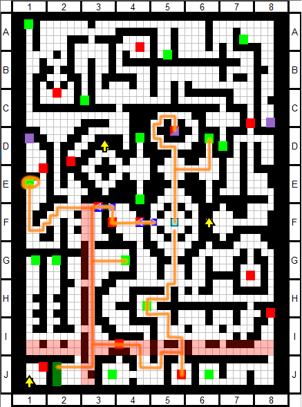

* Right after you open the locked treasure chest, do this menu:
	*  **Keine**:
		*  (1) **Life Fragment** (1)
		*  (2) **Purple Metallic Armor** (1)
	*  **Reimu**:
		*  (2) **Biggest Sword Ever** (1)
		*  (1) **Symbol of Faith** (1)
	*  **Marisa**:
		*  (1) **Mana Flower** (1)
* Once you reach the destination on the map, farm until wipe

* Back to Gensokyo, use these facilities:
	*  **Hakurei Shrine**: Level All Characters 
	*  **Human Village**: Include Momiji in party (slot 5) 
* Open the menu and take the following actions:
	*  Form Change: **Momiji / Keine / Reimu / Marisa** 
	* Equipment:
		*  **Keine**:
			*  (1, 2) **Remove**
		*  **Momiji**:
			*  (2) **Life Fragment** (1)
			*  (1) **Purple Metallic Armor** (1)
		*  **Marisa**:
			*  (M) **Cypress Stick** (1)
	* Learn Skills:
		*  **Keine**: MP Boost 0 -> 2 
		*  **Marisa**: MP Boost 0 -> 2 
		*  **Kourin**: Shopkeeper 3 -> 4 
* Level reference: Reimu 2
* Enter the dungeon (1F)

* **Boss Fight - Chen Encounter (Lv4)**
	* Momiji spams Expellee's Canaan
	* Keine spams 3ST - Sword
	* Reimu spams Fantasy Seal
	* Marisa uses Master Spark
* When you reach the destination, farm until wipe

## Youmu Fight

* Do the following menu after re-entering the dungeon:
	*  Form Change: **Marisa** 
* Move up towards Youmu fight and wipe 11/12 times to get Kasen

* Back at Gensokyo, visit the following facilities:
	*  **Hakurei Shrine**: Level All Characters 
	*  **Human Village**: Include Kasen in party (slot 6) 
* Open the menu and take the following actions:
	*  Form Change: **Momiji / Kasen / Keine / Reimu** 
	* Equipment:
		*  **Reimu**:
			*  (2) **Remove**
		*  **Marisa**:
			*  (2) Light Staff (1) (if dropped)
			*  (M) **Remove**
		*  **Kasen**:
			*  (M) **Cypress Stick** (3)
			*  (3) **Bulletproof Armor** (1)
			*  (2) **Biggest Sword Ever** (1)
			*  (1) **Bludgeon** (3)
	* Learn Skills:
		*  **Reimu**: Yin-Yang Orb 1 -> 2 
		*  **Kourin**: Shopkeeper 4 -> 5 
* Level reference: Reimu 3
* Enter the dungeon (1F)

* Move up to Youmu's boss icon and fight her
* **Boss Fight - Youmu Konpaku (Lv5)**
	* Kasen spams Higekiri's Cursed Arm
	* Reimu uses Great Hakurei Barrier once
	* Keine spams 3ST - Sword
	* Momiji does Attack -> Switch Reimu for Marisa -> Rabies Bite
	* Marisa spams Magic Missile
	* For finer details see Youmu's [Boss Info](../../enemy/youmu.md)
* Exit the dungeon when you beat Youmu

## Explore 2F (Part 1)

* Back at Gensokyo, visit the following facilities:
	*  **Hakurei Shrine**: Level All Characters, apply bonus 
		*  Reimu, Marisa MAG 
		*  Kourin, Keine, Momiji HP 
		*  Youmu, Kasen ATK 
	*  **Human Village**: Include Youmu in party (slot 9) 
	*  **Nitori Shop**: Buy 2 Manga Meat 
* Open the menu and take the following actions:
	*  Form Change: **Momiji / Keine / Reimu / Marisa** 
	* Equipment (only if Youmu drop):
		*  **Reimu**:
			*  (2) **Uniform of Exorcism** (3)
	* Learn Skills:
		*  **Kourin**: Shopkeeper 5 -> 6 
		*  **Kasen**: Guts 0 -> 1 
		*  **Youmu**: Netherworld Dweller 0 -> 1 
* Level reference: Reimu 4
* Enter the dungeon (1F)

* When you reach the destination, farm until wipe

## Chrysomallos Fight

* Back at Gensokyo, visit the following facilities:
	*  **Hakurei Shrine**: Level All Characters, apply new bonus 
		*  Rumia MAG 
		*  Cirno ATK 
	*  **Human Village**: Include Rumia and Cirno in party (slots 7 and 8) 
	*  **Nitori Shop**: Buy 1 Cypress Stick 
* Open the menu and take the following actions:
	*  Form Change: **Momiji / Kasen / Keine / Reimu** 
	* Equipment:
		*  **Marisa**: 
			*  (M) **Cypress Stick** (1)
		*  **Kasen**: 
			*  (3) Bludgeon (3) (if dropped) 
	* Learn Skills:
		*  **Kourin**: Shopkeeper 6 -> 7 
		*  **Rumia**: Piercing Attack 0 -> 1 
		*  **Cirno**: Icicle Fall 1 -> 2 
* Level reference: Reimu 6
* Enter the dungeon (2F)

* **FOE Boss Fight - Chrysomallos (Lv9)**
	* Kasen spams Higekiri's Cursed Arm
	* Reimu uses Great Hakurei Barrier once
	* Keine spams 3ST - Sword
	* Momiji does switching as needed
	* Marisa uses Buff -> Buff -> MP Heal -> Master Spark
		* If Marisa gets TRR just spam Magic Missile
	* Reimu and Rumia can also deal reliable damage
	* For finer details see Chrysomallos' [Boss Info](../../enemy/chrysomallos.md)
* Keep going up and take both treasures in 1F, then exit the dungeon

## Explore 2F (Part 2)

* Back at Gensokyo, visit the following facilities:
	*  **Hakurei Shrine**: Level All Characters 
* Open the menu and take the following actions:
	*  Form Change: **Momiji / Kasen / Reimu / Marisa** 
	* Equipment:
		*  **Reimu**: 
			*  (3) **DX Mecha Model** (1)
			*  (if no Exorcism) (2) **Crepe Mariette** (1)
	* Learn Skills:
		*  **Kourin**: Shopkeeper 7 -> 8 
* Level reference: Reimu 6
* Enter the dungeon (2F)

* When you reach 3F, take the relay point and farm on rare spot until wipe
* When you're done grinding, go back to Gensokyo

## Explore 3F

* Back at Gensokyo, visit the following facilities:
	*  **Hakurei Shrine**: Level All Characters, apply all bonuses 
	*  **Nitori Shop**: Buy 1 Cypress Stick 
* Open the menu and take the following actions:
	* Equipment:
		*  **Momiji**: 
			*  (M) **Cypress Stick** (1)
			*  (3) **Sirloin** (3)
		*  **Kasen**: 
			*  (if no Bludgeon) (3) **Bludgeon** (3)
		*  **Reimu**: 
			*  (if no Exorcism) (2) **Light Crystal** (3)
	* Learn Skills:
		*  **Momiji**: Accelerate 0 -> 1 
		*  **Kourin**: Shopkeeper 8 -> 10 
		*  **Rumia**: Piercing Attack 1 -> 2 
		*  **Cirno**: Icicle Fall 2 -> 3 
* Level reference: Reimu 7
* Enter the dungeon (3F)

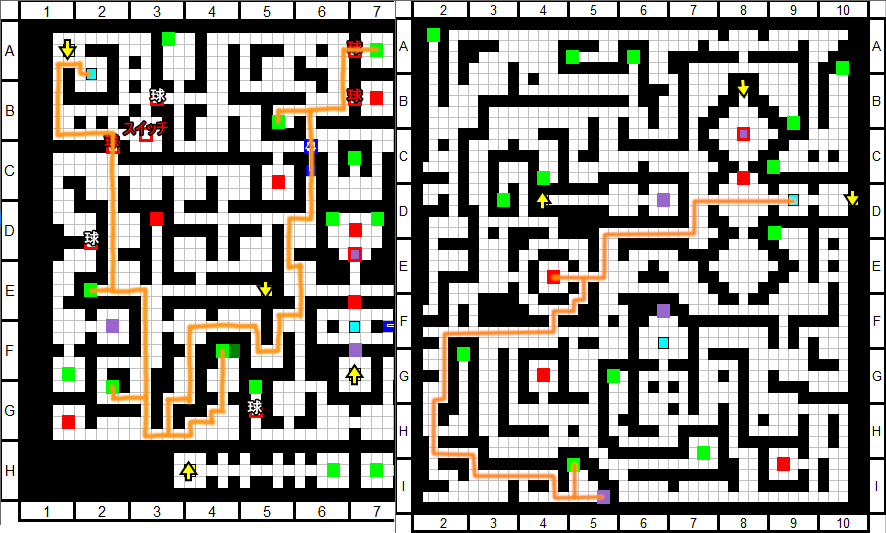

* **Boss Fight - Chen Encounter (Lv6)**
	* Just beat it with what you have
* Exit the dungeon back to Gensokyo

## Alaya-Vijnana Fight

* Back at Gensokyo, visit the following facilities:
	*  **Hakurei Shrine**: Level All Characters, apply new bonus 
		*  Minoriko MAG 
	*  **Human Village**: Include Minoriko in party (slot 10) 
* Open the menu and take the following actions:
	* Equipment:
		*  **Marisa**: 
			*  (3) **Glow Crystal** (3)
* Level reference: Reimu 9
* Enter the dungeon (3F)

* **Boss Fight - Chen Encounter (Lv10)**
	* Just beat it with what you have
* Before entering the fight with Alaya-Vijana, do the following menu:
*  Form Change: **Momiji / Kasen** 
* **Boss Fight - Alaya-Vijnana (Lv11)**
	* Yukari spams Shikigami: Ran Yakumo+
	* Yuyuko uses Ghostly Butterfly -> Attack -> Saigyouji Flawless Nirvana
* Exit the dungeon back to Gensokyo

## Komachi Fight

* Back at Gensokyo, visit the following facilities:
	*  **Hakurei Shrine**: Level All Characters 
	*  **Nitori Shop**: 
		*  Forge whatever you can, a general guide: 
		  *  Ephemeral Bauble x1 guaranteed 
		  *  Crepe Mariette x1 guaranteed 
		  *  Book of Stamp Bingo if dropped Chitin Shell 
		*  Count how many forges you have, need 10 total on next trip 
* Level reference: Reimu 10
* Enter the dungeon (3F)

* When you reach the relay point, farm 60 battles in 1F
* Prolong grind if you don't have materials for 10 total crafts

* Back at Gensokyo, visit the facilities:
	*  **Nitori Shop**: 
		*  Forge until you recruit Nitori 
		*  Buy **Cypress Stick x1** 
	*  **Human Village**: Include Nitori in party (slot 11) 
	*  **Magic Library**: 
		*  **Reset Kourin** 
		*  **Reimu**: HP/DEF/MND 0 -> 10 
		*  **Momiji**: HP/DEF 0 -> 20 
		*  **Nitori**: ATK 0 -> 40 
		*  **Kasen**: HP/DEF/MND 0 -> 10 
	*  **Hakurei Shrine**: Level All Characters, apply all bonuses 
		*  Nitori ATK 
		*  Use **Training Manual x3** on **Nitori** 
* Open the menu and take the following actions:
	*  Form Change: **Momiji / Keine / Reimu / Nitori** 
	* Equipment:
		*  **Marisa**: 
			*  (M) **Remove**
		*  **Momiji**: 
			*  (2) **Courtesan's Sorrow** (3)
		*  **Keine**: 
			*  (3) **Heater Muffler** (2)
			*  (2) **Gokiri's Charm** (2)
			*  (1) **Lucky Horseshoe** (2)
		*  **Reimu**: 
			*  (3) **Super-Hard Rye Bread** (3)
			*  (M) **Cypress Stick** (1)
		*  **Nitori**: 
			*  (M) **Cypress Stick** (1)
			*  (1) **DX Mecha Model** (1)
			*  (2) (if dropped) Super-Hard Rye Bread (3)
			*  (2) **Bracer of Power** (1)
			*  (3) **Wash Basin Set** (5)
		*  **Youmu**: 
			*  (3) **Bulletproof Armor** (1)
			*  (2) **Life Fragment** (1)
			*  (1) **Life Fragment** (1)
		*  **Minoriko**: 
			*  (1) **Mana Flower** (1)
			*  (2) **Crepe Mariette** (1)
	* Learn Skills:
		*  **Keine**: 3ST - Sword 1 -> 2 
		*  **Reimu**: Armored Yin-Yang Orb 0 -> 1 / MP Boost 0 -> 1 
		*  **Nitori**: Maintenance 0 -> 1 
		*  **Kourin**: Effective Formation Change 0 -> 2 
		*  **Kasen**: Guts 1 -> 2 
		*  **Youmu**: Netherworld Dweller 1 -> 2 
		*  **Minoriko**: Rapid Charge 0 -> 1 
		*  **Marisa**: MP Boost 2 -> 5 
* Level reference: Reimu 10
* Enter the dungeon (3F Center)

* **Boss Fight - Komachi Onozuka (Lv12)**
	* **Phase 1 - Buffing**
		* Momiji attacks to delay turn
		* Nitori spams Portable Machine
		* Keine uses 3ST - Sword
		* Reimu uses Great Hakurei Barrier
		* Momiji swaps Nitori for Kasen
	* **Phase 2 - Kasen**
		* Keine spams 3ST - Sword
		* Reimu uses Exorcising Border
		* Kasen spams Diving Waltz of the Raijuu
		* Momiji swaps Keine with Kasen
		* Momiji swaps Reimu with Minoriko
		* Minoriko juggles buff/heal/damage
	* **Phase 3 - Kourin/Nitori**
		* Momiji swaps no MP Keine with Cirno
		* Cirno uses Icicle Fall
		* Minoriko swaps self with Kourin
		* Momiji swaps no MP Kasen with Youmu
		* Kourin swaps Cirno with Nitori
		* Nitori spams Extending Arm
		* Momiji/Kourin combo swap Nitori to renew her ATB
	* **Phase 4 - Narrow Confines of Avici**
		* Swap Nitori for Reimu when Komachi below 40%
		* Reimu uses Great Hakurei Barrier
		* Tank the Confines of Avici
		* Resume combo swap with Nitori
	* For finer details see Komachi' [Boss Info](../../enemy/komachi.md)
* Take the stairs to 4F, get the relay point and exit the dungeon

# Ocean Stratum (4F ~ 6F)

## Explore 4F

* Back at Genokyo, visit these facilities:
	*  **Hakurei Shrine**: Level All Characters, apply new bonus 
		*  Komachi HP 
	*  **Human Village**: Include Komachi in party (slot 12) 
* Open the menu and take the following actions:
	*  Form Change: **Komachi / Kasen / Minoriko / Nitori** 
	* Equipment:
		*  **Momiji**: 
			*  (M, 2, 3) **Remove**
		*  **Komachi**: 
			*  (3) **Sirloin** (3) 
		*  **Minoriko**: 
			*  (M) **Cypress Stick** (1) 
	* Learn Skills:
		*  **Komachi**: Shinigami Work 0 -> 1 / Ferry Wages 0 -> 2 
* Level reference: Nitori 11
* Enter the dungeon (4F)

* After reaching 5F, do the blue outline path
* Before going down to 3F, farm until frontline is out of MP

## Explore 5F

* Back at Genokyo, visit these facilities:
	*  **Hakurei Shrine**: Level All Characters, apply all bonuses 
* Open the menu and take the following actions:
	* Equipment:
		*  **Kasen**: 
			*  (if dropped) (3) Legendary Blender (3) 
		*  **Nitori**: 
			*  (2) **Getitup V** (4) 
		*  **Reimu**: 
			*  (2) **Ultrafast Granite Keystone** (3) 
		*  **Komachi**: 
			*  (2) **Light Crystal** (3) 
			*  (M) **Violent Green Rupee** (2) 
	* Learn Skills:
		*  **Komachi**: Ferry Wages 2 -> 4 
		*  **Minoriko**: Ability Control Harvests 0 -> 1 
		*  **Keine**: 3ST - Sword 2 -> 3 
		*  **Rumia**: Darkness Manipulation 0 -> 1 
		*  **Reimu**: MP Boost 1 -> 2 
		*  **Marisa**: Magic Training 0 -> 1 
* Level reference: Nitori 13
* Enter the dungeon (5F)

* When you reach the warp, go back to Gensokyo
* When you reach the destination, farm as much as you can

## Wriggle Side Quest

* When you're back to Gensokyo, visit the facilities:
	*  **Hakurei Shrine**: Level All Characters 
		*  Use **Tome of Insight - Vitality** on **Kourin** 
* Open the menu and take the following actions:
	*  Form Change: **Momiji / Kasen / Keine / Nitori** 
	* Equipment:
		*  **Kasen**: 
			*  (if dropped) (3) Legendary Blender (3) 
		*  **Nitori**: 
			*  (1) **Biggest Sword Ever** (1) 
		*  **Reimu**: 
			*  (3) **Cuckri** (3) 
		*  **Minoriko**: 
			*  (3) **Super-Hard Rye Bread** (3) 
	* Learn Skills:
		*  **Nitori**: Kappa Ecology Observation 0 -> 1 
		*  **Kourin**: HP High Boost 0 -> 1 
		*  **Reimu**: MP Boost 2 -> 4 
		*  **Komachi**: Ferry Wages 4 -> 6 
* Level reference: Nitori 16
* Enter the dungeon (2F Center)

* Go up and fight Kaguya as a boss
* **Boss Fight - Kaguya Houraisan (Lv8)** 
	* Spam highest damage spells, you're overlevelled
* Exit the dungeon and enter back on (3F)

* Move back to 2F and go south for Eirin event
* Exit the dungeon and enter back on (3F)

* Follow the path south, then head west for Wriggle event
* Exit the dungeon and enter back on (3F Center)

* Take the shortcut to the right and fight the Wasp
* **Boss Fight - Great Tree's Poisonous Wasp (Lv11)**
	* Spam highest damage spells, you're overlevelled
* Exit the dungeon and enter back on (4F)

* Head north then west on upper area, then fight the Wasp
* **Boss Fight - Great Tree's Paralyzing Wasp (Lv15)**
	* Momiji just tanks hits and attacks, will probably stay PAR'd
	* Kasen spams Higekiri's Cursed Arm
	* Keine spams 3ST - Sword
	* Nitori buff x3 -> Super Scope
	* For finer details see Para Wasp's [Boss Info](../../enemy/parawasp.md)
* Head back to Gensokyo and enter the dungeon on (3F)

* Go talk to Eirin on 2F
* Head back to Gensokyo and enter the dungeon on (3F Center)

* Move southeast to get Reisen event
* Go talk to Wriggle and finally recruit her
* Head back to Gensokyo and enter the dungeon on (1F)

* Recruit Parsee and go back to Gensokyo

## Hina Fight

* When you're back at Gensokyo, use these facilities:
	*  **Hakurei Shrine**: Level All Characters, apply all bonus 
		*  Ignore Youmu and Cirno 
		*  Parsee MND 
		*  Wriggle HP 
	*  **Magic Library**: 
		*  **Parsee**: HP/MND 0 -> 30 
		*  **Kasen**: HP/DEF 10 -> 20 
	*  **Human Village**: 
		*  Swap **Youmu -> Wriggle** 
		*  Swap **Cirno -> Parsee** 
	*  **Nitori Shop**: 
		*  Buy **Cypress Stick, Booster v0.8, Crazy Milk** 
* Open the menu and take the following actions:
	*  Form Change: **Parsee / Rumia / Reimu / Wriggle** 
	* Equipment:
		*  **Parsee**: 
			*  (M) **Shoes of Happiness** (2) 
			*  (1) **Symbol of Faith** (1) 
			*  (2) **Crepe Mariette** (1) 
			*  (3) **Love Machine 3322** (2) 
		*  **Rumia**: 
			*  (if Kaguya drop) (3) **Glow Crystal** (3) 
		*  **Wriggle**: 
			*  (3) **Booster v0.8** (2) 
			*  (2) **Booster v0.8** (2) 
			*  (1) **Bone Stake** (3) 
		*  **Kasen**: 
			*  (1) **DX Mecha Model** (1) 
			*  (if dropped) (3) Legendary Blender (3) 
		*  **Komachi**: 
			*  (1) **Crazy Milk** (1) 
	* Learn Skills:
		*  **Parsee**: Final Blow 0 -> 2 / Flames of Jealousy 0 -> 1 
		*  **Komachi**: Ferry Wages 6 -> 7 
* Level reference: Reimu 16
* Enter the dungeon (5F South)

* **Boss Fight - Hina Kagiyama (Lv20)**
	* **Wriggle cannot die turn 1**
	* Parsee sponges all the hits and does the switching
	* Wriggle spams Comet on Earth
	* **Sacrifice Rumia, Marisa and Keine at start**
	* Watch Hina's ATB to switch in Minoriko to buff/heal
		* Reimu can also buff/heal and tank a hit
	* On Biorhythm of Misfortune God, cast Midnight Anathema Ritual
	* On second cast of biorhythm, damage race
	* For finer details see Hina's [Boss Info](../../enemy/hina.md)
* Go up and take the 6F relay, then go back to Gensokyo

## Explore 6F

* When you're back at Gensokyo, open the menu and take these actions:
	*  Form Change: **Komachi / Kasen / Nitori / Rumia** 
* Enter the dungeon (3F Center)

* **FOE Boss Fight - Lesser Golem (Lv14)**
	* Spam strongest moves, you're overlevelled
* Recruit **Chen** and take treasures
* Go back to Gensokyo and re-enter the dungeon through (4F)

* Move all the way east to recruit **Aya**

* Go back to Gensokyo and use these facilities:
	*  **Hakurei Shrine**: Level All Characters, apply new bonus 
		*  Chen, Parsee, Aya ATK 
	*  **Human Village**: 
		*  Swap **Kourin -> Chen** 
		*  Swap **Keine -> Aya** 
	*  **Nitori Shop**: 
		*  Buy **Cypress Stick x2** 
*  Open the menu and take the following actions:
	*  Form Change: **Komachi / Kasen / Nitori / Aya** 
	* Equipment:
		*  **Wriggle**: 
			*  (1, 2, 3) **Remove** 
		*  **Aya**: 
			*  (M) **Cypress Stick** (1) 
			*  (1) **Booster v0.8** (2) 
			*  (2) **Bone Stake** (3) 
			*  (if Komachi drop) (3) **Bone Stake** (3) 
		*  **Chen**: 
			*  (2) **Booster v0.8** (2) 
			*  (1) **Bracer of Power** (1) 
			*  (M) **Cypress Stick** (1) 
	* Learn Skills:
		*  **Komachi**: Ferry Wages 7 -> 8 
		*  **Aya**: Gensokyo's Fastest 0 -> 2 / ATK Boost 0 -> 4 
		*  **Chen**: Instant Attack 0 -> 1 
* Level reference: Nitori 17
* Enter the dungeon (6F)

* When you reach the destination, backtrack to 5F part with FOE and farm
* Go back to Gensokyo after farming and visit the facilities:
	*  **Hakurei Shrine**: Level All Characters, apply bonus 
		*  Reimu, Marisa 
		*  Momiji, Rumia, Minoriko 
		*  Komachi, Chen 
		*  Nitori, Parsee 
		*  Wriggle, Aya, Kasen 
	*  **Nitori Shop**: 
		*  Forge **Getitup V** 
*  Open the menu and take the following actions:
	* Equipment:
		*  **Kasen**: 
			*  (3) **Getitup V** (4) 
		*  **Nitori**: 
			*  (1) **Legendary Blender** (3) 
		*  **Aya**: 
			*  (1) **Pale Wing Thruster** (2) 
			*  (if free slot) (3) **Bone Stake** (3) 
	* Learn Skills:
		*  **Komachi**: Ferry Wages 8 -> 10 
		*  **Kasen**: Impact Attack 0 -> 1 
		*  **Nitori**: Kappa Ecology Observation 1 -> 2 
		*  **Minoriko**: Ability Control Harvests 1 -> 2 
		*  **Reimu**: MP Boost 4 -> 5 
		*  **Rumia**: Darkness Manipulation 1 -> 2 
		*  **Marisa**: Magic Training 1 -> 2 
		*  **Parsee**: Flames of Jealousy 1 -> 2 / MP Boost 0 -> 1 
* Level reference: Nitori 20
* Enter the dungeon (6F Center)

* When you reach the destination, simply go back to Gensokyo

## Kraken Fight

* When you're back to Genokyo, visit the facilities:
	*  **Magic Library**:  
		*  **Wriggle** learns **Toxicologist** subclass 
* Open the menu and take the following actions:
	*  Form Change: **Momiji / Kasen / Nitori / Parsee** 
	* Equipment:
		*  **Parsee**: 
			*  (M) **Cypress Stick** (1) 
			*  (3) **Biggest Sword Ever** (1) 
			*  (2) (if dropped) Cuckri (3) 
		*  **Momiji**: 
			*  (3) **Lv70 Lover Snapper's Scale** (2) 
			*  (2) **Love Machine 3322** (2) 
	* Learn Skills:
		*  **Wriggle**: Enhanced Toxins 0 -> 2 / Numbing Incense 0 -> 3 
* Enter the dungeon (5F)

* Take the shortcut and go northwest to fight the Kraken
* **Boss Fight - Kraken (Lv19)**
	* Kasen spams Higekiri's Cursed Arm
	* Parsee spams Jealousy of the Kind and Lovely
	* Nitori self buffs and then uses Super Scope 3D
	* Momiji swaps Kasen and Parsee with Chen for Instant Attack pivoting
	* Keine can join to buff if Nitori dies
	* For finer details see Kraken's [Boss Info](../../enemy/kraken.md)
* Exit the dungeon and go back to Gensokyo

## Blue Orchid Fight

* When you're back at Gensokyo, take the following actions:
	*  Form Change: **Kasen / Wriggle / Aya / Parsee** 
* Enter the dungeon (6F)

* Take the lower shortcut and fight the Orchid boss
* **Boss Fight - Blue Orchid (Lv23)**
	* Aya uses DGA on Wriggle to inflict HVY
	* Wriggle then switches herself out for Nitori
	* Kasen and Parsee do the TRR combo
	* Aya and Nitori swap Kasen/Parsee with Chen for IA pivoting
	* For finer details see Blue Orchid's [Boss Info](../../enemy/orchid.md)
* Go back to Gensokyo

## Mokou Side Quest

* When back at Gensokyo and use these facilities:
	*  **Magic Library**:  
		*  **Reset Nitori / Wriggle** 
		*  **Chen** learns **Warrior** subclass 
		*  **Chen**: ATK 0 -> 30 
	*  **Human Village**: 
		*  Swap **Rumia -> Keine** 
* Open the menu and take the following action:
	*  Form Change: **Komachi / Kasen / Nitori / Keine** 
	* Learn Skills:
		*  **Nitori**: Maintenance 0 -> 1 / Ability to Manip Water 0 -> 2 
* Enter the dungeon (4F Northeast)

* Go up and fight Mokou as a boss
* **Boss Fight - Mokou Fujiwara (Lv17)**
	* Switch things in if anyone dies
	* Komachi spams Narrow Confines of Avici
	* Kasen spams Diving Waltz of the Raijuu
	* Nitori spams Kappa's Waterfall
	* Keine spams 3ST - Sword
	* After Mokou resurrects, switch in Marisa for Master Spark
	* For finer details see Mokou's [Boss Info](../../enemy/mokou.md)
* Go back to Gensokyo and re-enter through (5F)

* Go down and see the event with Mokou and Kaguya
* **CHOOSE MOKOU** (Just hold A)
* Keep going and recruit Satori
* Retreat to Gensokyo with your new allies

## Tenshi 1 Fight

* When you're back, use these facilities:
	*  **Hakurei Shrine**: Level All Characters, apply new bonus 
		*  Mokou ATK 
		*  Utsuho MAG 
	*  **Human Village**: 
		*  Swap **Minoriko -> Rumia** 
		*  Swap **Wriggle -> Mokou** 
		*  Swap **Keine -> Utsuho** 
		*  Unequip non-party characters 
* Open the menu and take the following actions:
	*  Form Change: **Komachi / Utsuho / Nitori / Chen** 
	* Equipment:
		*  **Parsee**: 
			*  (M) **Shoes of Happiness** (2) 
			*  (3) **Remove** 
		*  **Aya**: 
			*  (only if no Komachi drop) (3) **Remove** 
		*  **Utsuho**: 
			*  (M) **Cypress Stick** (1) 
			*  (1) **Mana Flower** (1) 
			*  (if dropped) (3) Mana Flower (1) 
		*  **Chen**: 
			*  (1) **Biggest Sword Ever** (1) 
			*  (3) **Bone Stake** (3) 
		*  **Mokou**: 
			*  (3) **Super-Hard Rye Bread** (3) 
			*  (M) **Cypress Stick** (1) 
			*  (1) **Life Fragment** (1) 
			*  (2) **Purple Metallic Armor** (1) 
	* Learn Skills:
		*  **Utsuho**: MP Boost 0 -> 5 / Blazing 0 -> 2 
		*  **Chen**: Enhanced Row Attack 0 -> 3 
		*  **Momiji**: Instant Attack: 0 -> 1 
		*  **Mokou**: Blazing 0 -> 2 / Resurrection 0 -> 2 
* Level reference: Nitori 21
* Enter the dungeon (6F)

* Take the northern shortcut and fight Tenshi
* **Boss Fight - Tenshi Hinanawi (Lv40)**
	* Simply throw characters at the leftmost spots to die
	* Concentrate spam since higher delay
* Destroy the Satori rock ahead and take the relay on 7F
* Go back to Gensokyo to heal

# Jungle Stratum (7F ~ 9F)

## Explore 7F

* When you're back, enter the dungeon (7F)

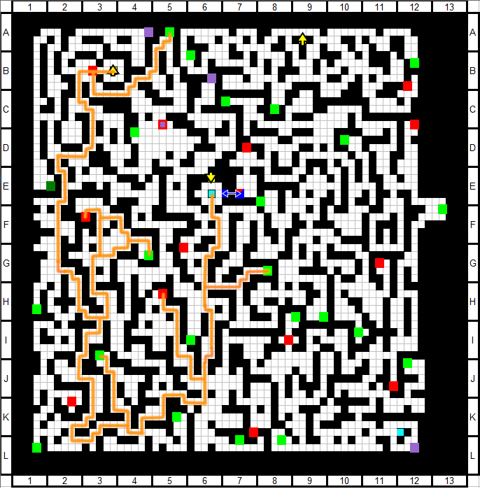

* When you reach the destination, farm until wipe
* Go back to Gensokyo and use this facility
	*  **Hakurei Shrine**: Level All Characters, apply bonuses 
		*  Reimu, Marisa 
		*  Momiji, Rumia 
		*  Komachi, Chen 
		*  Nitori, Parsee 
		*  Mokou, Aya 
		*  Kasen, Utsuho 
* Open the menu and take the following actions:
	* Equipment:
		*  **Utsuho**: 
			*  (2) **Glow Crystal** (3) 
			*  (if dropped) (3) Mana Flower (1) 
		*  **Nitori**: 
			*  (1) **Asura Blade** (4) 
		*  **Chen**: 
			*  (2) **Legendary Blender** (3) 
		*  **Kasen**: 
			*  (1) **Luster Candy** (4) 
		*  **Mokou**: 
			*  (1) **DX Mecha Model** (1) 
	* Learn Skills:
		*  **Aya**: Ability to Manipulate Wind 0 -> 1 
* Level reference: Nitori 22
* Enter the dungeon (7F)

* When you reach the destination, farm until wipe

## Explore 8F (Part 1)

* When you're back at Gensokyo, use these facilities:
	*  **Hakurei Shrine**: Level All Characters, apply bonuses 
		*  Komachi, Chen 
		*  Nitori, Mokou 
		*  Kasen, Utsuho 
	*  **Magic Library**:  
		*  **Nitori** learns **Warrior** subclass 
* Open the menu and take the following actions:
	* Equipment:
		*  **Utsuho**: 
			*  (if dropped) (3) Mana Flower (1) 
		*  **Aya**: 
			*  (M) **Shoes of Happiness** (1) 
		*  **Komachi**: 
			*  (2) **Energy Tank** (1) 
	* Learn Skills:
		*  **Reimu**: Armored YinYang Orb 1 -> 2 
* Level reference: Nitori 24
* Enter the dungeon (8F)

* When you recruit Sanae, farm until wipe

## Iku Fight

* When you're back at Gensokyo, use these facilities:
	*  **Hakurei Shrine**: Level All Characters, apply bonuses 
		*  Reimu, Marisa 
		*  Kourin, Keine 
		*  Rumia, Komachi, Chen 
		*  Nitori, Parsee(HP) 
		*  Mokou, Aya(HP) 
		*  Kasen, Utsuho, Sanae(HP) 
	*  **Magic Library**:  
		*  Reset **Nitori** 
		*  **Nitori** learns **Warrior** subclass 
		*  **Aya** learns **Guardian** subclass 
		*  **Reimu**: HP 10 -> 30 
		*  **Nitori**: HP 0 -> 30 
		*  **Aya**: HP 0 -> 30 
		*  **Sanae**: HP 0 -> 30 
	*  **Human Village**: 
		*  Swap **Utsuho -> Kourin** 
		*  Swap **Rumia -> Keine** 
		*  Swap **Momiji -> Sanae** 
	*  **Nitori Shop**: 
		*  Buy **Source of Magic x2** 
* Open the menu and take the following actions:
	*  Form Change: **Parsee / Reimu / Aya / Sanae** 
	* Equipment:
		*  **Nitori**: 
			*  (M) **Source of Magic** (1) 
		*  **Parsee**: 
			*  (M) **First-Aid Kit** (2) 
			*  (3) **Card Ruler of Heavens** (2) 
			*  (2) **Hero's Medal** (4) 
		*  **Aya**: 
			*  (M) **Cypress Stick** (1) 
		*  **Sanae**: 
			*  (M) **Cypress Stick** (1) 
			*  (1) **Big Bang Wave Cannon** (4) 
			*  (2) **Lambda Driver** (4) 
			*  (3) **Crepe Mariette** (1) 
		*  **Keine**: 
			*  (3) **Crepe Mariette** (1) 
			*  (2) **Life Fragment** (1) 
			*  (1) **Life Fragment** (1) 
			*  (M) **Source of Magic** (1) 
		*  **Kourin**: 
			*  (1) **Life Fragment** (1) 
			*  (2) **Spellbook Hurricane** (2) 
			*  (3) **Light Crystal** (3) 
	* Learn Skills:
		*  **Aya**: HP Boost 0 -> 2 
		*  **Sanae**: Miracle Fruit 1 -> 5 / Last Wish 0 -> 1 
		*  **Kasen**: Fighting Spirit 0 -> 1 
		*  **Keine**: 3ST - Sword 3 -> 5 
		*  **Chen**: Beat Down 0 -> 1 
		*  **Mokou**: Resurrection 2 -> 3 
		*  **Kourin**: HP High Boost 1 -> 2 
		*  **Nitori**: Maintenance 0 -> 1 / Kappa Ecology Observation 0 -> 2 / Mind Body One 0 -> 1 
* Level reference: Reimu 26
* Enter the dungeon (8F South)

* Head right to fight Iku
* **Boss Fight - Iku Nagae (Lv29)**
	* **Phase 1 - Buffing**
		* Aya buffs Reimu and Sanae
		* Reimu uses GHB
		* Swap Reimu with Keine, Aya with Nitori
		* Buff Nitori for a while
		* Swap Nitori with Kasen
	* **Phase 2 - Kasen**
		* Kasen spams Higekiri's Cursed Arm
		* Keine spams 3ST - Sword
		* Sanae juggles Miracle Fruit on Kasen and heals
		* Parsee switches Chen with whoever needs IA pivoting
		* Chen can Kimontonkou + PSW
	* **Phase 3 - Light Dragon's Sigh**
		* Swap Keine with Aya, Kasen with Kourin
		* Put Nitori in slot 4 to attack with Extending Arm
		* Aya can DGA her for another hit
		* Parsee switches her out, Kourin back in
		* Lineup Parsee/Aya/Komachi/Sanae for Light Dragon's Sigh
	* **Phase 4 - Whiskers of the Dragon God**
		* Swap in Reimu so she can use Exorcising Border
		* Swap Kourin back in to damage rush with Nitori
		* Chen and Kasen deal massive damage now that she is debuffed
		* Improvise until you win
	* For finer details see Iku's [Boss Info](../../enemy/iku.md)
* Go back to Gensokyo to heal

## Explore 8F (Part 2)

* When you're back at Gensokyo, use these facilities:
	*  **Hakurei Shrine**: Level All Characters 
	*  **Magic Library**:  
		*  Reset **Nitori** 
		*  **Nitori** learns **Warrior** subclass 
	*  **Human Village**: 
		*  Swap **Keine -> Rumia** 
		*  Swap **Kourin -> Utsuho** 
* Open the menu and take the following actions:
	*  Form Change: **Komachi / Utsuho / Nitori / Chen** 
	* Equipment:
		*  **Chen**: 
			*  (if Iku drop) (1) **Shinai of Spirits** (1) 
		*  **Parsee**: 
			*  (3) **Biggest Sword Ever** (1) 
			*  (M) **Shoes of Happiness** (2) 
		*  **Aya**: 
			*  (M) **Shoes of Happiness** (2) 
	* Learn Skills:
		*  **Nitori**: Maintenance 0 -> 1 / Ability Manip Water 0 -> 2 / Mind Body One 0 -> 1 
* Level reference: Nitori 26
* Enter the dungeon (8F South)

* When you reach 9F, get the locked chest and farm until wipe

## Explore 9F

* When you're back at Gensokyo, use these facilities:
	*  **Hakurei Shrine**: Level All Characters, apply bonuses 
		*  Komachi, Chen 
		*  Nitori, Mokou 
		*  Kasen, Utsuho 
* Open the menu and take the following actions:
	* Equipment:
		*  **Nitori**: 
			*  (1) **Glaive of Pain** (4) 
		*  **Kasen**: 
			*  (2) **Asura Blade** (4) 
		*  **Parsee**: 
			*  (M) **Growing Egg** (1) 
* Level reference: Nitori 28
* Enter the dungeon (9F)

* When you reach the destination event go back to Gensokyo
* When you're back at Gensokyo, use the shrine and then do a menu:
	*  **Hakurei Shrine**: Level All Characters 
	* Equipment:
		*  **Sanae**: 
			*  (3) **Century's End Jacket** (4) 
		*  **Reimu**: 
			*  (3) **Water Cutting Sword** (4) 
			*  (1) **Star of the Just** (5) 
		*  **Parsee**: 
			*  (1) **Diva's Apron** (1) 
* Level reference: Nitori 29
* Enter the dungeon (9F)

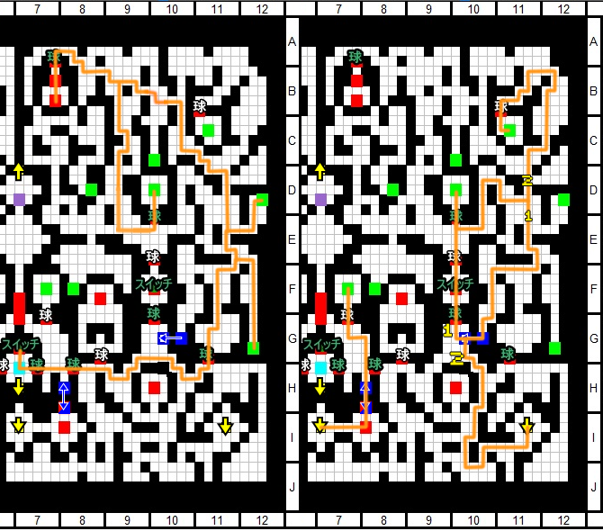

* When you reach the destination farm until wipe

## Tenshi 2 Fight

* When you're back at Gensokyo, open the menu and take the following actions:
	* Equipment:
		*  **Utsuho**: 
			*  (M, 1, 2, 3) **Remove** 
		*  **Mokou**: 
			*  (M, 1, 2, 3) **Remove** 

* Use these facilities:
	*  **Hakurei Shrine**: Level All Characters, apply bonuses 
		*  Reimu, Marisa(SPD) 
		*  Minoriko, Komachi 
		*  Nitori(HP), Parsee(ATK) 
		*  Aya(ATK), Kasen 
		*  Reisen(HP), Sanae(MAG), Iku(MAG) 
	*  **Magic Library**: 
		*  Reset **Marisa / Chen / Nitori / Aya** 
		*  **Marisa** learns **Enchanter** subclass 
		*  **Nitori** learns **Guardian** subclass 
		*  **Reisen** learns **Hexer** subclass 
		*  **Iku** learns **Sorcerer** subclass 
		*  **Nitori**: HP 30 -> 50 / DEF 0 -> 50 / SPD 0 -> 30 
		*  **Iku**: MAG/SPD 0 -> 50 
	*  **Human Village**: 
		*  Swap **Utsuho -> Minoriko** 
		*  Swap **Chen -> Reisen** 
		*  Swap **Mokou -> Iku** 
* Open the menu and take the following actions:
	*  Form Change: **Sanae / Minoriko / Aya / Reisen** 
	* Equipment:
		*  **Marisa**: 
			*  (1) **Remove** 
		*  **Nitori**: 
			*  (M) **First Aid Kit** (2) 
			*  (2) **Intama** (2) 
		*  **Minoriko**: 
			*  (3) **Cuckri** (3) 
			*  (2) **Super-Hard Rye Bread** (3) 
			*  (1) **Super-Hard Rye Bread** (3) 
		*  **Aya**: 
			*  (1) **The Arch** (4) 
		*  **Reisen**: 
			*  (1) **Pale Wing Thruster** (2) 
			*  (2) **Pale Wing Thruster** (2) 
			*  (3) **Booster v0.8** (2) 
			*  (M) **Cypress Stick** (1) 
		*  **Iku**: 
			*  (M) **Source of Magic** (1) 
			*  (3) **Mana Flower** (1) 
			*  (2) **Mana Flower** (1) 
			*  (1) **Glow Crystal** (3) 
		*  **Marisa**: 
			*  (M) **Cypress Stick** (1) 
	* Learn Skills:
		*  **Sanae**: Last Wish 1 -> 2 
		*  **Minoriko**: SPD Boost 0 -> 5 
		*  **Aya**: Gensokyo's Fastest Lessons 0 -> 2 / Tengu's Wind 0 -> 2 / HP Boost 0 -> 4 
		*  **Reisen**: MP Boost 0 -> 4 / Enhanced Hexes 0 -> 2 / Intense Vertigo 0 -> 1 
		*  **Kasen**: Fighting Spirit 1 -> 2 
		*  **Rumia**: Youkai Knowledge 0 -> 2 
		*  **Iku**: Hagoromo Sky 0 -> 2 / Enhanced Attack 0 -> 1 / Mind Body One 0 -> 2 
		*  **Reimu**: Final Prayer 0 -> 1 
		*  **Marisa**: Magic Training 0 -> 2 / Art of Battlemage 0 -> 5 / MP Boost 0 -> 2 
		*  **Nitori**: DEF Boost 0 -> 4 / Frontline Guard 0 -> 1 / Maintenance 0 -> 1 
* Level reference: Nitori 29
* Enter the dungeon (9F)

* Head north to fight Tenshi
* **Boss Fight - Tenshi Hinanawi (Lv36)**
	* **Phase 1 - Sacrifice**
		* Aya buffs Minoriko SPD twice
		* Minoriko swaps Aya for Iku
		* Reisen uses Lunatic Red Eyes
		* Sanae uses Miracle Fruit on Iku
		* Minoriko swaps Reisen for Marisa
		* Iku uses Attack
		* Minoriko uses Owotoshi Harvester on Sanae
		* Sanae dies to Sword of Hisou, triggering Last Wish
	* **Phase 2 - Concentrate**
		* Marisa swaps in Nitori
		* Iku spams Attack
		* Nitori spams Portable Versatile Machine / Concentrate
		* Minoriko juggles Nitori's buffs and heals
		* Marisa spams Art of the Battlemage on Iku
		* On concentrate, make lineup Nitori / Reimu / Komachi
	* **Phase 3 - State of Enlightenment**
		* Repeat phase 2 loop until State of Enlightenment
		* Swap Marisa for Reisen so she can debuff MND with LRE
		* Swap Marisa back and repeat phase 2
	* For finer details see Tenshi's [Boss Info](../../enemy/tenshi2.md)
* Take the stairs to 10F and get the relay point
* Go back to Gensokyo to heal

# Desert Stratum (10F ~ 12F)

## Explore 10F

* When you're back at Gensokyo, use these facilities:
	*  **Hakurei Shrine**: Level All Characters, apply bonus 
		*  Rumia, Chen 
		*  Nitori(ATK) 
	*  **Magic Library**: 
		*  Reset **Marisa / Nitori** 
		*  **Chen** learns **Warrior** subclass 
		*  **Nitori** learns **Warrior** subclass 
	*  **Human Village**: 
		*  Swap **Marisa -> Chen** 
* Open the menu and take the following actions:
	*  Form Change: **Komachi / Kasen / Nitori / Chen** 
	* Equipment:
		*  **Iku**: 
			*  (M) **Cypress Stick** (1) 
			*  (if Tenshi drop) (1) **Portable Oscillation Cannon** (4) 
		*  **Nitori**: 
			*  (2) **Getitup V** (4) 
			*  (M) **Source of Magic** (1) 
	* Learn Skills:
		*  **Komachi** Short Life Expectancy 1 -> 3 
		*  **Nitori**: Cooling Down 0 -> 1 / Maintenance 0 -> 1 
		*  **Chen**: Instant Attack 0 -> 1 / Beat Down 0 -> 1 / Enhanced Row Attack 0 -> 3 
* Level reference: Nitori 30
* Enter the dungeon (10F)

* After getting last treasure, farm until wipe
* When you're back at Gensokyo, use these facilities:
	*  **Hakurei Shrine**: Level All Characters
* Open the menu and take the following actions:
	* Equipment:
		*  **Iku**: 
			*  (if no Tenshi drop) (1) **Portable Oscillation Cannon** (4) 
			*  (2) **Tisiphone Edge** (4) 
		*  **Chen**: 
			*  (if Tenshi drop) (1) **Portable Oscillation Cannon** (4) 
	* Learn Skills:
		*  **Chen** Beat Down 1 -> 2 
* Level reference: Nitori 31
* Enter the dungeon (10F)

* When you reach the destination, farm until wipe

## Gold Hymn Fight

* When you're back at Gensokyo, use these facilities:
	*  **Hakurei Shrine**: Level All Characters, apply bonus 
		*  Reimu, Rumia 
		*  Cirno(SPD), Minoriko 
		*  Komachi, Chen 
		*  Nitori, Parsee 
		*  Aya, Kasen 
		*  Reisen, Sanae, Iku 
	*  **Human Village**: 
		*  Swap **Rumia -> Keine** 
		*  Swap **Parsee -> Cirno** 
* Open the menu and take the following actions:
	*  Form Change: **Keine / Kasen / Nitori / Aya** 
	* Equipment:
		*  **Kasen**: 
			*  (M) **Purple Orb** (1) 
		*  **Nitori**: 
			*  (M) **Purple Orb** (1) 
		*  **Aya**: 
			*  (M) **Source of Magic** (1) 
		*  **Iku**: 
			*  (M) **Purple Orb** (1) 
			*  (3) **Forbidden Tablet** (4) 
		*  **Reimu**: 
			*  (3) **Getitup V** (4) 
		*  **Cirno**: 
			*  (3) **Booster v0.8** (2) 
			*  (2) **Booster v0.8** (2) 
			*  (1) **Booster v0.8** (2) 
			*  (M) **Cypress Stick** (1) 
	* Learn Skills:
		*  **Iku**: Heavenly Maiden Blow 0 -> 1 
		*  **Cirno**: Icicle Fall 3 -> 5 
* Level reference: Nitori 32
* Enter the dungeon (10F) and head east for FOE

* **FOE Boss Fight - Gold Hymn (Lv36)**
	* Aya DGAs Keine, then Nitori twice
	* Keine spams 3ST - Sword
	* Kasen spams Diving Waltz of Raijuu to keep PAR
	* Nitori spams Kappa's Watterfall
	* For finer details see Gold Hymn' [Boss Info](../../enemy/goldhymn.md)
* Get the treasure behind FOE, then exit the dungeon
* Re-enter to talk to Kanako and then again for Suwako

## Remilia & Sakuya Fight

* When you're back at Gensokyo, use these facilities:
	*  **Hakurei Shrine**: Level All Characters 
		*  Nitori/Aya to HP 
	*  **Magic Library**: 
		*  Reset **Komachi / Nitori / Sanae** 
		*  **Nitori** learns **Guardian** subclass  
		*  **Aya** learns **Guardian** subclass 
		*  **Nitori**: ATK 40 -> 80 
		*  **Reisen**: HP 0 -> 50 
* Open the menu and take the following actions:
	*  Form Change: **Nitori / Aya / Komachi / Reisen** 
	* Equipment:
		*  **Nitori**: 
			*  (M) **First-Aid Kit** (2) 
			*  (2) **Aegis Button** (2) 
	* Learn Skills:
		*  **Nitori**: DEF Boost 0 -> 5 / Frontline Guard 0 -> 1 / Maintenance 0 -> 1 
		*  **Aya**: EVA Boost 0 -> 1 / HP Boost 4 -> 5 
		*  **Komachi**: Shinigami Work 0 -> 1 / Ferry Wages 0 -> 2 / Ferriage Fog 1 -> 5 
		*  **Sanae**: Youkai Buster 0 -> 2 / Miracle Fruit 1 -> 5 
* Enter the dungeon (10F southwest) and head for the boss
* Level reference: Nitori 32

* **Boss Fight - Remilia Scarlet & Sakuya Izayoi (Lv43)**
	* **Phase 1 - DTH Sakuya**
		* Aya DGA Komachi twice for Ferriage in Deep Fog DTH
		* Reisen spams Lunatic Red Eyes
		* Nitori buffs self with PVM
		* No DTH proc or Reisen dead = reset
	* **Phase 2 - Remilia**
		* Nitori self buffs and switches, Super Scopes at end
		* Aya plays switch and DGA support
		* Swap in Cirno to debuff SPD with Icicle Fall
		* Reisen spams LRE until MND debuff is big enough, can also Discarder
		* Iku spams EDP until DEF debuff is big enough
		* Sanae must heal Nitori, can buff Iku for extra damage, stay out for Youkai Buster
		* Chen does IA pivoting and Kimontonkou + PSW for damage when DEF debuff present
		* Reimu is a good source of emergency damage with Yin-Yang, if buffed
	* For finer details see RemiSaku's [Boss Info](../../enemy/sakuremi.md)
* Take the stairs to 11F and get the relay circle, then retreat to Gensokyo

## Explore 11F

* When you're back at Gensokyo, use these facilities:
	*  **Hakurei Shrine**: Level All Characters, apply bonuses 
		*  Komachi, Nitori(ATK) 
		*  Aya(ATK), Iku 
	*  **Magic Library**: 
		*  Reset **Komachi / Nitori / Aya / Iku** 
		*  **Nitori** learns **Warrior** subclass  
		*  **Aya** learns **Monk** subclass 
		*  **Iku** learns **Monk** subclass 
	*  **Human Village**: 
		*  Swap **Keine -> Rumia** 
		*  Swap **Reisen -> Wriggle** 
* Open the menu and take the following actions:
	*  Form Change: **Komachi / Aya / Nitori / Iku** 
	* Equipment:
		*  **Aya**: 
			*  (M) **Shoes of Happiness** (2) 
		*  **Nitori**: 
			*  (M) **Purple Orb** (1) 
			*  (2) **Getitup V** (4) 
		*  **Chen**: 
			*  (if Remilia dropped) (1) **Glaive of Pain** (4) 
	* Learn Skills:
		*  **Komachi**: Shinigami Work 0 -> 1 / Ferry Wages 0 -> 10 / Short Life Expectancy 1 -> 3 
		*  **Aya**: Gensokyo Fastest 0 -> 2 / Tengu Wind 0 -> 2 / HP Boost 0 -> 5 
		*  **Nitori**: Cooling Down 0 -> 1 / Ability Manip Water 0 -> 2 / Maintenance 0 -> 1 
		*  **Iku**: Hagoromo Sky 0 -> 2 / Lightning Fish 0 -> 1 / Area Attack 0 -> 1 
		*  **Reimu**: Final Prayer 1 -> 2 
* Level reference: Nitori 33
* Enter the dungeon (11F)

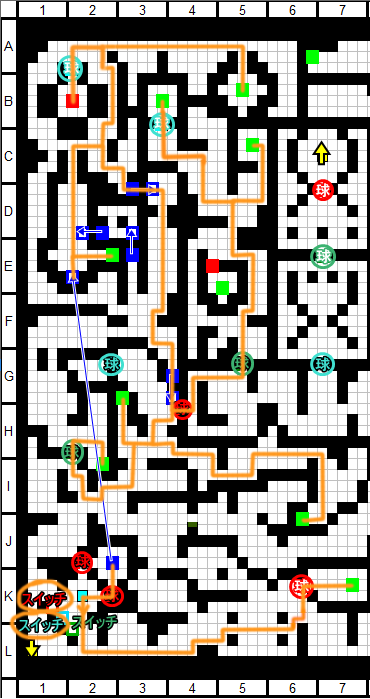

* When you reach the destination, farm until Nitori wipe
* When you're back at Gensokyo, use these facilities:
	*  **Hakurei Shrine**: Level All Characters 
	*  **Magic Library**: 
		*  **Komachi** learns **Guardian** subclass 
* Open the menu and take the following actions:
	* Equipment:
		*  **Chen**: 
			*  (if not dropped) (1) **Glaive of Pain** (4) 
			*  (3) **The Arch** (4) 
			*  (M) **Purple Orb** (1) 
		*  **Komachi**: 
			*  (3) **Yggdrasil Dew** (1) 
		*  **Aya**: 
			*  (M) **Growing Egg** (2) 
* Level reference: Nitori 35
* Enter the dungeon (11F)

* When you reach the 12F relay circle, farm until Nitori wipe on 11F

## Explore 12F

* When you're back at Gensokyo, use these facilities:
	*  **Hakurei Shrine**: Level All Characters, apply bonuses 
		*  Komachi, Chen, Nitori 
		*  Aya, Kasen, Iku 
* Open the menu and take the following actions:
	* Equipment:
		*  **Aya**: 
			*  (3) **Meteor Drive** (5) 
* Level reference: Nitori 38
* Enter the dungeon (12F)

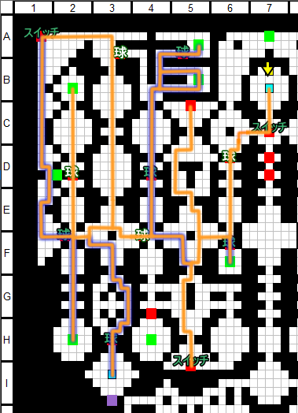

* Once you get to the relay point, go back to Gensokyo
* When you're back at Gensokyo, use these facilities:
	*  **Hakurei Shrine**: Level All Characters 
* Open the menu and take the following actions:
	* Equipment:
		*  **Aya**: 
			*  (2) **Wallbreaker Armband** (5) 
		*  **Reimu**: 
			*  (2) **Lambda Driver** (4) 
* Level reference: Nitori 39
* Enter the dungeon (12F)

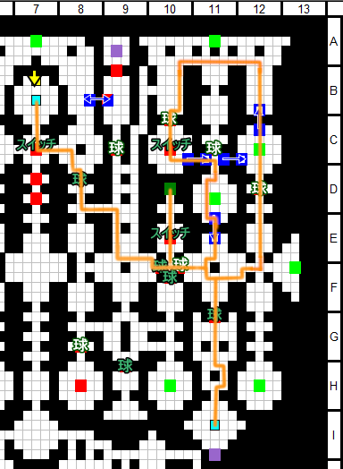

* Once you get to the relay point, grind until Wriggle 120 BP on 11F

## Golden Mirror Fight

* When you're back at Gensokyo, use these facilities:
	*  **Hakurei Shrine**: Level All Characters 
		*  Aya(HP), Reisen 
	*  **Magic Library**: 
		*  **Reset Komachi** 
	*  **Human Village**: 
		*  Swap **Wriggle -> Reisen** 
* Open the menu and take the following actions:
	* *  Form Change: **Kasen / Aya / Komachi / Reisen** 
	* Equipment:
		*  **Aya**: 
			*  (if not equipped) (M) **Growing Egg** (2) 
		*  **Komachi**: 
			*  (1) **Energy Pack** (5) 
	* Learn Skills:
		*  **Komachi**: Ferriage Fog 1 -> 5 / Shinigami Work 0 -> 1 / Ferry Wages 0 -> 9 
* Level reference: Reisen 39
* Enter the dungeon (12F west) and go fight the Mirror

* **Boss Fight - Golden Mirror (Lv48)**
	* **If Reisen dies or Komachi fails thrice, reset**
	* Hit the 9% DTH proc on Komachi's Ferriage in the Deep Fog
	* Aya DGAs Komachi for try #1
		* Sarutahiko self while Komachi does try #2
		* DGA again for try #3
	* Reisen spams Grand Patriot's Elixir so she lives
	* Komachi spams Ferriage in Deep Fog for DTH
	* For finer details see Golden Mirror's [Boss Info](../../enemy/mirror.md)
* When you're done, retreat to Gensokyo

## Magatama Fight

* Enter the dungeon (12F east) and go fight the Magatama
* **Boss Fight - Magatama of Amber Fangs (Lv48)**
	* **If Reisen dies or Komachi fails thrice, reset**
	* Hit the 9% DTH proc on Komachi's Ferriage in the Deep Fog
	* Aya DGAs Komachi for try #1
		* Sarutahiko self while Komachi does try #2
		* DGA again for try #3
	* Reisen spams Grand Patriot's Elixir so she lives
	* Komachi spams Ferriage in Deep Fog for DTH
	* For finer details see Magatama's [Boss Info](../../enemy/magatama.md)
* When you're done, retreat to Gensokyo

## Tenshi 3 Fight

* When you're back at Gensokyo, use these facilities:
	*  **Hakurei Shrine**: Level All Characters 
* Open the menu and take the following actions:
	*  Form Change: **Komachi / Aya / Nitori / Iku** 
	* Learn Skills:
		*  **Aya**: EVA Boost 0 -> 5 
* Level reference: Nitori 40
* Enter the dungeon (12F)

* Once you've reached the relay point, go back to Gensokyo
* When you're back on Gensokyo, use these facilities:
	*  **Hakurei Shrine**: Level All Characters, apply bonus 
		*  Reimu, Marisa 
		*  Komachi, Nitori, Aya 
		*  Reisen, Sanae, Iku 
		*  Use **Wisdom Gems** on **Iku** 
	*  **Magic Library**: 
		*  **Reset Iku** 
		*  **Marisa** learns **Enchanter** subclass 
		*  **Iku** learns **Sorcerer** subclass 
	*  **Human Village**: 
		*  Swap **Rumia -> Marisa** 
* Open the menu and take the following actions:
	*  Form Change: **Sanae / Minoriko / Aya / Reisen** 
	* Learn Skills:
		*  **Sanae**: Last Wish 0 -> 2 
		*  **Reisen**: SPD Boost 0 -> 5 
		*  **Marisa**: Magic Training 0 -> 2 / Enhanced Buffing 0 -> 2 / Art of the Battlemage 0 -> 5 
		*  **Iku**: Enhanced Attack 0 -> 1 / Mind Body 0 -> 2 / Magic Beating 0 -> 2 / Hagoromo Sky 0 -> 2 
* Level reference: Aya 40
* Enter the dungeon (12F depths) and fight Tenshi

* **Boss Fight - Tenshi Hinanawi (Lv50)**
	* **Phase 1 - Sacrifice**
		* Aya buffs Minoriko SPD twice
		* Minoriko swaps Aya for Iku
		* Reisen uses Lunatic Red Eyes
		* Sanae uses Miracle Fruit on Iku
		* Minoriko swaps Reisen for Marisa
		* Iku uses Attack
		* Minoriko uses Owotoshi Harvester on Sanae
		* Sanae dies to Sword of Hisou, triggering Last Wish
	* **Phase 2 - Quick Kill**
		* Iku spams Attack
		* Marisa spams Art of the Battlemage on Iku
		* Minoriko swaps in Aya then self with Reisen
		* Marisa spams Art of the Battlemage on Iku
		* Reisen spams Lunatic Red Eyes
		* Aya spams DGA on Iku
		* **REMOVE REISEN FROM FRONT BEFORE KILL**
	* **Phase 3 - Murakumo DTH**
		* Swap in Reisen
		* Yuyuko spams Saigyouji Flawless Nirvana
		* Keep Yuyuko and Reisen alive
	* For finer details see Tenshi's [Boss Info](../../enemy/tenshi3.md)
* When you're done, move to 13F and take the relay circle

# Fire Stratum (13F ~ 15F)

## Explore 13F (Part 1)

* When you're back on Gensokyo, use these facilities:
	*  **Hakurei Shrine**: Level All Characters 
	*  **Magic Library**: 
		*  **Reset Komachi, Iku** 
		*  **Komachi** learns **Guardian** subclass 
		*  **Iku** learns **Monk** subclass 
	*  **Human Village**: 
		*  Swap **Marisa -> Rumia** 
* Open the menu and take the following actions:
	*  Form Change: **Komachi / Aya / Nitori / Iku** 
	* Equipment:
		*  **Nitori**: 
			*  (if Murakumo DTH) (1) **Cinderforge Sword** (5) 
	* Learn Skills:
		*  **Komachi**: Shinigami Work 0 -> 1 / Ferry Wages 0 -> 10 / Short Life Expectancy 1 -> 5 
		*  **Iku**: Area Attack 0 -> 1 / Lightning Fish 0 -> 2 / Hagoromo Sky 0 -> 2 
* Level reference: Nitori 41
* Enter the dungeon (13F)

* When you reach the -4 orb, re-enter the dungeon
* When you reach the 14F relay circle, farm until Nitori wipe on 13F

## Explore 14F (Part 1)

* When you're back on Gensokyo, use these facilities:
	*  **Hakurei Shrine**: Level All Characters 
* Open the menu and take the following actions:
	* Equipment:
		*  **Iku**: 
			*  (2) **Wash Basin Set** (5) 
* Level reference: Nitori 44
* Enter the dungeon (14F center east)

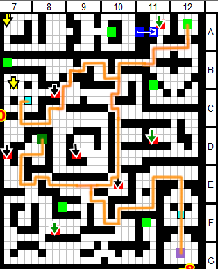

* When you reach the relay circle, farm until Nitori wipe

## Memorized Knowledge Fight

* When you're back on Gensokyo, use these facilities:
	*  **Hakurei Shrine**: Level All Characters, apply bonus 
		*  Cirno, Komachi, Chen 
		*  Nitori(HP), Parsee 
		*  Aya, Kasen 
		*  Reisen(SPD), Sanae, Iku 
	*  **Magic Library**: 
		*  **Reset Cirno, Nitori** 
		*  **Nitori** learns **Guardian** subclass 
		*  **Parsee**: ATK 0 -> 50 
		*  **Kasen**: ATK 0 -> 50 
	*  **Human Village**: 
		*  Swap **Komachi -> Parsee** 
* Open the menu and take the following actions:
	*  Form Change: **Nitori / Aya / Sanae / Parsee** 
	* Equipment:
		*  **Nitori**: 
			*  (M) **First-Aid Kit** (2) 
			*  (1) **Olzhas Shamshir** (5) 
			*  (2) **Olzhas Shamshir** (5) 
		*  **Parsee**: 
			*  (3) **Cinderforge Sword** (5) 
			*  (M) **Strange Meat Pie** (2) 
			*  (1) **Pride** (4) 
		*  **Kasen**: 
			*  (1) **War Mask of the Butcher** (5) 
	* Learn Skills:
		*  **Nitori**: MND Boost 0 -> 5 / AFF Boost 0 -> 5 / Maintenance 0 -> 1 / Cooling Down 0 -> 1 
		*  **Parsee**: Grudge Returning 1 -> 5 / MP Boost 1 -> 4 
		*  **Cirno**: Blizzard Blowout 0 -> 5 
		*  **Kasen**: SPD Boost 0 -> 5 
		*  **Chen**: Mind Body One 0 -> 2 
* Level reference: Nitori 46
* Enter the dungeon (14F east) and go fight the boss

* **Boss Fight - Memorized Knowledge (Lv55)**
	* **Phase 1 - Preparation**
		* Aya buffs Sanae SPD twice
		* Sanae spams Miracle Fruit on Parsee
		* Aya switches self for Reisen
		* Nitori IA pivots Sanae
		* Parsee uses Grudge Returning
		* Reisen spams Discarder
		* If TRR proc'd:
			* Nitori swaps Sanae with Cirno
			* Parsee uses Jealousy of the Kind and Lovely
		* Form Change Nitori / Reimu / Cirno / Iku
	* **Phase 2 - Quick Kill**
		* Nitori swaps in Chen, who swaps in Parsee
		* Parsee concentrates
		* Nitori swaps in Sanae
		* Chen swaps self with Reisen
		* Sanae spams Miracle Fruit on Parsee
		* Nitori and Reisen IA pivot Sanae and Parsee
		* Parsee uses Grudge Returning
		* If TRR does not proc:
			* Concentrate -> Grudge Returning until proc
		* Parsee uses Jealousy of the Kind and Lovely
		* At low HP, Nitori, Kasen and Chen finish
	* For finer details see Memorized Knowledge's [Boss Info](../../enemy/knowledge.md)
* When you're done, simply go back to Gensokyo

## Explore 13F (Part 2)

* When you're back on Gensokyo, do the following menu:
	* Equipment:
		*  **Parsee**: 
			*  (M) **Growing Egg** (2) 
* After that, visit the following facilities:
	*  **Hakurei Shrine**: Level All Characters 
		*  Change Nitori to ATK 
	*  **Magic Library**: 
		*  **Reset Nitori** 
		*  **Nitori** learns **Warrior** subclass 
	*  **Human Village**: 
		*  Swap **Parsee -> Komachi** 
* Open the menu and take the following actions:
	*  Form Change: **Komachi / Aya / Nitori / Iku** 
	* Equipment:
		*  **Nitori**: 
			*  (M) **Master's Emblem** (1) 
			*  (2) **Getitup V** (4) 
	* Learn Skills:
		*  **Nitori**: Cooling Down 0 -> 2 / Ability Manip Water 0 -> 2 / Maintenance 0 -> 1 
* Level reference: Nitori 46
* Enter the dungeon (13F) and reset the temperature

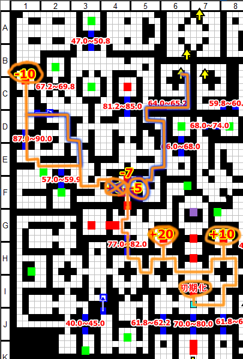

* After getting the 14F relay, farm until Nitori wipe

## Explore 14F (Part 2)

* When you're back on Gensokyo, use these facilities:
	*  **Hakurei Shrine**: Level All Characters 
* Level reference: Nitori 48
* Enter the dungeon (14F center west)

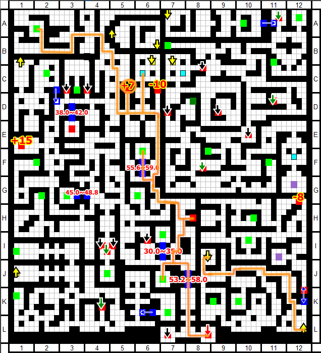

* When you reach the 15F relay, keep exploring!

## Explore 15F

* No need to re-enter the dungeon, just keep exploring:

* When you are done, leave and re-enter from (15F Center)

* After fleeing from FOE, return to Gensokyo

## Yuuka Side Quest

* When you're back on Gensokyo, re-enter the dungeon to do Yuuka events
* Level reference: Nitori 50
* Locations: (3F, 5F south, 8F south, 10F southwest, 14F center east hole)

* When you're done with all events, go back to Gensokyo
* If Nitori isn't around Lv50, farm on 15F
* When you're back on Gensokyo, use these facilities:
	*  **Nitori Shop**: Sell every material 
	*  **Hakurei Shrine**: Level All Characters, apply bonuses 
		*  Reimu, Kourin 
		*  Cirno, Minoriko(HP) 
		*  Komachi, Chen 
		*  Nitori, Aya(HP) 
		*  Kasen, Rin(SPD) 
		*  Reisen, Sanae, Iku 
		*  Use **Fighting gems** on **Nitori** 
	*  **Magic Library**: 
		*  **Reset Marisa** 
		*  **Kourin** learns **Guardian** subclass 
		*  **Minoriko** learns **Enchanter** subclass 
		*  **Sanae** learns **Enchanter** subclass 
		*  **Kourin**: HP/MND/SPD 0 -> 50 
		*  **Nitori**: MND 0 -> 50 
		*  **Aya**: SPD 0 -> 50 
		*  **Sanae**: HP 30 -> 50 / MND 0 -> 50 
		*  **Nitori**: Use all money on ATK 
	*  **Human Village**: 
		*  Swap **Rumia -> Kourin** 
		*  Swap **Reisen -> Rin** 
* Open the menu and take the following actions:
	*  Form Change: **Cirno / Kourin / Sanae / Kasen** 
	* Equipment:
		*  **Kourin**: 
			*  (M) **First-Aid Kit** (2) 
			*  (1) **Energy Pack** (5) 
			*  (2) **Rosebush Robe** (2) 
			*  (3) **Star World Bracelet** (2) 
		*  **Sanae**: 
			*  (M) **Purple Orb** (1) 
		*  **Minoriko**: 
			*  (2) **Divine Barrier** (5) 
			*  (1) **Green Dream** (2) 
		*  **Nitori**: 
			*  (if Cinderforge drop) (1) **Glaive of Pain** (5) 
			*  (2) **Green Dream** (2) 
		*  **Rin**: 
			*  (1) **Bone Stake** (3) 
			*  (2) **Bone Stake** (3) 
			*  (3) **Getitup V** (4) 
			*  (M) **Great Hammer** (2) 
	* Learn Skills:
		*  **Kourin**: HP High Boost 2 -> 5 / MND High Boost 0 -> 1 
		*  **Sanae**: Enhanced Buffing 0 -> 1 
		*  **Kasen**: HP Boost 0 -> 5 
		*  **Minoriko**: Symbol of Harvest 0 -> 2 / Art of the Battlemage 0 -> 3 
		*  **Rin**: Cat's Walk 1 -> 7 / Extra Attack 0 -> 1 
		*  **Reimu**: HP Boost 0 -> 5 / MAG Boost 0 -> 3 
		*  **Iku**: Lightning Fish 2 -> 3 
		*  **Chen**: ATK Boost 0 -> 5 
* Enter the dungeon (9F) and unlock Yuuka's room

* Re-enter after saving and fight Yuuka
* **Boss Fight - Yuuka Kazami (Lv53)**
	* **Phase 1 - Blizzard Blowout**
		* Wait for Cirno to die, spam Icicle Fall
		* Sanae juggles Miracle Fruit on Kasen and heals
		* Kasen spams Higekiri's Cursed Arm
		* Kourin spams Battle Command on Kasen
	* **Phase 2 - Damage Rush**
		* Swap in Minoriko where Cirno was
		* Minoriko juggles heals, buffs and switches
		* Swap Kasen with Nitori
		* Sanae spams Miracle Fruit on Nitori
		* Nitori spams Kappa Waterfall
		* Occasionally swap Nitori with Chen
		* Chen spams Kimontonkou + PSW
		* Occasionally swap Sanae with Aya
		* Aya DGAs Nitori with good timing
	* **Phase 3 - Master Spark**
		* Either damage rush with Nitori or SHK spam
		* Swap Minoriko with Rin
		* Rin spams Cat's Walk
		* Pray for SHK and keep dealing damage
	* For finer details see Yuuka's [Boss Info](../../enemy/yuuka.md)
* When you're done, go back to Gensokyo

## Silver Mail Fight

* Open the menu and take the following actions:
	*  Form Change: **Rin / Nitori / Chen / Kasen** 
* Enter the dungeon (10F) and go west to fight FOE
* **FOE Boss Fight - Silver Mail (Lv36)**
	* Rin spams Cat's Walk
	* Nitori uses Super Scope 3D
	* Chen uses Kimontonkou + PSW
	* Kasen spams Higekiri's Cursed Arm
	* For finer details see Silver Mail's [Boss Info](../../enemy/silvermail.md)
* When you're done, take the treasure and go back to Gensokyo

## Yuyuko Fight

* Open the menu and take the following actions:
	* Equipment:
		*  **Kourin**:
			*  (M, 1, 2, 3) **Remove**
* When you're back on Gensokyo, use these facilities:
	*  **Human Village**: 
		*  Swap **Minoriko -> Parsee** 
		*  Swap **Rin -> Satori** 
		*  Swap **Kourin -> Yuuka** 
	*  **Magic Library**: 
		*  **Reset Kourin / Minoriko / Chen / Komachi / Parsee** 
		*  **Reincarnate Nitori, Kasen** 
		*  **Chen** learns **Herbalist** subclass 
		*  **Komachi** learns **Guardian** subclass 
		*  **Parsee** learns **Gambler** subclass 
		*  **Satori**: HP/SPD 0 -> 50 
		*  **Yuuka**: HP/SPD 0 -> 50 
		*  **Parsee**: HP/MND 30 -> 50 / SPD 0 -> 50 
		*  **Parsee**: Use all money on ATK 
	*  **Hakurei Shrine**: Level All Characters, apply new bonus 
		*  Switch Chen to SPD 
		*  Switch Parsee to ATK 
		*  Satori, Yuuka HP 
		*  Use **Training Manual x6** on **Satori** 
		*  Use **Training Manuals** on **Parsee** 
		*  Use **Fighting gems** on **Parsee** 
* Open the menu and take the following actions:
	*  Form Change: **Komachi / Cirno / Reimu / Kasen** 
	* Equipment:
		*  **Nitori**: 
			*  (if no Cinderforge) (1) **Remove** 
		*  **Komachi**: 
			*  (M) **First-Aid Kit** (2) 
		*  **Reimu**: 
			*  (1) **Remove** 
		*  **Parsee**: 
			*  (1) **Olzhas Shamshir** (5) 
			*  (2) **Olzhas Shamshir** (5) 
			*  (M) **Strange Meat Pie** (2) 
		*  **Yuuka**: 
			*  (M) **First-Aid Kit** (2) 
			*  (1) **Energy Pack** (5) 
			*  (2) **Sirloin** (3) 
			*  (3) **Dark Magic Grimoire** (2) 
		*  **Satori**: 
			*  (3) **Dark Magic Grimoire** (2) 
			*  (2) **Courtesan's Sorrow** (3) 
			*  (1) **Yggdrasil Dew** (1) 
			*  (M) **First-Aid Kit** (2) 
		*  **Sanae**: 
			*  (2) **Star of the Just** (5) 
	* Learn Skills:
		*  **Komachi**: HP Boost 0 -> 5 / Frontline Guard 0 -> 1 / Regeneration 0 -> 1 / Shinigami Work 0 -> 1 / Ferry Wages 0 -> 8 
		*  **Parsee**: Final Blow 0 -> 2 / Flames of Jealousy 0 -> 2 / Jealousy of the Kind 1 -> 5 / High Stakes 0 -> 2 
		*  **Yuuka**: Extra Attack 0 -> 2 / HP/MP Boost 0 -> 5 
		*  **Chen**: SPD Boost 0 -> 5 / Instant Attack 0 -> 1 / Placebo Effect 0 -> 5 / Herb of Awakening 0 -> 5 
		*  **Satori**: Spell Recollection 0 -> 5 / Small MP Recovery 0 -> 1 / MP Boost 0 -> 5 
* Enter the dungeon (15F) and go fight Yuyuko

* **Boss Fight - Yuyuko Saigyouji (Lv60)**
	* **Phase 1 - TRR Proc**
		* Swap in Chen -> Sanae -> Parsee
		* Sanae uses Miracle Fruit on Parsee
		* Swap Sanae for Yuuka
		* Parsee uses Midnight Anathema Ritual
		* Swap Parsee with Satori
	* **Phase 2 - Beauty of Nature**
		* Yuuka and Satori spam Beauty of Nature
		* Swap Chen with Sanae
		* Komachi IA pivots Yuuka and Satori
		* Sanae juggles healing and IA pivoting
	* **Phase 3 - Jealousy of the Kind**
		* TRR reaches 1.2-2.0 million (6600+ ATK)
			* 1.22 million with Sanae buff
			* 2.06 million without Sanae buff
		* Swap in Chen -> Parsee on slots 3 and 4
		* Sanae uses Miracle Fruit on Parsee once
		* Chen uses Herb of Awakening on Parsee
		* Parsee delays her turn if needed then Jealousy of the Kind
	* For finer details see Yuyuko's [Boss Info](../../enemy/yuyuko.md)
* When you're done, go back to Gensokyo

## Azure Giant Fight

* When you're back on Gensokyo, use these facilities:
	*  **Hakurei Shrine**: Level All Characters, apply bonus 
		*  Aya(SPD), Reisen, Yuyuko(SPD) 
	*  **Human Village**: 
		*  Swap **Komachi -> Reisen** 
		*  Swap **Iku -> Yuyuko** 
* Open the menu and take the following actions:
	*  Form Change: **Nitori / Aya / Yuyuko / Reisen** 
	* Equipment:
		*  **Yuyuko**: 
			*  (if dropped) (M) **Dark Determination** (2) 
	* Learn Skills:
		*  **Yuyuko**: Saigyouji Flawless Nirvana 1 -> 5 
* Enter the dungeon (15F center) and go fight the Giant

* **Boss Fight - Glowing Azure Giant (Lv62)**
	* **If Reisen dies or Yuyuko fails twice, reset**
	* Hit the 48% DTH proc on Yuyuko's Saigyouji Flawless Nirvana
	* Aya DGAs Yuyuko for try #1
		* DGA again for try #2
	* For finer details see Azure Giant's [Boss Info](../../enemy/azuregiant.md)
* Level reference: Nitori 49
* When you're done, go back to Gensokyo

##  Yukari Fight

* When you're back on Gensokyo, use these facilities:
	*  **Hakurei Shrine**: Level All Characters 
		*  Nitori(ATK), Aya(SPD) 
	*  **Magic Library**: 
		*  **Reset Parsee / Aya / Satori / Yuuka** 
		*  **Parsee** learns **Monk** subclass 
		*  **Aya** learns **Strategist** subclass 
		*  **Satori** learns **Monk** subclass 
		*  **Yuuka** learns **Monk** subclass 
		*  Use **Swiftness gems** on **Aya** 
	*  **Human Village**: 
		*  Swap **Yuyuko -> Kourin** 
		*  Swap **Reisen -> Komachi** 
* Open the menu and take the following actions:
	*  Form Change: **Aya / Parsee / Yuuka / Satori** 
	*  Swap: **Reimu-Kourin / Kasen-Komachi** 
	* Equipment:
		*  **Komachi**: 
			*  (M) **Violent Green Rupee** (2) 
		*  **Aya**: 
			*  (M) **First-Aid Kit** (2) 
		*  **Satori**: 
			*  (2) **Meteor Drive** (5) 
		*  **Cirno**: 
			*  (M, 1, 2, 3) **Remove** 
		*  **Kourin**: 
			*  (M) **Chario Boots** (2) 
			*  (1) **Booster v0.8** (2) 
			*  (2) **Booster v0.8** (2) 
			*  (3) **Booster v0.8** (2) 
	* Learn Skills:
		*  **Aya**: HP Boost 0 -> 5 / Gensokyo Fastest 0 -> 2 / Tengu Wind 0 -> 2 / Ironclad Strat 0 -> 10 / Raid Maneuver 0 -> 1 
		*  **Parsee**: Fast Dash 0 -> 1 / Jealousy of the Kind 1 -> 5 / Flames of Jealousy 0 -> 2 / Final Blow 0 -> 2 
		*  **Yuuka**: Extra Attack 0 -> 2 / Fast Dash 0 -> 1 / MP Boost 0 -> 5 / HP Boost 0 -> 2 
		*  **Satori**: MP Boost 0 -> 5 / Small MP Recovery 0 -> 1 / Spell Recollection 0 -> 5 / Fast Dash 0 -> 1 
		*  **Kourin**: Effective Formation 0 -> 2 / First Aid 1 -> 2 / HP Boost 0 -> 5 / MND Boost 0 -> 1 
		*  **Sanae**: Enhanced Buffing 1 -> 2 
* Enter the dungeon (15F)

* When you get to the relay point, re-enter the dungeon and fight Yukari
* **Boss Fight - Yukari Yakumo (Lv66)**
	* **Phase 1 - TRR Proc**
		* Reset if less than 2 full ATBs
			* 14.06 / 38.94 / 35.94 / 11.06
		* Aya DGAs whoever didnt get a full ATB
			If everyone has a full ATB, Sarutahiko self
		* Parsee uses Midnight Anathema Ritual (54% proc)
		* Yuuka and Satori use Beauty of Nature
		* Swap Parsee with Kourin
	* **Phase 2 - Beauty of Nature**
		* Yuuka and Satori spam Beauty of Nature
		* Aya IA pivots Yuuka
		* Kourin swaps Satori and Sanae as needed
		* Sanae heals everyone with Yasaka's Divine Wind
	* **Phase 3 - Jealousy of the Kind**
		* TRR reaches 470-802k (Sanae in front)
			* 470k after Sanae buff
			* 802k if no buff
		* TRR reaches 610-1000k (Sanae dead/back)
			* 610k after Sanae buff
			* 1.01 million if no buff
		* Move Sanae to slot 1, swap in Parsee in slot 4
		* Sanae uses Miracle Fruit on Parsee
		* Swap in Chen whenever
		* Chen uses Herb of Awakening on Parsee
		* Parsee delays her turn if needed then Jealousy of the Kind
	* For finer details see Yukari's [Boss Info](../../enemy/yukari.md)
* After defeating her, get the 16F relay point and go back to Gensokyo

# Dark Stratum (16F ~ 18F)

## Explore 16F

* When you're back on Gensokyo, use these facilities:
	*  **Human Village**: 
		*  Swap **Cirno -> Rumia** 
* Enter the dungeon (16F)
* From this point on, use Aya + Instant Attack to flee

* When you reach the 17F relay point, go back to Gensokyo

## Explore 17F (Part 1)

* Once you're back in Gensokyo, use these facilities:
	*  **Magic Library**: 
		*  **Reincarnate Parsee** 
		*  **Reset Aya** 
		*  **Aya** learns **Diva** subclass 
	*  **Hakurei Shrine**: 
		*  Use **Training Manual x7** on **Aya** 
* Open the menu and take the following actions:
	* Learn Skills:
		*  **Aya**: Gensokyo Fastest 0 -> 2 / Tengu Wind 0 -> 2 / Silent Melody 0 -> 3 / Melody Fortune 0 -> 1 / Dance Cochlea 0 -> 5 
* Enter the dungeon (17F)
* Leave after getting the treasures on northwest and southwest ends

* When you fall down to 16F, get the relay point and go back to Gensokyo

## Goddess of Fertility Fight

* Before you do any menuing, do the following action:
	* Equipment:
		*  **Parsee**: 
			*  (3) **Remove** 
			*  (M) **Growing Egg** (2) 
* When you're back on Gensokyo, use these facilities:
	*  **Magic Library**: 
		*  **Reset Kourin / Satori / Iku / Yuuka** 
		*  **Kourin** learns **Diva** subclass 
		*  **Cirno** learns **Guardian** subclass 
		*  **Nitori** learns **Warrior** subclass 
		*  **Satori** learns **Enchanter** subclass 
		*  **Nitori**: Use all money on ATK 
	*  **Hakurei Shrine**: Level All Characters 
		*  Use **Fighting gems** on **Nitori** 
	*  **Human Village**: 
		*  Swap **Rumia -> Cirno** 
		*  Swap **Komachi -> Reisen** 
		*  Swap **Parsee -> Iku** 
* Open the menu and take the following actions:
	*  Form Change: **Cirno / Kourin / Satori / Reisen** 
	* Equipment:
		*  **Kourin**: 
			*  (1) **Wallbreaker Armband** (5) 
			*  (2) **Wallbreaker Armband** (5) 
		*  **Aya**: 
			*  (1) **Meteor Drive** (5) 
			*  (M) **Yogurt Doll** (2) 
		*  **Nitori**: 
			*  (2) **Cinderforge Sword** (5) 
	* Learn Skills:
		*  **Cirno**: Frontline Guard 0 -> 1 
		*  **Kourin**: Weird Creatures 0 -> 2 / Effective Formation 0 -> 2 / HP Boost 0 -> 5 
		*  **Satori**: MP Boost 0 -> 5 / Trauma Recollection 0 -> 2 / Enhanced Buffing 0 -> 2 / Art of the Battlemage 0 -> 5 
		*  **Nitori**: Mind Body as One 0 -> 2 / Cooling Down 0 -> 2 / Maintenance 0 -> 1 
* Enter the dungeon (16F Center) and go fight the boss

* **Boss Fight - Goddess of Fertility (Lv72)**
	* **Phase 1 - Diva Setup**
		* Let Cirno die to trigger Blizzard Blowout
		* If Cirno survives first turn, use Icicle Fall
			* Reisen spams Discarder to bring boss down to 50%
			* Use another Icicle Fall if not there
		* Swap in Aya where Cirno was
		* Reisen uses Lunatic Red Eyes once
		* Aya spams Dance of the Cochlea until boss is at 0 ATB
		* Swap Reisen with Iku
		* Iku uses Elekiter Dragon Palace once
		* Swap Iku with Nitori
	* **Phase 2 - Super Scoping**
		* Nitori self buffs until ready, then concentrates
		* Kourin uses Battle Command on Nitori
		* Satori uses Art of the Battlemage on Nitori
		* Nitori uses Super Scope
		* Aya uses DGA on Nitori
		* Nitori uses Super Scope
	* For finer details see Goddess of Fertility's [Boss Info](../../enemy/goddess.md)
* Go back to Gensokyo to heal after the fight

## Explore 17F (Part 2)

* When you're back on Gensokyo, use these facilities:
	*  **Human Village**: 
		*  Swap **Cirno -> Rumia** 
* Open the menu and take the following actions:
	*  Form Change: **Aya / Kourin / Satori / Reisen** 
	* Equipment:
		*  **Aya**: 
			*  (M) **Remove** 
* Enter the dungeon (17F)

* When you reach the 18F relay, keep exploring!

## Explore 18F

* No need to re-enter the dungeon, just keep exploring:

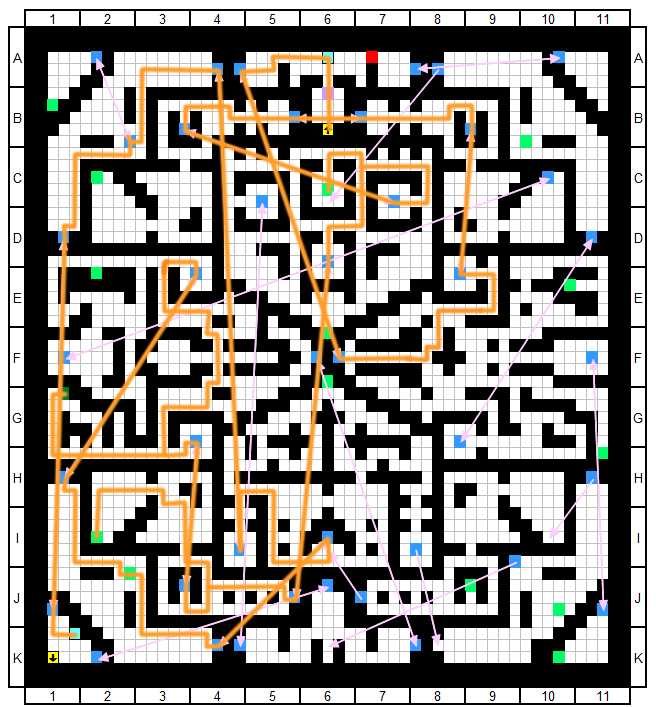

* When you get the relay point, go back to Gensokyo

## Golden Orbs Fight

* Before you do any menuing, do the following action:
	* Equipment:
		*  **Kourin**:
			*  (M, 1, 2, 3) **Remove**
* When you're back on Gensokyo, use these facilities:
	*  **Hakurei Shrine**: Level All Characters, apply bonus 
		*  Nitori, Aya 
		*  Suwako(SPD) 
		*  Use **Training Manual x4** on **Nitori** 
	*  **Magic Library**: 
		*  **Reincarnate Kourin** 
		*  **Suwako** learns **Enchanter** subclass 
		*  **Nitori**: Use all money on ATK 
	*  **Human Village**: 
		*  Swap **Rumia -> Cirno** 
		*  Swap **Kourin -> Suwako** 
		*  Swap **Yuuka -> Yuyuko** 
* Open the menu and take the following actions:
	*  Form Change: **Aya / Cirno / Yuyuko / Reisen** 
	* Equipment:
		*  **Aya**: 
			*  (M) **Yogurt Doll** (2) 
		*  **Suwako**: 
			*  (M) **Chario Boots** (2) 
			*  (1) **Wallbreaker Armband** (5) 
			*  (2) **Wallbreaker Armband** (5) 
			*  (3) **Full Custom** (2) 
	* Learn Skills:
		*  **Suwako**: Froggy Power 0 -> 2 / Enhanced Buffing 0 -> 2 / Art of the Battlemage 0 -> 5 / MP Boost 0 -> 5 
		*  **Nitori**: Overheating 0 -> 1 
		*  **Kasen**: Guts 0 -> 2 
* Enter the dungeon (18F North)

* **Boss Fight - Golden Orb Trio (Lv76)**
	* **Phase 1 - Diva Setup**
		* Aya DGAs Yuyuko turn 1 for Saigyouji Flawless Nirvana
		* Aya swaps self for Kasen
		* Cirno swaps Yuyuko with Satori
		* Stall until Cirno dies
		* Swap in Chen -> Aya
		* Aya awaps Chen with Suwako
		* Satori swaps Reisen with Nitori
	* **Phase 2 - Extending Arm**
		* Suwako and Satori spam Art of the Battlemage on Nitori
		* Nitori spams Extending Arm
		* **DO NOT IA PIVOT NITORI**, she'll lose Overheat stack
		* Aya spams Dance of Cochlea and supports Nitori
	* **Phase 3 - Super Scope**
		* Aya DGAs Nitori
		* Nitori ends it with Super Scope
	* For finer details see Golden Orb Trio's [Boss Info](../../enemy/goldenorbs.md)
* Go back to Gensokyo to heal after the fight

# Heaven Stratum (19F ~ 20F)

## Explore 19F North / 20F West

* When you're back on Gensokyo, use these facilities:
	*  **Human Village**: 
		*  Swap **Cirno -> Rumia** 
* Open the menu and take the following actions:
	*  Form Change: **Aya / Suwako / Yuyuko / Reisen** 
	* Equipment:
		*  **Aya**: 
			*  (M) **Tin Watering Can** (1) 
* Enter the dungeon (19F)

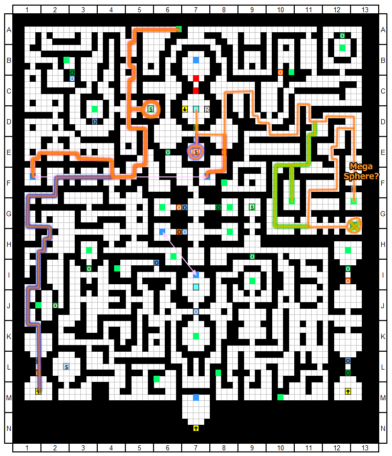

* When you reach 20F, follow the path:

* When you reach the destination on 20F, go back to Gensokyo

## Explore 19F South / 20F East

* Enter the dungeon (19F)

* When you reach the second green orb, go back and re-enter dungeon

* When you reach the destination on 20F, go back to Gensokyo

## High Mirror Fight

* When you're back at Gensokyo, open the menu and take the following actions:
	* Equipment:
		*  **Suwako**:
			*  (M, 1, 2, 3) **Remove**
* When you're back on Gensokyo, use these facilities:
	*  **Magic Library**: 
		*  **Reset Komachi / Rin** 
		*  **Reincarnate Nitori / Satori** 
		*  **Nitori** learns **Warrior** subclass 
		*  **Rin** learns **Magician** subclass 
		*  **Satori** learns **Enchanter** subclass 
		*  **Aya**: SPD 50 -> 150 
		*  **Rin**: SPD 0 -> 100 
		*  **Satori**: SPD 0 -> 50 
		*  **Nitori**: SPD 0 -> 50 
		*  **Nitori**: Use all money on ATK 
	*  **Human Village**: 
		*  Swap **Suwako -> Cirno** 
		*  Swap **Yuyuko -> Rin** 
	*  **Hakurei Shrine**: Level All Characters 
		*  Nitori(ATK), Rin, Satori(HP), Reisen 
		*  Delevel Rumia, Cirno, Kasen 
		*  Use **Training Manual x13** on **Nitori** 
		*  Use **Magic gems** on **Aya** and **Rin** 
		*  Use **Fighting gems** on **Nitori** 
		*  Use **Swiftness gems** on **Aya** and **Nitori** 
* Open the menu and take the following actions:
	*  Form Change: **Reimu / Aya / Sanae / Satori** 
	* Equipment:
		*  **Rin**: 
			*  (3) **Wallbreaker Armband** (5) 
			*  (2) **Wallbreaker Armband** (5) 
			*  (M) **Chario Boots** (2) 
		*  **Aya**: 
			*  (M) **Gaia's Orb** (2) 
		*  **Sanae**: 
			*  (1) **Grand Master Breaker** (5) 
			*  (3) **Astral Dominae** (5) 
		*  **Nitori**: 
			*  (M) **Yogurt Doll** (2) 
	* Learn Skills:
		*  **Satori**: MP Boost 0 -> 5 / Trauma Recollection 0 -> 2 / Enhanced Buffing 0 -> 2 / Art of the Battlemage 0 -> 5 
		*  **Nitori**: Maintenance 0 -> 1 / Ability Manip Water 0 -> 2 / Overheat 0 -> 1 / Cooling Down 0 -> 2 / Mind Body One 0 -> 2 
		*  **Rin**: Magic Conservation 0 -> 1 / Magic Transfer 0 -> 5 / Magic Circuit 0 -> 5 
* Enter the dungeon (20F West)

* **Boss Fight - Mirror of the High God (Lv87)**
	* **Phase 1 - Diva Setup**
		* Aya uses DGA on Reimu
		* Reimu uses Great Hakurei Barrier
		* Aya/Satori/Sanae/Aya Concentrate
		* Reimu swaps self with Cirno
		* Aya concentrates again
		* Cirno swaps Aya with Reimu
		* Satori swaps self with Kasen
		* Wait for Cirno to die and hope someone lives
	* **Phase 2 - Nitori Attack**
		* Swap in Aya and lock the boss with Dance of Cochlea
		* Swap in Rin on survivor's turn
		* Swap in Nitori
		* Sanae buffs Nitori for a while then swaps for Satori
		* Iku comes in to debuff boss
		* Aya spams Dance of Cochlea
			* Concentrate when boss ATB < 6500
			* Can also swap Chen in if MP is fine for Herb of Awakening
		* Rin manages everyone's MP
		* Satori buffs Nitori
		* Nitori builds Overheat stacks then spams Waterfall
	* For finer details see High Mirror's [Boss Info](../../enemy/highmirror.md)
* Go back to Gensokyo to heal after the fight

## High Magatama Fight

* Back on Gensokyo, open the menu and do a form change:
	*  Form Change: **Aya / Reimu / Sanae / Satori** 
* Enter the dungeon (20F East)

* **Boss Fight - Magatama of the High God (Lv88)**
	* **Phase 1 - Diva Setup**
		* Aya buffs own SPD, then Sanae's, then swaps self for Cirno
		* Wait for Cirno to die and hope someone lives
	* **Phase 2 - Nitori Attack**
		* Swap in Chen into slot 2, then Aya into 1
		* Aya spams Dance of Cochlea
			* Concentrate when boss ATB < 7000
		* Sanae spams buffs on Nitori
		* Iku comes in to debuff boss
		* Nitori spams Super Scope 3D
	* For finer details see High Magatama's [Boss Info](../../enemy/highmagatama.md)
* Go back to Gensokyo to heal after the fight

## Explore 20F Depths

* When you're back on Gensokyo, simply re-enter the dungeon (19F)
* Break the seals up north and go into 20F Depths

* When you reach the destination, go back to Gensokyo

## Ame-no-Murakumo

* When you're back on Gensokyo, use these facilities:
	*  **Human Village**: 
		*  Swap **Rin -> Kourin** 
		*  Swap **Reisen -> Parsee** 
		*  Swap **Rumia -> Eirin** 
		*  Swap **Kasen -> Yukari** 
		*  Swap **Reimu -> Yuuka** 
		*  Unequip non-party 
	*  **Magic Library**: 
		*  **Reset Cirno / Satori / Reisen / Suwako** 
		*  **Reincarnate Nitori / Aya / Rin / Sanae / Iku** 
		*  **Kourin** learns **Guardian** subclass 
		*  **Nitori** learns **Guardian** subclass 
		*  **Parsee** learns **Gambler** subclass 
		*  **Aya** learns **Strategist** subclass 
		*  **Eirin** learns **Toxicologist** subclass 
		*  **Sanae** learns **Enchanter** subclass 
		*  **Yuuka** learns **Monk** subclass 
		*  **Yukari** learns **Monk** subclass 
	*  **Hakurei Shrine**: Level All Characters, apply bonus 
		*  Kourin - HP 
		*  Cirno - SPD 
		*  Chen - SPD 
		*  Nitori - DEF 
		*  Parsee - ATK 
		*  Aya - SPD 
		*  Satori - HP 
		*  Eirin - HP 
		*  Sanae - MAG 
		*  Iku - SPD 
		*  Yuuka - HP 
		*  Yukari - HP 
		*  Use **Training Manual x2** on **Satori** 
		*  Use **Training Manual x13** on **Parsee** 
		*  Use remaining **Training Manual** on **Yuuka** 
		*  Use **HP Gems** on **Nitori / Kourin** 
		*  Use **MP Gems** on **Yuuka / Satori** 
		*  Use **TP Gems** on **Chen** 
		*  Use **ATK Gems** on **Parsee** 
		*  Use **DEF Gems** on **Kourin / Nitori** 
		*  Use **MAG Gems** on **Sanae** 
		*  Use **SPD Gems** on **Kourin / Satori** 
* Open the menu and take the following actions:
	*  Form Change: **Eirin / Aya / Yuuka / Yukari** 
	* Equipment:
		*  **Eirin**: 
			*  (M) **Repulsion Orb** (1) 
		*  **Yuuka**: 
			*  (2) **Megasphere** / **Energy Pack** (5) 
			*  (3) **Intama** (2) 
		*  **Yukari**: 
			*  (M) **Master's Emblem** (1) 
		*  **Nitori**: 
			*  (M) **First-Aid Kit** (2) 
			*  (1) **Intama** (2) 
			*  (2) **Grand Master Breaker** (5) 
			*  (3) **Divine Barrier** (5) 
		*  **Parsee**: 
			*  (3) **Cinderforge Sword** (5) 
			*  (2) **Cinderforge Sword** (5) 
			*  (1) **Holy Sword Centurio** (5) 
			*  (M) **Strange Meat Pie** (2) 
		*  **Chen**: 
			*  (2) **Century End Jacket** (4) 
			*  (1) **The Arch** (4) 
			*  (M) **Micron Magic Book** (2) 
		*  **Satori**: 
			*  (1) **Aegis Button** (2) 
			*  (2) **Intama** (2) 
			*  (3) **Energy Pack** (5) 
		*  **Iku**: 
			*  (3) **Wash Basin Set** (5) 
			*  (2) **Wash Basin Set** (5) 
			*  (1) **Wash Basin Set** (5) 
		*  **Kourin**: 
			*  (M) **Chario Boots** (2) 
			*  (1) **Intama** (2) 
			*  (2) **Megasphere** (5) 
			*  (3) **Megasphere** (5) 
	* Learn Skills:
		*  **Eirin**: HP Boost 0 -> 5 / Enhanced Toxins 0 -> 2 
		*  **Aya**: EVA Boost 0 -> 5 / Gensokyo Fastest 0 -> 2 / Tengu Wind 0 -> 2 / Raid Maneuver 0 -> 1 / Sarutahiko Guidance 1 -> 3 
		*  **Yuuka**: Fast Dash 0 -> 1 / HP/MP Boost 0 -> 5 / Extra Attack 0 -> 2 / Majesty 0 -> 2 
		*  **Yukari**: MP Boost 0 -> 5 / Yukari Spiriting Away 1 -> 5 / Fast Dash 0 -> 1 
		*  **Sanae**: MAG Boost 0 -> 5 / Last Wish 0 -> 2 / Miracle Fruit 1 -> 5 / Enhanced Buffs 0 -> 2 
		*  **Nitori**: Absolute Defensive 0 -> 1 / Frontline Guard 0 -> 1 / Maintenance 0 -> 1 / DEF/AFF Boost 0 -> 5 
		*  **Cirno**: Blizzard Blowout 0 -> 5 
		*  **Parsee**: Final Blow 0 -> 2 / Flames of Jealousy 0 -> 2 / Jealous of the Kind and Lovely 1 -> 5 / High Stakes 0 -> 2 / All or Nothing 0 -> 2 
		*  **Chen**: EVA Boost 0 -> 5 
		*  **Satori**: Spellcard Recollection 0 -> 5 / Trauma Recollection 0 -> 2 / Small MP Recovery 0 -> 1 / MP Boost 0 -> 5 
		*  **Iku**: Supple Hagoromo 0 -> 2 / Elekiter Dragon Palace 1 -> 5 / Thundercloud Stickleback 1 -> 5 
		*  **Kourin**: DEF Boost 0 -> 5 / Formation Change 0 -> 2 / Absolute Defensive 0 -> 1 
* Visit the following facilities to finish:
	*  **Nitori Shop**: Sell everything 
	*  **Magic Library**: 
		*  **Kourin**: HP/DEF/SPD 0 -> 100 
		*  **Nitori**: HP/DEF/SPD 0 -> 100 
		*  **Satori**: HP/DEF/SPD 0 -> 100 
		*  **Yuuka**: HP/SPD 50 -> 100 / DEF 0 -> 100 
		*  **Parsee**: Spend all money on ATK 
* Enter the dungeon (20F Depths)

* **Boss Fight - Ame-no-Murakumo (Lv100)**
	* **Phase 1 - HVY+TRR proc**
		* Reset if less than 2 full ATBs
			* 5.41 / 31.62 / 44.54 / 18.43
		* DGA whoever didn't get a full ATB
		* Astronomical Entombing (must HVY - 80%)
		* Swap Eirin with Parsee
		* Yukari's Spiriting Away
		* Midnight Anathema Ritual (must TRR - 46%)
		* Swap Parsee with Cirno
		* Beauty of Nature
		* Swap Yukari with Satori
		* Swap Aya with Kourin
		* Wait for Cirno to die, then swap in Nitori
	* **Phase 2 - Beauty of Nature**
		* Yuuka and Satori do BoN spam
		* Nitori swaps Yuuka with Chen into Yuuka
		* Kourin swaps Satori with Sanae and back
		* Improvise if anyone dies
	* **Phase 3 - Jealousy**
		* TRR reaches 0.7-1.4 million (1 cinderforge)
			* 700k if HVY + debuff
			* 1 million if HVY
			* 1.4 million if only debuff
		* Absolutely need Trauma Recollection, HoA and buff on Parsee
		* Put Parsee in slot 4 and get Sanae to buff her
			* Sacrificing Sanae is a good option
		* Iku MUST debuff boss if going for early kill
			* She can also buff Parsee, in an emergency
		* Whenever you're ready sacrifice Yuuka
	* For finer details see Ame-no-Murakumo's [Boss Info](../../enemy/murakumo.md)
* GG !!!

[Back to index page](../../index.md)
